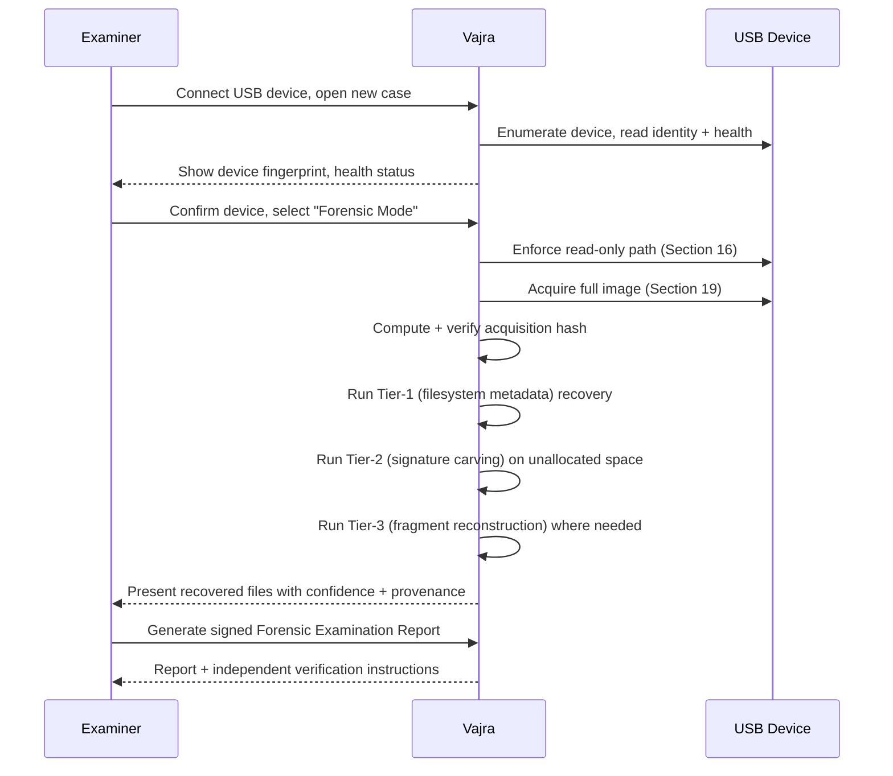
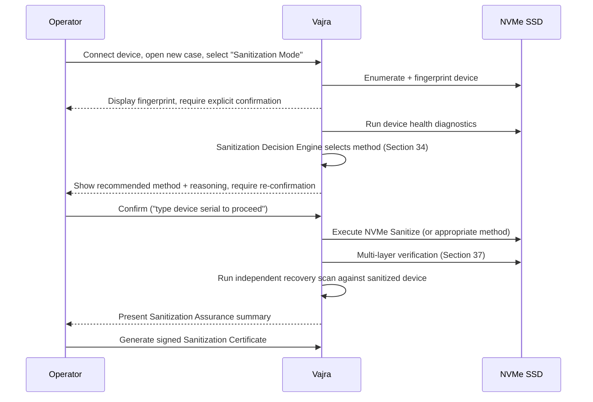
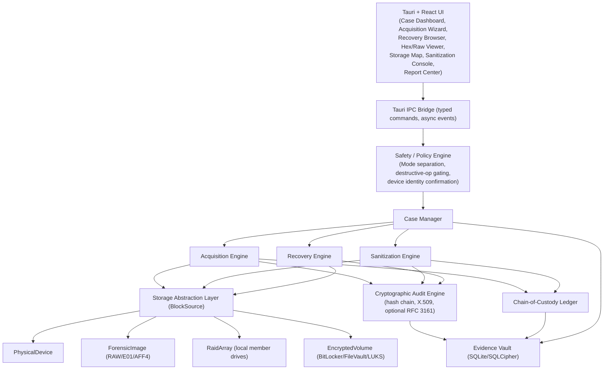
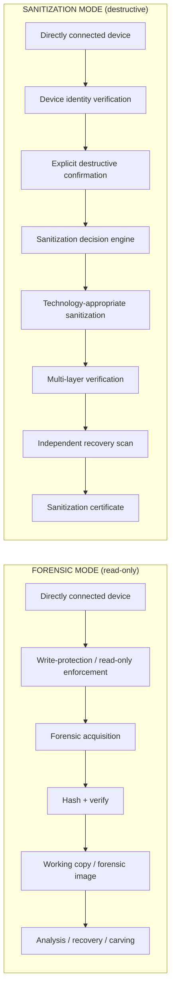
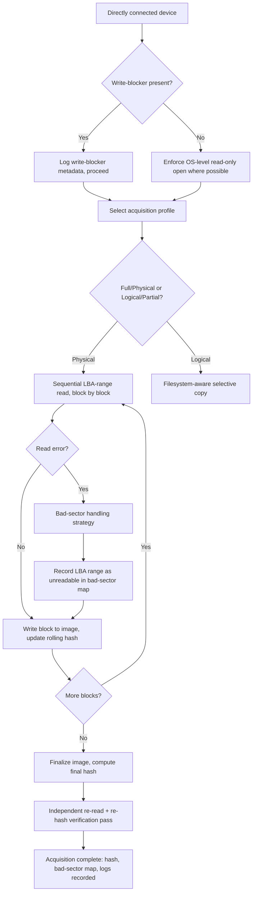
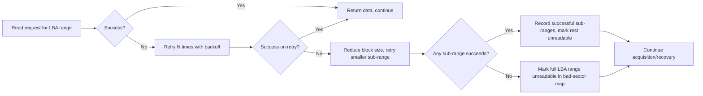
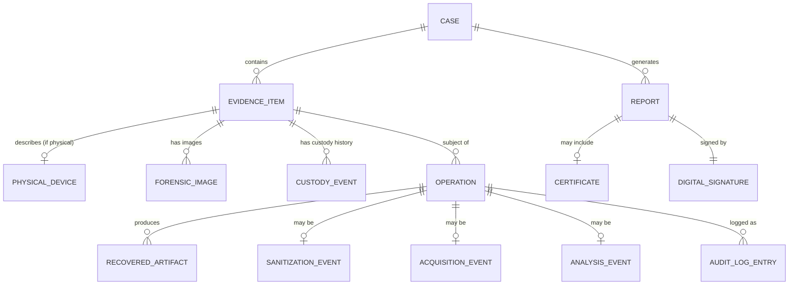
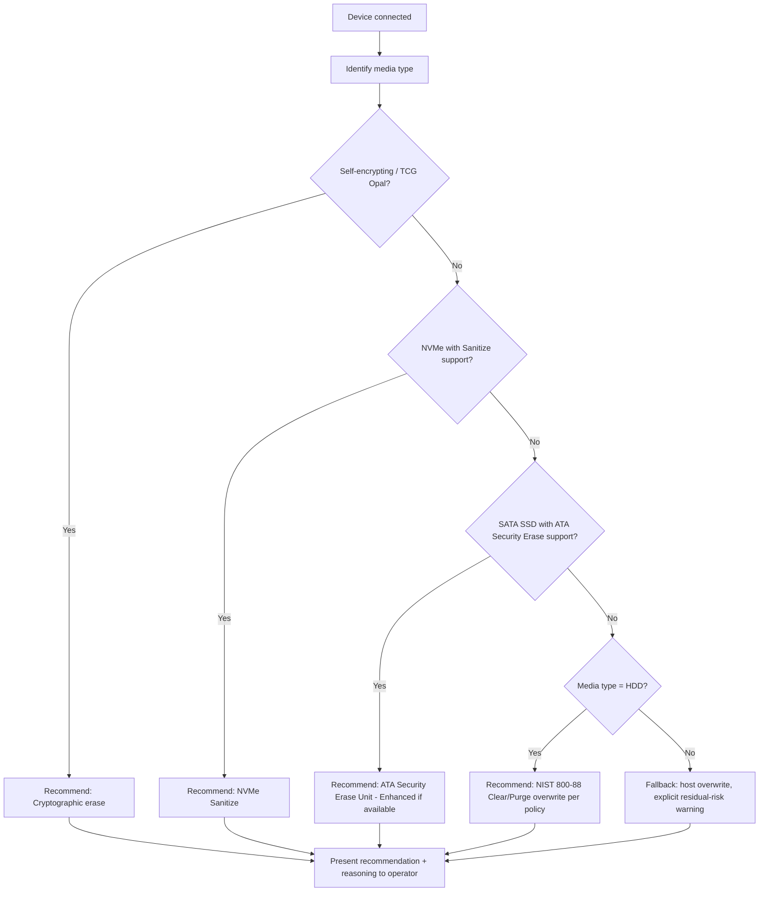
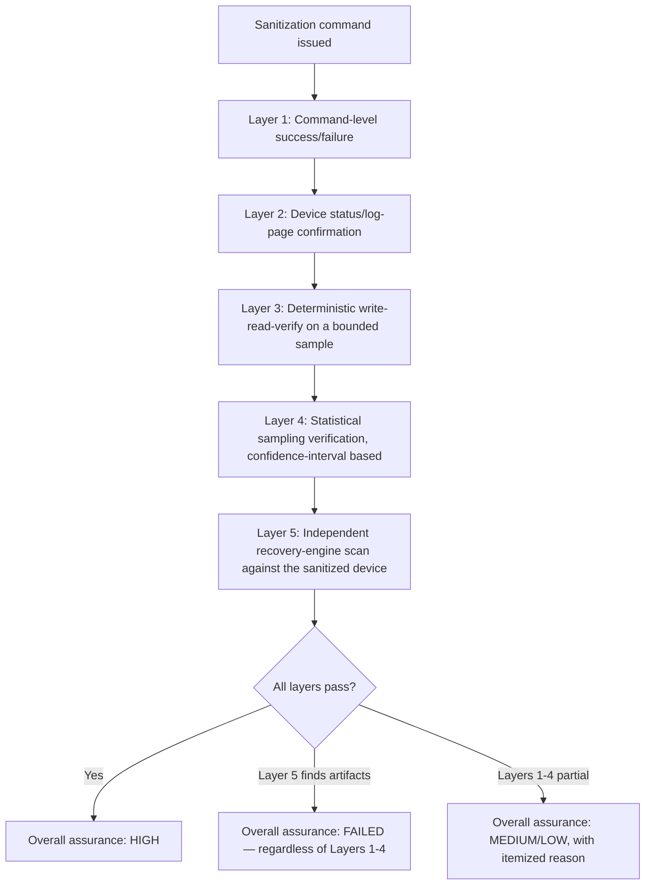

# Vajra: An Offline-First Digital Forensics and Secure Data Sanitization Platform
## Master Technical & Research Document

**Document class:** Combined Product Requirements Document, Technical Design Document, System Architecture Document, Digital Forensics Research Proposal, Data Sanitization Engineering Specification, Recovery Engine Design, Validation & Benchmarking Plan, and SIH Project Strategy Document.

**Architecture in one sentence:** A standalone, offline-first forensic workstation, written primarily in Rust with a Tauri/React interface, that acquires, analyzes, recovers, and — where authorized — sanitizes data on **directly connected physical storage devices and locally accessible forensic disk images only**, with no server, agent, NAS, SMB/NFS, or cloud component of any kind.

---

# Part 0 — Scope Declaration

This section exists because scope discipline is the single highest-leverage decision in this project, and it must be stated before anything else so every later section can be read against it without ambiguity.

## 0.1 What the platform touches

- Directly connected HDDs (SATA, PATA/legacy where feasible)
- Directly connected SATA SSDs
- Directly connected NVMe SSDs
- USB flash drives
- External HDD/SSD enclosures (USB, Thunderbolt)
- SD / microSD cards (via card reader)
- Other directly attached removable block storage exposed by the host OS
- Locally accessible forensic disk images (RAW/DD, E01, AFF4) residing on the examiner's own filesystem

## 0.2 What the platform explicitly does not do

- No centralized server component
- No server-agent architecture, no headless remote worker processes
- No remote execution of any kind
- No NAS access
- No SMB/CIFS or NFS acquisition or sanitization
- No cloud object storage integration (S3, Azure Blob, GCS, or equivalents)
- No network-based evidence acquisition
- No fleet management or multi-endpoint orchestration
- No remote sanitization
- No cloud-hosted case management

Every architectural decision in this document is downstream of Section 0. Where an idea would strengthen the product but requires network capability (e.g., a centralized evidence repository, remote tasking), it is recorded in **Future Scope (Part X, §55)** as a *possible, deliberately-deferred* direction rather than folded into the core design.

---

# Part I — Problem, Vision, and Boundaries

## 1. Executive Summary

Organizations, law enforcement units, and individuals routinely need two capabilities that are usually served by separate, expensive, or fragmented toolchains: **making data on a storage device permanently unrecoverable** (sanitization) and **recovering data that has been deleted, corrupted, or partially destroyed** (forensic recovery). Existing options split cleanly into two camps — enterprise sanitization suites (Blancco, DBAN successors) that know nothing about forensic recovery, and forensic suites (Autopsy, EnCase, FTK, PhotoRec/TestDisk) that know nothing about verified sanitization. Practitioners end up running multiple disconnected tools, re-establishing chain of custody across tool boundaries, and reconciling inconsistent reporting formats.

Vajra proposes a single, offline-first, standalone application that treats sanitization and recovery as two expressions of the same underlying competency — **precise, verifiable control over what data exists on a storage device** — sharing one architecture, one evidence model, one audit/cryptographic-integrity engine, and one reporting system. The recovery engine can independently validate whether a sanitization operation actually succeeded (Part VI, §37), which is a genuinely novel product idea: most sanitization tools ask you to trust their own overwrite-completion status; Vajra can additionally ask its own recovery engine "can you find anything?" and report the answer.

This document is intentionally conservative about claims. It does not assert perfect recovery, guaranteed sanitization, or automatic legal admissibility — each of those claims is false in general, and asserting them would be both dishonest and, to any technically literate reviewer, an immediate credibility failure. Instead, the document specifies calibrated confidence scoring, multi-layer verification, explicit representation of uncertainty, and "forensically defensible" (not "court-admissible") reporting — see Part IX for the reasoning behind each of these framing choices.

## 2. Problem Definition

Two distinct but related problems motivate this project:

**Problem A — Data sanitization is not one problem, it is several, and generic tools often solve the wrong one.** A single overwrite pass is close to sufficient for a magnetic HDD but can be actively misleading for a modern SSD or NVMe device, because the host OS does not control which physical NAND cells hold stale data — the drive's own flash translation layer (FTL) does (see Part VI, §33 for the full technical treatment). A tool that applies one algorithm uniformly to every device either wastes time (over-wiping an HDD with 35 passes) or under-delivers assurance (overwrite-only "wiping" of an SSD, leaving stale data recoverable from spare/over-provisioned blocks the host never touched).

**Problem B — Forensic recovery tools generally assume intact, cooperative media, and degrade unpredictably outside that assumption.** Real forensic cases frequently involve formatted volumes, partially overwritten data, fragmented files, damaged/failing media, and corrupted filesystem structures. A recovery tool that cannot represent *partial* success — that can only say "recovered" or "not recovered" — misrepresents its own output in exactly the cases where correct interpretation matters most (evidentiary use, forensic reporting, legal proceedings).

**The unifying problem statement:** build a platform that (a) selects sanitization methods based on actual device technology and verifies the outcome through multiple independent mechanisms rather than trusting a single overwrite-completion flag, and (b) recovers data with an explicit, calibrated, evidence-based confidence model that honestly represents missing, corrupted, and uncertain regions rather than collapsing everything into a binary success/failure outcome.

## 3. Background and Motivation

Digital storage technology has diverged rapidly. A 2010-era HDD and a 2026-era NVMe SSD with a self-encrypting controller are, from a sanitization-engineering perspective, almost unrelated problems that happen to expose the same block-device interface to the OS. Meanwhile, the volume and diversity of digital evidence in investigations has grown — mobile-adjacent removable media, high-capacity external drives, increasingly common use of full-disk encryption — while investigators are still frequently constrained to a mix of free tools (PhotoRec, TestDisk), expensive commercial suites, and manual sector-level work.

The motivating insight for this project is that **the same low-level infrastructure — raw block access, filesystem parsing, cryptographically verifiable logging — is needed for both sanitization and recovery.** Building them as one platform rather than two products is not just convenient; it enables the sanitization-assurance loop described in §37, which is difficult to construct across two separately-developed tools with incompatible internal models of "what is on this device."

## 4. Existing Solutions and Their Limitations

| Category | Representative tools | Strength | Limitation relevant to this project |
|---|---|---|---|
| Sanitization suites | Blancco, DBAN, manufacturer secure-erase utilities | Mature overwrite/erase execution, compliance certificates | Little to no recovery capability to independently verify their own claims; DBAN in particular is unmaintained and SSD-unaware |
| Forensic recovery suites | Autopsy, EnCase, FTK, X-Ways | Deep filesystem support, mature case management | No sanitization capability at all; commercial licensing cost; EnCase/FTK are not open and not inspectable |
| Free carving tools | PhotoRec, TestDisk | Broad signature-based carving, free, cross-platform | No filesystem-aware Tier-1 recovery depth for some filesystems, no confidence scoring, no chain-of-custody or cryptographic reporting, no sanitization |
| Manufacturer secure-erase utilities | Samsung Magician, Western Digital Dashboard | Correct, vendor-verified use of ATA/NVMe secure-erase commands for their own hardware | Vendor-locked to one manufacturer's drives; no cross-vendor device support; no recovery or forensic capability |

The gap Vajra targets is not "a better carving tool" or "a better wiping tool" in isolation — both already exist in mature form. The gap is a **single, offline, standalone platform where the sanitization side and the recovery side share an evidence model and can validate each other**, aimed at practitioners (small forensic labs, cybersecurity teams, IT asset disposition units, individual investigators) for whom running and reconciling five separate tools is a real operational cost.

## 5. Proposed Solution

A Rust-core, Tauri/React-UI, single-binary-installable desktop application with two clearly separated operational tracks (Forensic Mode and Sanitization Mode, Part III §15), sharing:

- One device/storage abstraction layer (`BlockSource`, Part III §16)
- One Evidence Vault / case database (Part IV §22)
- One cryptographic audit and chain-of-custody engine (Part VII §39–40)
- One reporting and independent-verification system (Part VII §41–42)

The two tracks differ entirely in what they *do* to a device (read-only analysis vs. destructive sanitization) but not in *how they account for what they did* — every operation, regardless of track, produces the same class of auditable, hash-chained, optionally-signed record.

## 6. Product Vision

*"If data needs to be recovered, Vajra recovers it and shows exactly how confident that recovery is and why. If data needs to be destroyed, Vajra destroys it using a method appropriate to the actual hardware, and then proves — using its own independent recovery engine — that nothing is left."*

The product should read, to an evaluator with real forensic or systems-security background, as a **careful, technically honest, offline forensic workstation** — not as a feature checklist, and not as a tool that oversells its own certainty.

## 7. Goals

1. Provide filesystem-aware, signature-aware, and fragment-aware recovery across the four most common filesystems (NTFS, ext4, APFS, FAT32/exFAT) with an explicit, calibrated confidence model.
2. Provide technology-appropriate sanitization (HDD, SATA SSD, NVMe SSD, USB flash, SD/microSD) selected by a decision engine rather than a single blanket algorithm.
3. Verify sanitization through multiple independent layers, including the platform's own recovery engine run against the sanitized device.
4. Maintain forensically sound evidence handling: read-only enforcement in Forensic Mode, explicit device-identity confirmation before any destructive operation, chain of custody tracked separately from software audit logs.
5. Produce cryptographically verifiable, independently checkable reports and certificates, without overclaiming legal status.
6. Operate entirely offline, with no server, agent, or cloud dependency for any core function.
7. Be honest, in documentation, UI copy, and generated reports, about the limits of what software-only sanitization and recovery can guarantee.

## 8. Non-Goals

- Not a general-purpose backup or file-management tool.
- Not a network security or endpoint-monitoring product.
- Not a mobile-device forensic extraction tool (ADB/MTP/iOS logical acquisition) in this scope — a real and valuable adjacent problem, deliberately excluded to keep the vertical slice coherent (see Future Scope, §55).
- Not a NAS, cloud, or multi-endpoint enterprise product in this scope (Part 0).
- Not a tool that claims automatic legal/court admissibility — admissibility is a legal determination made by a court based on process, jurisdiction, and testimony, not a property a software tool can confer on itself.
- Not a password-cracking or credential-bypass tool — encrypted-volume support (where included) operates only given valid credentials supplied by the operator.

## 9. Scope

Restated precisely from Part 0: directly connected physical storage devices and local forensic images, offline-first, single-investigator standalone application (with an architecture that does not preclude a future multi-user or role-based mode, but does not build one now).

## 10. Explicit Architecture Constraints

These constraints are binding on every subsystem described later in this document:

1. **No open listening network ports** in the core application. No implicit outbound network calls for core functionality. (An optional, clearly-labeled, non-blocking RFC 3161 timestamp fetch — Part VII §40 — is the one narrow, explicitly-optional exception, and it must degrade gracefully offline.)
2. **No remote code execution surface.** The application does not accept commands from any external process over a network interface.
3. **Read-only guarantee in Forensic Mode is enforced at the type level**, not just by UI convention (Part III §16) — the recovery/analysis code path must be structurally incapable of invoking a write operation on original evidence.
4. **Destructive operations require explicit, reconfirmed, device-identity-bound authorization** (Part VIII §43) before any write path is reachable.
5. **All persistent evidence-related state lives locally** — the Evidence Vault, forensic images, and reports are files and a local encrypted database on the examiner's own machine, never transmitted anywhere by the application itself.

---

## 9a. User Personas

| Persona | Context | Primary needs from Vajra |
|---|---|---|
| **Forensic examiner** (small lab / independent) | Handles a mix of criminal and civil digital-evidence cases, often without access to expensive commercial suites | Reliable acquisition, filesystem-aware recovery, defensible reporting, chain of custody, offline operation for evidence isolation |
| **Corporate IT/security analyst** | Handles internal incident response and employee-offboarding data sanitization | Fast, correct, verifiable sanitization across a mix of laptop HDDs/SSDs and USB media; compliance-mapped certificates |
| **IT Asset Disposition (ITAD) operator** | Processes large volumes of decommissioned drives for reuse/resale/destruction decisions | Sanitization decision engine that recommends Clear vs. Purge vs. Destroy per device; audit trail for compliance |
| **Individual/consultant investigator** | Freelance digital forensics, limited budget, no institutional lab infrastructure | A single tool covering acquisition through reporting without needing five licenses |
| **SIH evaluator / technical judge** | Assesses technical depth, correctness of claims, and real-world credibility | Evidence that the team understands the actual hard problems (SSD sanitization limits, fragmented recovery, calibrated confidence) rather than a feature list |

## 9b. User Workflows

### Workflow 1 — Forensic recovery of a formatted USB drive



### Workflow 2 — Verified sanitization of a decommissioned NVMe SSD



Both workflows share the same case-creation, device-fingerprinting, and reporting subsystems — this shared spine is the architectural point of building one platform rather than two tools.

---

# Part II — Requirements

## 11. Functional Requirements

| ID | Requirement | Track |
|---|---|---|
| FR-1 | Enumerate directly connected block storage devices on Windows, Linux, and macOS | Both |
| FR-2 | Fingerprint a device (manufacturer, model, serial, capacity, interface, partition table, computed hash) before any operation | Both |
| FR-3 | Enforce read-only access to original evidence throughout Forensic Mode | Forensic |
| FR-4 | Acquire a forensic image (physical or logical) with retry/adaptive handling of bad sectors | Forensic |
| FR-5 | Compute and independently re-verify acquisition hashes | Forensic |
| FR-6 | Parse NTFS, ext4, APFS, and FAT32/exFAT structures to recover deleted-but-not-purged files with original metadata | Forensic |
| FR-7 | Perform signature-based carving across unallocated space for a defined set of file types | Forensic |
| FR-8 | Detect and reconstruct fragmented files using bounded, documented algorithms | Forensic |
| FR-9 | Produce a calibrated confidence score with a full evidence breakdown for every recovered artifact | Forensic |
| FR-10 | Maintain a chain-of-custody ledger separate from the software audit log | Both |
| FR-11 | Detect storage-device media type and capabilities (HDD, SATA SSD, NVMe, SED status, TRIM support) | Sanitization |
| FR-12 | Recommend a sanitization method based on detected media type and capability, with stated reasoning | Sanitization |
| FR-13 | Execute the selected sanitization method and capture command-level success/failure | Sanitization |
| FR-14 | Perform multi-layer sanitization verification, including an independent recovery-engine scan post-sanitization | Sanitization |
| FR-15 | Prevent destructive operations on a device without explicit, reconfirmed, identity-bound authorization | Sanitization |
| FR-16 | Detect and warn against selecting the active OS/system disk as a sanitization target | Sanitization |
| FR-17 | Generate hash-chained, optionally digitally signed, reports and certificates in both human-readable (PDF) and machine-readable (JSON) form | Both |
| FR-18 | Provide an independent CLI verifier capable of validating a report without the main application | Both |
| FR-19 | Operate fully offline for all functions except an optional, non-blocking trusted-timestamp fetch | Both |
| FR-20 | Store case metadata, evidence metadata, and audit/custody records in a local encrypted database | Both |

## 12. Non-Functional Requirements

| ID | Category | Requirement |
|---|---|---|
| NFR-1 | Reliability | A crash or power loss during acquisition or sanitization must not corrupt the case database or leave a device in an undocumented state; resumability from a checkpoint is required |
| NFR-2 | Security | The application must run with the minimum OS privilege required for the current operation, not with blanket elevated privileges for the whole process lifetime |
| NFR-3 | Auditability | Every state-changing operation must produce an immutable, hash-chained log entry before the operation is considered complete |
| NFR-4 | Performance | Acquisition and sanitization throughput must be within a documented factor of raw device I/O bandwidth (measured, not assumed — Part IX §48) |
| NFR-5 | Portability | Core recovery/sanitization logic must be OS-agnostic at the crate level, with OS-specific code isolated to a thin device-access layer |
| NFR-6 | Explainability | No confidence score, recommendation, or verification result may be presented without an inspectable basis (weights, evidence, or rule) behind it |
| NFR-7 | Data minimization | The application must not transmit case data, evidence, or telemetry off the local machine by default |
| NFR-8 | Usability/Safety | Any UI path capable of triggering a destructive operation must require a minimum of two distinct, deliberate confirmations |
| NFR-9 | Maintainability | Filesystem parsers, carving validators, and sanitization strategies must be structured as independently testable modules against a documented trait/interface |

---

# Part III — System Architecture

## 13. Overall System Architecture



The **Safety/Policy Engine** is architecturally positioned so that no engine (Acquisition, Sanitization, Recovery) can be reached from the UI without first passing through mode-appropriate gating. This is deliberate: it means a bug in one engine's own internal checks is not the last line of defense against, say, a recovery operation accidentally issuing a write.

## 14. Security Architecture

The application's threat model treats forensic input data (disk images, filesystem structures, carved file candidates) as **untrusted, potentially adversarial input** — this is a forensics-tool-specific consideration many general-purpose applications don't need to make, because in a real investigation the media being analyzed may have been deliberately crafted (e.g., malformed filesystem structures, files designed to exploit a parser) by a hostile party. Consequently:

- Filesystem parsers and carving validators are treated as the highest-risk attack surface in the codebase and should be built with the same rigor as a network-facing parser: no `unsafe` Rust in parsing code without a specific, reviewed justification; fuzz-testing (e.g., `cargo-fuzz`) against malformed NTFS/ext4/FAT structures and malformed file-signature candidates as a required part of the test suite, not an optional extra.
- Parsing of untrusted structures happens in a dedicated module with bounded memory allocation and explicit length/offset validation before any pointer-arithmetic-equivalent access — Rust's memory safety guarantees remove whole classes of memory-corruption bugs here by default, which is one of the concrete, specific reasons (not just "Rust is fast") that Rust is the right choice for this codebase (see §18 for the full comparison).
- No parsed or carved content is ever executed, opened with a system handler, or rendered by anything other than the platform's own safe viewers.

## 15. Forensic Architecture — Mode Separation



The two modes are visually distinct in the UI (separate color language, separate entry points, no shared "in-progress" screen) and technically incapable of crossing over, enforced by the type-level split described next.

## 16. Block Device Abstraction — The `BlockSource` Design

This is the single most load-bearing design decision in the codebase. Every higher-level engine operates on a trait, never on a concrete device type, and the trait itself is split to make the Forensic/Sanitization separation a **compile-time guarantee**:

```rust
/// Implemented by anything that can be read from: physical devices,
/// forensic images, RAID arrays composed of local drives, and
/// decrypted views of encrypted volumes.
trait ReadOnlyBlockSource {
    fn read_blocks(&mut self, lba: u64, count: u32) -> Result<Vec<u8>, IoError>;
    fn total_blocks(&self) -> u64;
    fn block_size(&self) -> u32;
    fn media_type(&self) -> MediaType; // Hdd, SataSsd, Nvme, Sed, Usb, SdCard, ForensicImage
    fn is_write_blocked(&self) -> bool;
    fn write_blocker_info(&self) -> Option<WriteBlockerMetadata>;
    fn device_fingerprint(&self) -> DeviceFingerprint;
}

/// Only implemented by live physical devices being deliberately
/// operated on in Sanitization Mode. A ForensicImage type, by
/// construction, never implements this trait.
trait WritableBlockSource: ReadOnlyBlockSource {
    fn write_blocks(&mut self, lba: u64, data: &[u8]) -> Result<(), IoError>;
    fn supported_sanitize_methods(&self) -> Vec<SanitizeMethod>;
    fn issue_sanitize(&mut self, method: SanitizeMethod) -> Result<(), IoError>;
}
```

**Why this matters more than it looks like it should:** the Recovery Engine's public functions are declared to accept `&mut dyn ReadOnlyBlockSource`. There is no code path, anywhere in the recovery/carving/analysis crates, through which a `write_blocks` call is even syntactically reachable, because those crates never import or reference `WritableBlockSource` at all. This converts "the recovery engine must never write to evidence" from a discipline the team has to maintain by convention into a property the Rust compiler enforces. This is worth stating plainly in any technical review — it is a stronger and more verifiable claim than "we tested that recovery mode is read-only."

Concrete implementations, all local per Part 0:

| Type | Backing | Implements |
|---|---|---|
| `PhysicalDrive` | Real ATA/NVMe/SCSI device via OS raw-device interface | `ReadOnlyBlockSource`; also `WritableBlockSource` when explicitly constructed in Sanitization Mode context |
| `ForensicImage` | RAW/DD, E01, or AFF4 file on local disk | `ReadOnlyBlockSource` only |
| `RaidArray` | N local `PhysicalDrive`s + parity/stripe logic | `ReadOnlyBlockSource`; write path deliberately not exposed even for RAID members in the MVP (Section 55 — RAID sanitization is future scope) |
| `EncryptedVolume` | Wraps an inner source, decrypts given valid credentials | `ReadOnlyBlockSource`; forwards to inner source's writability only if explicitly needed for a future in-place-sanitization-of-decrypted-volume feature (not MVP) |

**Authoritative Rust workspace layout.** Every `vajra-*` crate name used throughout this document refers to a specific member of this single workspace — this is the one structure to treat as canonical when scaffolding the actual repository, rather than inferring crate boundaries from prose references scattered across later sections:

```
vajra/
├── Cargo.toml                # workspace root
├── crates/
│   ├── vajra-core/           # ReadOnlyBlockSource/WritableBlockSource traits, shared types, errors (§16)
│   ├── vajra-device/         # ATA/NVMe/SCSI raw I/O, OS device enumeration, write-blocker detection (§23–24)
│   ├── vajra-raid/           # RAID 0/5/6 reconstruction, local member drives only (§15 Part III / future-scope per §53)
│   ├── vajra-crypto-vol/     # BitLocker/FileVault/LUKS unlock, future-scope per §53
│   ├── vajra-image/          # RAW/DD, E01, AFF4 forensic image reading (§19)
│   ├── vajra-fs-ntfs/        # NTFS: $MFT, $LogFile, $UsnJrnl, VSS (§25)
│   ├── vajra-fs-ext4/        # ext4: inodes, extents, jbd2 journal (§25)
│   ├── vajra-fs-apfs/        # APFS: object map, snapshots (§25)
│   ├── vajra-fs-fat/         # FAT32/exFAT (§25)
│   ├── vajra-acquire/        # Module 0: acquisition/imaging, bad-sector handling (§19–20)
│   ├── vajra-erase/          # Module 1: NIST 800-88/IEEE 2883 sanitization, decision engine (§33a–35)
│   ├── vajra-file-erase/     # Module 2: secure file/folder deletion, residual artifact scanner (§36)
│   ├── vajra-carve/          # Module 3: Tier-1 metadata recovery + Tier-2 signature carving + Tier-3
│   │                         # fragment reconstruction, confidence scoring, provenance (§25–§32)
│   ├── vajra-ml/             # Classification, fragmentation-boundary prediction, confidence-signal
│   │                         # inputs — CPU-only, ONNX inference via the `ort` crate (§33)
│   ├── vajra-audit/          # Hash-chained log, X.509 signing, RFC 3161 timestamp, external anchoring,
│   │                         # report generation (§39–41)
│   ├── vajra-custody/        # Chain-of-custody ledger, distinct from vajra-audit (§21, §39)
│   ├── vajra-case-db/        # SQLite/SQLCipher Evidence Vault (§17, §22)
│   ├── vajra-verify/         # Standalone independent report verifier, `vajra-verify report.vjr` (§42)
│   └── vajra-tauri-app/      # Tauri shell, IPC commands, Safety/Policy Engine enforcement (§13, §43a)
├── ui/                       # React/TypeScript frontend — screen inventory in §43a
├── ml-models/                 # Trained ONNX artifacts (§33)
├── test-corpus/               # Public + synthetic ground-truth data (§45)
└── docs/
    ├── standards-mapping.md   # Living document, §58
    └── validation-report.md   # Living document, §30/§45–50
```

Two crate-boundary decisions are worth calling out explicitly rather than leaving implicit: `vajra-carve` is the single crate responsible for **all three recovery tiers** (filesystem-metadata recovery, signature carving, and fragment reconstruction — §25 through §27), not three separate crates, because these tiers share the same structural-validator trait and the same `ReadOnlyBlockSource`-typed input and are meant to run as one pipeline (§25's ordering requirement) rather than as independently invokable tools; and `vajra-audit` and `vajra-custody` are kept as two separate crates despite both being "logging," specifically because §21 draws a hard conceptual line between "what did the software do" and "who possessed the evidence," and collapsing them into one crate would blur a distinction this document treats as architecturally important.

## 17. Database / Case Management Architecture

SQLite via SQLCipher (AES-256 encryption at rest) for all case metadata, evidence metadata, audit records, and chain-of-custody records. **Binary evidence content (forensic images, recovered files) is never stored inside the relational database** — only file-system paths, hashes, and size metadata are stored in SQLite, with the actual bytes living as regular files under a case-specific directory structure. This distinction matters for three reasons: (1) SQLite/SQLCipher is not designed or optimized for multi-gigabyte BLOB storage and performance degrades badly if abused this way; (2) keeping evidence as discrete files makes it possible to independently hash-verify a piece of evidence with standard OS tools, outside the application, which strengthens the "not just trust the app" verification story; (3) it keeps database backup/corruption recovery scoped to metadata, which is small and fast to protect, rather than coupling metadata integrity to multi-terabyte image integrity.

Full schema is specified in Part IV §22.

## 18. Technology Stack — Rationale

| Layer | Choice | Why (specific reasons, not slogans) |
|---|---|---|
| Core engines (acquisition, recovery, carving, sanitization, crypto/audit) | **Rust** | (1) Memory safety without a garbage collector is specifically valuable here because these crates do raw pointer-adjacent work — direct sector I/O, manual struct-layout parsing of filesystem metadata, byte-level carving — which in C/C++ is exactly the class of code most prone to buffer overreads/overflows; a memory-safety bug in a forensic tool's parser is a serious credibility and security problem, not just a crash. (2) Rust's ownership model maps naturally onto the `ReadOnlyBlockSource`/`WritableBlockSource` split (§16) — the compiler enforces the safety boundary. (3) No GC pause behavior matters for sustained high-throughput block I/O during multi-hour imaging/sanitization jobs. (4) A single Rust codebase cross-compiles to Windows/Linux/macOS without a separate native codebase per platform, with OS-specific differences isolated to well-defined `vajra-device` modules using conditional compilation. |
| UI shell | **Tauri** | A native window with a lightweight embedded webview, communicating with the Rust core over a typed, local-only IPC bridge — no bundled Chromium runtime (unlike Electron), smaller binary, and critically no local HTTP server is required for the IPC transport in Tauri's default configuration, which aligns with the "no listening network ports" constraint (§10). |
| UI framework | **React + TypeScript** | Mature ecosystem, and the team's stated familiarity reduces implementation risk for the UI layer specifically — the UI is not where this project's hard engineering problems live, so using a well-understood stack here is the correct tradeoff. |
| IPC | **Tauri's typed command/event system** | Commands are strongly typed at the Rust/TypeScript boundary (via generated bindings), which reduces an entire class of "UI sent malformed parameters to a destructive operation" bugs — relevant given NFR-8. |
| Privilege model | Raw device access requires elevated OS privileges (Administrator on Windows, root on Linux/macOS); the application should **request elevation only for the specific operation requiring it** (e.g., a helper process/task invoked with elevation for the duration of a raw-device operation) rather than running the entire UI process elevated for its whole lifetime, consistent with NFR-2. |
| ONNX runtime (`ort` crate) | For ML inference (Part V §32) | Keeps ML inference native-Rust in the shipped binary; models are trained offline in Python/scikit-learn/LightGBM and exported once, so no Python runtime dependency ships in the product. |

FFI is used only where unavoidable — e.g., specific vendor SMART/NVMe-log ioctl structures on a given OS may be easiest to bind via a thin `libc`/`windows-sys` FFI call rather than reimplementing OS header definitions by hand; every such FFI boundary should be wrapped in a minimal, individually-reviewed safe wrapper rather than left as raw `unsafe` scattered through business logic.

---

# Part IV — Evidence Acquisition and Preservation

## 19. Evidence Acquisition

**Purpose:** convert a directly connected physical device into a hash-verified forensic image (or, for lower-stakes/logical-acquisition scenarios, a verified logical copy), so that all further analysis operates on a preserved copy rather than repeatedly touching original evidence.

**Problem being solved:** repeated direct access to original media (a) risks accidental modification, (b) is slower for iterative analysis than working from a local image, and (c) is fragile against a failing/damaged device that may not survive multiple full read passes.

**Inputs:** a `ReadOnlyBlockSource` bound to a physical device; an acquisition profile (physical/full, logical/filesystem-level, or partial/targeted); a chosen image format.

**Outputs:** one or more image files (or a filesystem-level logical copy), an acquisition hash record, a bad-sector map (if applicable), and an acquisition log entry in both the audit log and the chain-of-custody ledger.

**Internal architecture and data flow:**



**Physical vs. logical acquisition — real tradeoffs, not just a list:**

| Consideration | Physical (full disk image) | Logical (filesystem-level copy) |
|---|---|---|
| Coverage | Captures unallocated space, slack space, deleted-but-not-purged data — required for carving/Tier-2/Tier-3 recovery | Captures only live, allocated files as the filesystem currently presents them — deleted data is invisible to this method |
| Time/storage cost | Proportional to full device capacity, regardless of how much is actually used | Proportional to actual data volume — often much faster/smaller |
| When appropriate | Any case where recovery of deleted/hidden/fragmented data matters (the primary use case of this platform) | Triage scenarios, or when the legal/operational scope explicitly limits acquisition to currently-existing files |
| Vajra's default | **Physical acquisition is the default recommendation** for the Forensic Mode workflow, since deleted-data recovery is a core product capability and logical acquisition would silently forfeit it | Logical acquisition remains available as an explicit option for triage/scope-limited cases |

**Bad-sector and retry strategy (detailed in §20).**

**Forensic image format tradeoffs:**

| Format | Structure | Pros | Cons | Vajra's use |
|---|---|---|---|---|
| **RAW/DD** | Byte-for-byte flat image, no embedded metadata | Simplest possible format; universally readable by every forensic tool; trivial to hash-verify with standard tools (`sha256sum`) | No embedded case metadata; no built-in compression; a bad-sector gap must be handled by convention (e.g., zero-fill with an external log) since the format itself has no error-marking mechanism | **Primary/default format** — simplicity and universal compatibility are the right tradeoff for an offline, standalone tool that should never lock evidence into a proprietary structure |
| **E01 (Expert Witness Format / EWF)** | Segmented, compressed, with embedded case metadata and a built-in CRC per chunk | Industry-standard in commercial forensic tooling; built-in per-chunk integrity checking; embedded metadata travels with the image | More complex to implement correctly (chunked compression, CRC framing); primarily associated with proprietary tool ecosystems historically, though open libraries (libewf) exist | **Secondary/optional format**, offered for interoperability with examiners whose existing toolchain expects E01 |
| **AFF4** | Modern, container-based (often backed by a ZIP-like structure), designed for sparse/segmented images and rich provenance metadata | Handles very large, sparse, or segmented acquisitions well; designed with provenance/chain-of-custody metadata as a first-class concept, which aligns well with this project's evidence model | Less universally supported by legacy tooling than RAW or E01; more implementation complexity | **Tertiary/future-scope format** — genuinely a good philosophical fit for this project's evidence model, but lower priority than getting RAW/E01 correct first |

**Precedent for the acquisition-and-hash workflow itself.** The core imaging-plus-hash-verification loop specified above is not a novel design — it is the standard workflow of the established open-source imaging tools reviewed for this project: `dcfldd` (the forensics-oriented fork of `dd` that adds on-the-fly hashing during the copy, rather than requiring a separate pass afterward) and **Guymager** (a mature, GUI-based forensic imager) both compute and verify hashes as an integral part of acquisition rather than a bolted-on afterthought, and Guymager specifically supports parallel imaging of multiple devices with per-device progress and case metadata — a reasonable feature-parity target for the Acquisition Wizard screen (§43a). **Hashdeep**, a tool purpose-built for computing and auditing hash sets across large numbers of files, is a relevant reference for a related but distinct need: verifying a *set* of recovered artifacts against known-good reference hashes (e.g., NSRL) in bulk, which is functionality worth exposing in `vajra-carve`'s reporting alongside the per-artifact SHA-256/fuzzy-hash fields already specified in §31.

**A note on acquisition-level taxonomy, for consistency with the extraction-method literature.** Forensic acquisition methods for storage/memory devices are sometimes described on a five-level destructiveness scale: manual (viewing data as displayed, non-invasive), logical (connecting the device and copying via its normal interface — this is the level `vajra-acquire`'s "Logical" profile above corresponds to), JTAG/hex-dump (testing-port-level access requiring partial disassembly), chip-off (physical desoldering and direct chip reading), and microreading (electron-microscopy-level physical inspection). This project's acquisition scope — consistent with the "directly connected storage device" boundary established in Part 0 — corresponds to the first two, non-invasive/non-destructive levels only; JTAG, chip-off, and microreading all require physical disassembly of the target device and fall outside what "directly connected" is intended to mean, which is worth stating explicitly so the acquisition scope boundary reads as a deliberate choice rather than an oversight.

**Failure modes and edge cases:**
- Device disconnects mid-acquisition → acquisition must checkpoint progress (last successfully-imaged LBA) so it can be resumed against the same device (verified via fingerprint match) without restarting from zero.
- Device reports success on read but returns corrupted data (silent corruption, rare but real on failing media) → the independent re-read/re-hash verification pass (final step in the data-flow diagram above) is the primary defense; a hash mismatch between the acquisition-time rolling hash and the post-acquisition verification hash must be surfaced as a hard warning, not silently accepted.
- Insufficient local storage for the image → pre-flight check comparing device capacity to available local disk space before acquisition begins, not discovered mid-acquisition.

**Testing strategy:** acquisition correctness is tested primarily against synthetic devices/images with known, injected bad-sector patterns and known content, verifying that (a) the bad-sector map exactly matches the injected fault pattern, (b) all readable data is byte-identical to source, (c) resumability works correctly when acquisition is deliberately interrupted at various points.

## 20. Bad-Sector and Damaged-Media Handling

A dedicated, explicit strategy, shared between Acquisition (§19) and, where direct-device carving is unavoidable, Recovery (§29 onward):



Design rules that matter more than the flowchart itself:

- **Unreadable bytes are never silently replaced with zeros.** If a substitution placeholder is used in the image file (to preserve correct offsets for everything after the gap), it must be a documented, non-ambiguous marker, and the bad-sector map is the authoritative record of exactly which byte ranges are placeholders versus real zero-content.
- **Timeouts must be bounded and configurable.** A single unreadable sector should not be allowed to stall an entire multi-hour acquisition indefinitely; a per-sector timeout with a documented default and a running "time spent on error recovery" counter surfaced to the operator lets them make an informed call about whether to keep going.
- **Device health (§23) should inform strategy before acquisition starts**, not just react to failures during it — a device already reporting a high pending-sector count should trigger a recommendation to image once, immediately, with generous timeouts, rather than being subjected to repeated exploratory reads.

## 21. Evidence Preservation and Chain of Custody

**The distinction that must never be collapsed:**

| | Audit log (§39) | Chain of custody (this section) |
|---|---|---|
| Answers | "What did the software do, and when?" | "Who possessed or handled the evidence, when, where, and why?" |
| Subject | Software operations | People and physical/logical custody events |
| Example entry | `Op #4821: Acquisition started, device SN X, operator O, 09:24:03 UTC` | `Evidence #E-001: Transferred from Officer A to Examiner B, 09:12, purpose: forensic imaging` |
| Storage | `audit_log` table, hash-chained | `custody_events` table, referenced per evidence item |

**Example custody event sequence:**

```
Evidence #E-001
15:31  Seized (field)
15:42  Received by Officer A
16:03  Stored in Evidence Locker 4
09:12  Transferred to Examiner B
09:18  Write-blocker attached (hardware, logged with VID/PID)
09:24  Imaging started (Vajra Module 0 acquisition)
11:47  Imaging completed
11:49  Hash independently re-verified
12:03  Working copy created for analysis
```

**Custody event schema:**

```rust
struct CustodyEvent {
    event_id: Uuid,
    evidence_id: Uuid,
    event_type: CustodyEventType, // Seized, Received, Transferred, StorageChange, AnalysisStarted, Returned
    from_party: Option<String>,
    to_party: Option<String>,
    timestamp_utc: DateTime<Utc>,
    location: Option<String>,
    purpose: Option<String>,
    evidence_condition: Option<String>,
    signature_ref: Option<Uuid>, // links to a signed attestation for this specific event
}
```

Because Vajra is a single-machine, offline, standalone tool, it cannot itself observe physical custody events that happen outside the software (an officer handing a drive to an examiner in person). **The application's role here is to provide the data structure and a convenient recording interface**, not to claim it can automatically verify physical custody — this is stated explicitly in the UI copy and in generated reports, to avoid an overclaim about what the software can actually attest to.

## 22. Evidence Vault / Case Management — Entity Model



Full relational schema:

```sql
CREATE TABLE cases (
    case_id TEXT PRIMARY KEY,
    case_name TEXT,
    investigator_id TEXT,
    created_at TEXT,
    status TEXT
);

CREATE TABLE evidence_items (
    evidence_id TEXT PRIMARY KEY,
    case_id TEXT REFERENCES cases,
    item_type TEXT,              -- PhysicalDevice, ForensicImage
    device_serial TEXT,
    manufacturer TEXT,
    model TEXT,
    capacity_bytes INTEGER,
    interface TEXT,               -- SATA, NVMe, USB, SD
    filesystem TEXT,
    device_fingerprint_hash TEXT,
    source_location TEXT,
    physical_condition TEXT,
    write_block_status TEXT,
    current_custody_owner TEXT,
    current_location TEXT
);

CREATE TABLE forensic_images (
    image_id TEXT PRIMARY KEY,
    evidence_id TEXT REFERENCES evidence_items,
    image_format TEXT,            -- RAW, E01, AFF4
    file_path TEXT,
    acquisition_hash TEXT,
    verification_hash TEXT,
    bad_sector_map_json TEXT,
    acquired_at TEXT,
    operator TEXT
);

CREATE TABLE operations (
    op_id TEXT PRIMARY KEY,
    case_id TEXT REFERENCES cases,
    evidence_id TEXT REFERENCES evidence_items,
    op_type TEXT,                 -- Acquire, Recover, Sanitize, Verify, Analyze
    parameters_json TEXT,
    tool_version TEXT,
    build_id TEXT,
    started_at TEXT,
    completed_at TEXT,
    status TEXT
);

CREATE TABLE recovered_artifacts (
    artifact_id TEXT PRIMARY KEY,
    op_id TEXT REFERENCES operations,
    original_path TEXT,
    recovered_path TEXT,
    file_type TEXT,
    recovery_tier INTEGER,        -- 1=metadata, 2=signature, 3=fragmented
    confidence_score REAL,
    confidence_breakdown_json TEXT,
    provenance_json TEXT
);

CREATE TABLE sanitization_events (
    san_id TEXT PRIMARY KEY,
    op_id TEXT REFERENCES operations,
    method TEXT,
    standard_reference TEXT,
    verification_layers_json TEXT,
    assurance_level TEXT           -- HIGH, MEDIUM, LOW, FAILED
);

CREATE TABLE custody_events (
    event_id TEXT PRIMARY KEY,
    evidence_id TEXT REFERENCES evidence_items,
    event_type TEXT,
    from_party TEXT, to_party TEXT,
    timestamp_utc TEXT,
    location TEXT, purpose TEXT,
    evidence_condition TEXT,
    signature_ref TEXT
);

CREATE TABLE audit_log (
    seq INTEGER PRIMARY KEY,
    entry_json TEXT,
    entry_hash TEXT,
    prev_hash TEXT
);

CREATE TABLE reports (
    report_id TEXT PRIMARY KEY,
    case_id TEXT REFERENCES cases,
    report_type TEXT,             -- ForensicExamination, SanitizationCertificate, Acquisition, Recovery, DeviceHealth, ChainOfCustody
    file_path_pdf TEXT,
    file_path_json TEXT,
    signature TEXT,
    certificate_chain TEXT,
    trusted_timestamp TEXT
);
```

As established in §17, `forensic_images.file_path` and `recovered_artifacts.recovered_path` point to files on disk — the database stores metadata and hashes, never the bytes themselves.

**Cases are never deleted, only closed.** A real, actively-maintained tamper-evident audit system (*Attest*) enforces exactly this rule for its own tenant/project records — a project moves from Active to **Tombstoned** and stays there permanently: no new events, keys, or rotations are accepted, but its full history remains independently verifiable forever, and the state transition is itself irreversible and logged. The same rule belongs in `cases.status` here, for the same reason: a forensic case record that could be truly deleted (rather than closed/archived) would be a gap an examiner or reviewer could never fully account for, and it would undermine the entire audit-log/chain-of-custody design in §21/§39 for no real operational benefit — closing a case costs nothing that deleting it would have saved. `cases.status` should be constrained to `Active → Closed` (or `Active → Tombstoned`, matching the term used above) as the only allowed transition, enforced at the database layer, not just by UI convention.

## 23. Storage Device Detection, Fingerprinting, and Health Diagnostics

**Detection:** enumerate block devices via OS-specific APIs (`IOCTL_STORAGE_QUERY_PROPERTY`/`SetupAPI` on Windows, `/sys/block` + `udev` on Linux, `IOKit`/`diskutil`-equivalent APIs on macOS), normalized into a common `DeviceDescriptor` before anything else touches the device.

**Fingerprinting (feeds both Forensic and Sanitization tracks):**

```
Manufacturer: Samsung        Model: XYZ
Serial: XXXXXXXX             Capacity: 1.92 TB
Interface: NVMe              Partition table: GPT
SHA-256 device fingerprint (derived from serial + model + capacity + first/last LBA sample): 8B3F...91AC
```

The fingerprint is not a hash of the device's *data* (that would be prohibitively slow to compute up front and would change as data changes) — it is a hash of stable *identity* attributes plus a small boundary-sector sample, used purely to let the operator and the audit log unambiguously confirm "this is the same physical device I intended to operate on," which is the actual safety property needed (§43).

**Health diagnostics (via SMART for HDD/SATA SSD, NVMe SMART/Health Information Log for NVMe):**

| Media | Key fields collected | Why they matter to acquisition/sanitization strategy |
|---|---|---|
| HDD | Reallocated sector count, pending sector count, uncorrectable sector count, power-on hours, temperature, read error rate | High reallocated/pending counts predict imminent read failures — should trigger "image immediately, minimize repeated reads" guidance (§20); also flags that some sectors may be in a spare pool the OS-level sanitization pass cannot reach (relevant to §33's Purge-tier reasoning) |
| SSD/NVMe | Percentage used, available spare, media errors, critical warnings, temperature, power cycles, unsafe shutdowns, data units read/written | Low available-spare or high media-error counts indicate a drive nearing end of life, which affects both acquisition urgency and whether a crypto-erase (near-instant, doesn't stress the device) is preferable to a lengthy overwrite pass |

Example UI/report rendering:
```
DEVICE HEALTH
Status: WARNING
Reallocated sectors: 24   Pending sectors: 7   Uncorrectable sectors: 2
Recommendation: Acquire a forensic image immediately; minimize further direct reads.
```

## 24. Write Protection, Read-Only Enforcement, and Wrong-Disk Safety

Layered defenses, because no single mechanism should be trusted alone for something as consequential as "did not destroy the wrong device":

1. **Type-level enforcement** (§16) — the Forensic Mode code path cannot obtain a `WritableBlockSource` handle at all.
2. **Hardware write-blocker detection** — where present (Tableau, WiebeTech, CRU, or similar), detected via known VID/PID signatures and OS read-only status queries; if detected, the UI locks out sanitization functions for that device entirely and logs the detection.
3. **OS/system-disk detection** — before any Sanitization Mode operation is offered, the application checks whether the target device hosts the currently running OS's boot/system volume (by comparing the device's identifier against the OS's own reported boot-device path) and, if so, **refuses to proceed** rather than merely warning — this specific case (wiping your own running OS disk) is common enough in real-world tool misuse reports that it deserves a hard block, not just a confirmation dialog.
4. **Mounted-filesystem detection** — if the target device has any currently-mounted filesystem (other than the OS disk case already handled), require the operator to acknowledge and safely unmount before sanitization proceeds; do not attempt to force-unmount silently.
5. **Explicit, reconfirmed, identity-bound authorization** — detailed fully in §43.

## 25. Filesystem Analysis and Filesystem-Aware Recovery

**Purpose:** extract the maximum recoverable information from filesystem metadata structures that survive after deletion — this is consistently the highest-confidence, lowest-cost recovery tier and should always run before signature carving.

**Why it works:** most "delete" operations at the OS level remove a directory entry and/or mark space as free, but do not overwrite the underlying metadata structure (MFT record, inode, directory entry) or the data blocks themselves. A "quick format" in particular typically rewrites only the boot sector and a minimal portion of the top-level metadata structure (e.g., a fresh, mostly-empty MFT on NTFS), while the *original* MFT records — with correct filenames, timestamps, and cluster-run pointers — frequently remain fully intact elsewhere on the volume and are simply no longer referenced by the live filesystem view.

**Per-filesystem approach:**

| Filesystem | Key structures parsed | What survives typical deletion | What requires special handling |
|---|---|---|---|
| **NTFS** | `$MFT` (all records, not just currently-active ones), `$LogFile`, `$UsnJrnl:$J`, `$Bitmap`, Volume Shadow Copies | Deleted file's MFT record (filename, timestamps, `$DATA` attribute cluster runs) typically remains intact until overwritten by a new file's MFT record | Resident vs. non-resident `$DATA` attributes must be handled differently (resident = inline in the 1024-byte record, non-resident = cluster-run pointer); `$LogFile`/`$UsnJrnl` parsing can recover deletion *history* even after the MFT record itself is reused |
| **ext4** | Inode table, extent trees (or indirect blocks for older-style inodes), `jbd2` journal | Inode often remains until reused by the allocator, though some ext4 configurations zero specific fields on unlink — this is filesystem-version/mount-option-dependent and must be verified empirically, not assumed | `data=journal` mount mode may retain full file content in the journal even after inode reuse; `data=ordered` (the common default) only journals metadata |
| **APFS** | Object map (copy-on-write B-tree), APFS snapshots | Object map entries for recently-deleted files are frequently still resolvable before the copy-on-write allocator reclaims the space | APFS snapshots (created constantly by Time Machine and system updates) can retain a fully live copy of "deleted" data independent of anything happening on the live volume — must be enumerated and explicitly reported to the examiner, not silently ignored |
| **FAT32/exFAT** | FAT table chain, directory entries (including multi-entry long filenames) | Directory entry's first byte is simply marked as deleted (`0xE5` on FAT32) while the rest of the entry — including the original filename characters — remains; the FAT chain for the deleted file is frequently still walkable if not yet reused | Simplest of the four filesystems to parse correctly — no journal, no copy-on-write semantics — and the best target for an early, high-confidence MVP milestone |

**Recovery-tier priority ordering (why Tier 1 always runs first):** filesystem-metadata recovery gives exact filenames, timestamps, and directory structure with a level of certainty signature carving cannot match — a recovered file with a corroborating MFT/inode record showing the correct size and cluster locations is verifiably a much stronger claim than "we found bytes that look like a JPEG somewhere in unallocated space." The recovery pipeline should never skip this tier in favor of jumping straight to carving, even though carving is conceptually simpler to implement first.

---

# Part V — Recovery Engine

## 26. File Carving — Signature-Based and Structure-Based

### 26.1 Signature-based carving

**Problem being solved:** recovering file content when no usable filesystem metadata survives — the common case for fully reformatted media, severely corrupted filesystems, or files whose metadata has genuinely been overwritten while the data blocks themselves have not.

**Approach:** scan the acquired image (never the live device directly, per §19's "prefer forensic images" principle) for known header byte sequences, then determine the extent of the candidate file either via a matching footer sequence or, where no reliable footer exists, via a format-specific structural walk.

```rust
// Signature definitions are data, not code, so the database is extensible
// without recompiling the carving engine.
struct FileSignature {
    file_type: String,
    header: Vec<u8>,
    footer: Option<Vec<u8>>,
    max_size_bytes: u64,
    validator: ValidatorId,       // see 26.2
}
```

Naive footer-string-search carving produces a meaningful false-positive rate on its own (a footer byte sequence can occur by coincidence within unrelated data, or a second file's header can appear before the first file's true footer). This is why **every carved candidate is always passed through a structural validator (§26.2) before being accepted** — signature matching alone is a candidate-generation step, never the final recovery decision.

### 26.2 Structure-based (structural validation)

For each supported format, a dedicated validator that actually parses the candidate against the format's real specification, rather than just checking magic bytes:

| Format | Validator approach | Why this level of rigor matters |
|---|---|---|
| JPEG | Walk JFIF/EXIF marker segments (SOI → APPn → DQT → SOF → DHT → SOS → scan data → EOI); attempt an actual Huffman decode of the scan data and reject on bitstream error | A file with a valid header/footer but garbage in between is not a recoverable JPEG — only a successful decode confirms real content |
| PNG | Verify each chunk's CRC32 sequentially | PNG's own built-in per-chunk checksum makes this close to a deterministic pass/fail signal — one of the strongest, cheapest validators to build |
| PDF | Parse cross-reference table or cross-reference stream; walk object references; validate `trailer`/`startxref` consistency | PDFs recovered without valid xref structure are frequently unreadable by any PDF viewer even if the raw bytes are "present" — structural validity is what actually determines usability |
| DOCX/XLSX/PPTX/ZIP | Validate ZIP local file headers, central directory, and end-of-central-directory record; then validate that internal XML parts are well-formed | Office Open XML formats are ZIP containers — a corrupted central directory can make an otherwise-intact archive unreadable by standard tools even though most of the underlying data is fine, which is exactly the kind of partial-corruption case the platform must represent honestly (§37) rather than reporting binary success/failure |
| Legacy DOC/XLS/PPT (OLE2/CFB) | Validate FAT/MiniFAT sector-chain consistency within the compound file structure | Older but still common in real casework; structurally quite different from ZIP-based formats and needs its own validator |
| MP4/MOV | Parse the atom/box tree (`ftyp`, `moov`, `mdat`); specifically handle the common case where `moov` (the index atom, often written last during recording) is missing or truncated while `mdat` (raw media) is intact | This is a genuinely hard, high-value sub-problem — a truncated recording (e.g., power loss during video capture) is unplayable without `moov`, but the raw frame data is fully present; a validator that can reconstruct a minimal `moov` from `mdat`'s structure recovers otherwise-"lost" video that naive carving would report as corrupted |
| SQLite | Validate the page-header magic string and walk b-tree page structure for internal consistency | High practical value — browser history, messaging-app databases, and many application data stores are SQLite; validating structure (not just the magic string) distinguishes a genuinely intact database from one with silently corrupted pages |
| Generic archives (ZIP/RAR/7z beyond Office) | Format-specific central-directory/header validation per archive type | Archives are common carriers of case-relevant content and benefit from the same rigor as Office formats |

**Which formats are easier/harder to reconstruct, and why (a question the source document specifically asked to have answered honestly):**

- **Easiest:** formats with strong internal self-checking (PNG's per-chunk CRC, ZIP-based formats' central directory) — corruption is detectable with high precision, and partial recovery (some chunks/entries valid, others not) is naturally representable.
- **Moderate:** formats with a well-defined but not self-checksummed internal structure (JPEG, PDF, SQLite) — validity requires an active structural walk rather than a single checksum, but the walk itself gives a clear pass/fnormal-degradation-detected/fail signal.
- **Hardest:** formats where critical structural information is concentrated in one place that may not survive (MP4's `moov` atom, as above) or where the format has no strong self-validation at all and files of the same type are easily confused with each other (plain-text-adjacent formats, some legacy binary formats) — these require either specialized repair logic (MP4) or fall back to weaker confidence signals (content-based heuristics, Part V §32's ML classifier) rather than a clean structural pass/fail.

**Concrete precedent: this validator design is not speculative.** It matches, almost exactly, the architecture from Garfinkel's 2007 DFRWS paper *"Carving contiguous and fragmented files with fast object validation"* — the paper that introduced Bifragment Gap Carving and remains the standard reference for this problem, and whose algorithm underlies §27 below. Garfinkel's validators return a richer result than binary accept/reject: `V_OK`, `V_ERR`, and `V_EOF` (the validator ran out of data without hitting an error — relevant for a JPEG whose Huffman-coded region is truncated mid-file), plus an optional `object_length` when a format's internal structure allows exact length determination (an MSOLE file's Sector Allocation Table gives this directly). Validators also expose flags that materially change carving strategy, and `vajra-carve`'s validator trait should adopt the same set rather than re-deriving it: an `err_is_prefix` flag (true for JPEG — once decoding fails, no amount of appended data fixes it; false for MSOLE, which has no such sequential-scan property, so length must be found by binary search instead), an `appended_data_ignored` flag (true for most formats — meaning the carver can grow a candidate to the end of the image and then binary-search for the minimal valid length, rather than growing byte-by-byte), and a `no_zblocks` flag (JPEG never contains all-null sectors; MSOLE frequently does, which is a cheap early-reject signal).

**A concrete, current (2026) confirmation that this general architecture scales.** *Scalpel3* — a June 2026 successor to the long-standing Scalpel/Foremost carving lineage — generalizes exactly this validator-plus-reassembly model into a massively parallel, checkpointable framework: adding support for a new file type requires only a single-threaded validation function (plus, optionally, block-validation or custom reassembly logic), while the framework itself handles parallelization, synchronization, and I/O. Three of its specific design choices are directly worth adopting in `vajra-carve`: **persistent checkpointing** for long-running carving jobs on multi-terabyte images (so a crash or planned pause doesn't discard hours of progress — the same crash-safety principle already required in §19–20 for acquisition); **human-in-the-loop control**, letting the operator monitor progress and redirect carving effort toward specific regions or file types interactively rather than only running a fixed batch job to completion; and **block-level deduplication** to shrink the search space before validation, which is a cheap, high-value optimization when many identical blocks (zero-fill regions, common DLL/system-file content) would otherwise be redundantly validated. Scalpel3 also integrates the ONNX Runtime directly into its block-validation and reassembly path for learned classifiers — the same deployment choice this document already specifies in Part V §32 — which is independent, recent confirmation that ONNX-in-Rust (via the `ort` crate) is the right integration point rather than a bespoke ML pipeline.

## 27. Fragment Detection and Reconstruction

**Problem:** on any filesystem that has been in active use for a while, files are frequently not stored in one contiguous run of blocks — fragmentation defeats naive "read N bytes starting at the header" carving.

**Fragment detection:** when a candidate passes header validation but fails structural validation as a contiguous block, and Tier-1 metadata (if any survives) does not fully resolve the cluster/extent run, the candidate is classified as *fragmented* rather than *corrupted* — this distinction matters because it determines which recovery strategy applies next.

**Two-fragment reconstruction — Bifragment Gap Carving (BGC):**

```
Given: candidate start block S, target size N (from header metadata or
       format-specific size field), structural_validator function

For gap_size in 0 .. max_search_radius:
    For gap_start in S .. (S + N):
        fragment_1 = blocks[S : gap_start]
        fragment_2_start = gap_start + gap_size
        fragment_2 = blocks[fragment_2_start : fragment_2_start + (N - len(fragment_1))]
        candidate = concat(fragment_1, fragment_2)
        if structural_validator(candidate).is_valid():
            return candidate with recorded gap_size and both fragment LBA ranges
return None  # escalate to N-fragment search, or mark unrecoverable-fragmented
```

`max_search_radius` should be bounded using whatever Tier-1 metadata partially survives (even a partial MFT/inode record narrows the search space dramatically compared to a blind search across the whole volume) and using filesystem-specific allocation-pattern priors (most real-world fragmentation is local, a consequence of how filesystem allocators actually behave, not scattered randomly across the disk).

**Complexity, stated precisely.** For a single candidate object, header/footer-validated BGC as written above is O(n²) in the number of sectors searched. Finding *every* bifragmented object of a given type across a target is O(n⁴), since every sector must be checked as a possible header and every header can in principle pair with every footer — this is the precise, published bound from Garfinkel's 2007 analysis, and it is the actual reason `max_search_radius` bounding is a hard requirement for the algorithm to terminate in reasonable time on multi-terabyte media, not an optional tuning knob.

**Real-world fragmentation data, to ground the search-order strategy rather than guessing at it.** Garfinkel's survey of 324 used hard drives (secondary-market acquisitions spanning 1998–2006, still the largest published dataset of its kind) found that only about 6% of recoverable files were fragmented overall — but fragmentation is not evenly distributed across file types. JPEG, DOC, XLS, AVI, and PST files specifically (i.e., almost exactly the formats a forensic investigator cares most about) showed markedly higher fragmentation rates than system/installation files, and — critically for search-order optimization — the most common gap sizes between the first and second fragment clustered tightly around small powers of two (4, 8, 16, and 32 sectors), directly corresponding to filesystem cluster-allocation sizes rather than being randomly distributed. This is a specific, cheap, empirically-justified optimization for `vajra-carve`'s BGC implementation: **search gap sizes in the order 8, 16, 32, 4, 64, 24, 40 sectors… (most-common-first, per the published gap-size histogram) rather than a naive linear 1, 2, 3, 4… sweep.** On real-world media this converges far faster for the common case while the bound still covers the full search space for the uncommon one — a small implementation change with a real, cited empirical basis rather than an arbitrary heuristic.

**N-fragment reconstruction (bounded, heuristic):** modeled as a graph search — candidate block-runs (from clustering unallocated space by content-plausibility) become nodes; edge weights represent "structural compatibility" at the boundary (does a JPEG's Huffman decode continue without error across the join; does a ZIP local-header checksum validate at the seam; does text encoding remain valid across the boundary). Solved via a bounded best-first search rather than exhaustive search, with an explicit, documented search-depth/time cap.

**Honesty requirement, stated explicitly because the source document asked for it directly:** N-fragment (beyond roughly 2–3 fragments) reconstruction is **probabilistic and bounded**, not guaranteed. This is a defensible, well-precedented limitation in the forensic-recovery research literature (see the general treatment in Garfinkel's work on fragmented file carving, and Pal & Memon's survey of file carving techniques) — it is not a shortcoming unique to this project, and stating it explicitly is a sign of engineering maturity, not weakness.

## 28. File-Type-Specific Recovery — Summary Table

| File type | Recovery tier priority | Difficulty | Key technique |
|---|---|---|---|
| JPEG | 1 → 2 → 3 | Moderate | Marker-segment walk + Huffman decode validation |
| PNG | 1 → 2 → 3 | Easy | Per-chunk CRC32 |
| PDF | 1 → 2 → 3 | Moderate | xref/trailer structural walk |
| DOCX/XLSX/PPTX | 1 → 2 → 3 | Easy–Moderate | ZIP structure + internal XML well-formedness |
| Legacy DOC/XLS/PPT | 1 → 2 | Moderate | OLE2/CFB sector-chain validation |
| ZIP/archives | 1 → 2 | Easy–Moderate | Central directory + per-entry checksum |
| MP4/MOV | 1 → 2 → 3 | Hard | Atom/box tree walk; `moov` reconstruction from `mdat` when needed |
| SQLite | 1 → 2 | Moderate | Page-header + b-tree structural walk |

## 29. Recovery Confidence Scoring

**Design principle, stated up front:** a confidence score is only meaningful if it is (a) built from inspectable, named evidence signals and (b) empirically calibrated against ground truth (§37 of this document's testing plan, cross-referenced from Part IX §50). A single opaque percentage from a black-box model is *less* useful in a forensic context than a transparent weighted score, even if the black box is marginally more accurate in isolation — explainability has direct evidentiary value here that raw accuracy does not fully substitute for.

**Composite score:**

```rust
struct ConfidenceBreakdown {
    header_footer_integrity: f32,     // weight 0.20 — exact signature match, valid terminator present
    structural_validity: f32,          // weight 0.25 — result of the format-specific validator (26.2)
    metadata_cross_reference: f32,     // weight 0.20 — does surviving filesystem metadata corroborate size/location?
    entropy_consistency: f32,          // weight 0.15 — is the entropy profile consistent with the claimed type?
    fragmentation_confidence: f32,     // weight 0.15 — how well did fragment reconstruction converge, if applicable?
    overwrite_probability: f32,        // weight 0.05 — sector-level heuristic: was this region likely touched by newer writes?
}

fn composite_score(b: &ConfidenceBreakdown) -> f32 {
    0.20 * b.header_footer_integrity
  + 0.25 * b.structural_validity
  + 0.20 * b.metadata_cross_reference
  + 0.15 * b.entropy_consistency
  + 0.15 * b.fragmentation_confidence
  + 0.05 * b.overwrite_probability
}
```

Weights are **initial values, not final** — §37 (calibration) describes how they should be adjusted against a labeled ground-truth dataset until the predicted score actually tracks observed correctness. Shipping the initial weights without a calibration pass and calling the score "validated" would itself be an overclaim.

## 30. Confidence Calibration

A confidence score is calibrated if, across a large enough labeled sample, files scored (for example) "80–90% confidence" are actually correct/intact roughly 80–90% of the time. This must be measured, not assumed:

```
Predicted confidence bucket    Observed actual correctness (measured on ground-truth corpus)
0–10%                           TBD — measured experimentally
10–20%                          TBD — measured experimentally
...
80–90%                          TBD — measured experimentally
90–100%                         TBD — measured experimentally
```

The resulting calibration curve (predicted vs. observed, ideally close to the diagonal) is one of the strongest, most concrete pieces of evidence the project can produce that its confidence system is real rather than decorative — and it is exactly the kind of artifact a technically literate SIH judge will find far more convincing than a claim of "high accuracy."

## 31. Recovery Provenance

Every recovered artifact carries a full provenance record — not just the final score:

```
Recovered File #R-1042
Recovery method: Filesystem metadata (Tier 1)
Source: LBA 18,492,112 → 18,493,874
Original path: /Documents/Case/foo.pdf     Filesystem: NTFS
Metadata confidence: 98%    Content integrity: 94%
Fragmentation: 2 fragments (gap size: 4,096 sectors)
Recovered bytes: 3.4 MB / 3.6 MB
SHA-256: [hash]
Recovery limitations: last 200 KB unavailable (region overwritten, confirmed via
    overwrite-probability heuristic)
```

Missing, corrupted, uncertain, and reconstructed regions must be distinguishable from each other in this record — collapsing all four into "partially recovered" would discard exactly the information a forensic reviewer needs to judge the artifact's evidentiary weight.

**Exact hashing (SHA-256) answers only "identical or not" — pair it with fuzzy hashing for "how similar, and where do they differ."** A binary hash match/mismatch is the correct primary integrity check, but it gives a forensic reviewer no information when two versions of a file are related-but-not-identical — a partially recovered file compared against a known-good reference (e.g., an NSRL hash-set entry), or two snapshots of a document across edits. **Context-triggered piecewise hashing** ("fuzzy hashing" — ssdeep and TLSH are the standard implementations) produces a similarity score and can localize *which* regions differ, rather than a flat yes/no. This is a genuinely useful, low-cost addition to the provenance record: alongside the exact SHA-256, compute a fuzzy-hash digest for recovered artifacts and, where a reference file is available (a known-good NSRL entry, or a prior version in the same case), report a similarity percentage and, where the fuzzy-hash library supports it, the approximate byte ranges that changed. This pattern is a validated part of real evidence-integrity tooling — used specifically to characterize *partial* modification and highlight changed regions rather than only flag exact-match failure — and it directly strengthens the honesty goal of Recovery Provenance: "94% content integrity" becomes a *specific, inspectable* claim (these regions matched a reference, these did not) rather than an unexplained percentage.

## 32. Raw/Hex Data Explorer and Disk/Block Visualization

Two UI features that make the recovery pipeline demonstrable rather than a black box, and are genuinely worth building for both product quality and demo strength:

- **Hex/raw explorer:** for any recovered file, show a hex view, a raw sector map (which physical LBAs the bytes came from), a filesystem-mapping overlay, and — for fragmented files specifically — a visual marking of original fragments, gaps, reconstructed regions, and fragment boundaries with their source LBAs.
- **Disk/block visualization:** a colored bar or map across the drive's LBA range, representing allocated space, unallocated space, filesystem metadata regions, deleted-file candidates, recovered fragments, bad sectors, and (in Sanitization Mode) sanitized regions. This is one of the highest-value, lowest-cost features for making an otherwise invisible algorithm visually legible to a non-specialist audience within seconds — genuinely worth prioritizing for a live demo.

## 33. ML/AI — Secondary and Explainable Only

**Positioning, stated without hedging:** the deterministic pipeline (filesystem metadata → signature detection → structural validation → fragment analysis) is primary and load-bearing. ML augments specific, narrow sub-decisions and never becomes the sole basis for a recovery claim.

**Realistic applications:**

| Application | What it does | Why it's appropriate here |
|---|---|---|
| File-type classification from corrupted/stripped headers | Byte-frequency histogram, chunked entropy profile, N-gram features → gradient-boosted-tree classifier (e.g., LightGBM, CPU-only) | Genuinely solves a problem the deterministic pipeline cannot — classifying content whose signature is gone — while remaining fast and inspectable via feature importance |
| Fragment-boundary prediction | Local entropy discontinuity + structural-validity discontinuity + allocation-pattern priors → binary classifier predicting likely fragment boundaries | Prunes the BGC/graph search space (§27) from a blind search to a guided one — a search-space optimization, not a replacement for the deterministic validator that still makes the final accept/reject call |
| Corruption-type classification | Distinguishing "genuinely missing data" from "encrypted/compressed data" from "random overwrite noise" via entropy-profile shape | Directly useful triage information (e.g., flags likely-ransomware-encrypted content, §28's steganography/encryption heuristics) |

**What ML must never do here:** produce the final confidence score as an opaque end-to-end output, or make an accept/reject decision on a carved candidate without the structural validator's independent confirmation. Every ML-derived signal feeds into the transparent, weighted composite in §29 as one named, inspectable input among several — never as an unaccountable final verdict.

**Deployment:** trained offline (Python/scikit-learn/LightGBM) against public forensic corpora (Govdocs1, NIST CFReDS) supplemented with synthetically corrupted/truncated variants; exported to ONNX; run at inference time via the Rust `ort` crate, keeping the shipped application free of any Python runtime dependency.

---

# Part VI — Sanitization Engine

## 33a. Sanitization Standards and Media-Specific Technical Reality

**Do not treat "erase a drive" as one problem.** The correct method depends entirely on the storage technology, and applying the wrong method produces a false sense of assurance — which is a worse outcome than doing nothing, because it actively misleads whoever relies on the "sanitized" label.

**Current standards landscape (as of this document, subject to the versioning note below):**

| Standard | Status | Role in this project |
|---|---|---|
| **NIST SP 800-88 Rev. 2** | Current primary reference (supersedes Rev. 1) | Defines the **Clear / Purge / Destroy** framework used throughout this document |
| **IEEE 2883-2022** | Current, technology-specific | Supplements NIST 800-88 with more granular, media-technology-specific sanitization guidance, particularly relevant for flash/SSD nuances |
| **IEEE 2883.1-2025** | Current, technology-specific | Further technology-specific refinement; consult directly for the exact scope at implementation time |
| **DoD 5220.22-M** | **Historical/legacy** — withdrawn by DoD in 2007 in favor of NIST-aligned guidance | Included **only** as an optional legacy-compatibility mode for organizations whose internal policy documents still reference it by name; never presented as a current best-practice recommendation, and the UI/report language must say so explicitly |
| **BMB21-2019** (China, State Secrets Bureau) | Current regional standard | A regional overwrite-pattern standard, confirmed as actively maintained by its presence as a newly-added method in `nwipe` v0.40 (see below in this section) — included as an additional legacy/regional-compatibility overwrite mode alongside DoD and Gutmann, for organizations whose policy explicitly names it; same "not a recommended default" framing applies |
| **RCMP TSSIT OPS-II** (Canada) / **HMG IS5** (UK, Baseline and Enhanced) | Regional, largely superseded by NIST-style guidance in their own jurisdictions | Included as selectable legacy/regional overwrite patterns for the same compatibility reason as DoD — confirmed as still-shipped options in the most current release of `nwipe` (see below in this section), which is a reasonable signal that real deployments still ask for them by name |
| **ISO/IEC 27001** | Current, general information-security management | Informs the audit-logging and access-control posture around sanitization operations, not the sanitization technique itself |

*(A note on standard version accuracy: sanitization standards are periodically revised. This document reflects the most current understanding as of its writing; the implementation team should verify against the live NIST/IEEE publication pages at build time rather than treating any specific revision number here as permanently fixed.)*

**The Clear / Purge / Destroy framework, and why it applies differently per media type:**

| Tier | Definition | HDD | SATA/NVMe SSD | USB flash / SD card |
|---|---|---|---|---|
| **Clear** | Logical technique protecting against simple, non-invasive data-recovery methods (addresses user-addressable storage only) | Single-pass overwrite of addressable LBAs | Single-pass overwrite — **acknowledged as weaker on SSD than on HDD**, see below | Single-pass overwrite — same caveat |
| **Purge** | Physical or logical technique rendering data recovery infeasible even with state-of-the-art laboratory techniques | ATA Secure Erase (where supported) or multi-pass overwrite with verification | **Native controller-level Sanitize/Secure Erase command required** — see below for why host overwrite alone is insufficient | Purge-tier assurance is often not achievable via any host-issued command on low-cost consumer controllers — must be stated honestly as a residual-risk case |
| **Destroy** | Physical destruction rendering the media unusable and data unrecoverable by any means | Physical destruction (shredding, degaussing) | Physical destruction | Physical destruction |

**Why SSD/NVMe sanitization is fundamentally different from HDD sanitization — the flash translation layer problem, explained precisely:**

On an HDD, a logical block address (LBA) corresponds directly and stably to a physical location on the magnetic platter; overwriting LBA N genuinely overwrites the physical bits that held the old data at that address. On an SSD or NVMe device, the drive's **Flash Translation Layer (FTL)** sits between the LBA the host sees and the actual physical NAND page the data lives on. This has several consequences that a sanitization tool must account for, not gloss over:

- **Wear leveling** means the FTL deliberately spreads writes across physical cells to prolong device lifespan — writing new data to "the same LBA" frequently lands on a *different* physical NAND page than the one that held the old data, leaving the old page marked stale but not overwritten, awaiting a future garbage-collection cycle that may not happen promptly (or at all, if the drive is removed from service immediately after).
- **Over-provisioning** means the drive's controller reserves physical NAND capacity beyond what is exposed as addressable LBAs to the host — this reserved space is entirely outside the reach of any host-issued overwrite command, by design, and can retain stale data indefinitely.
- **Spare blocks** used to replace failing cells are similarly outside host LBA addressing.
- **Garbage collection** is scheduled by the controller's own firmware on its own timeline, not synchronously with host writes — a host-level overwrite does not force immediate reclamation of stale physical pages.

**The direct consequence:** a host-level overwrite pass on an SSD/NVMe device provides materially weaker assurance than the identical operation on an HDD, and this document does not claim otherwise anywhere. The correct Purge-tier approach for SSD/NVMe is to use the **controller's own sanitization capability**, because only the controller firmware actually knows the true physical-to-logical mapping:

| Method | Applicability | Mechanism | Assurance basis |
|---|---|---|---|
| **NVMe Sanitize** (`Sanitize` command, `SANACT` = Block Erase or Crypto Erase) | NVMe SSDs supporting the Sanitize command set (verify via `Identify Controller` capability bits — **do not assume support, always query it**) | Controller performs the erase at the physical layer, including over-provisioned and spare regions | Controller-native, addresses the FTL problem directly |
| **ATA Security Erase Unit** (Normal or Enhanced mode) | SATA SSDs supporting the ATA Security feature set (verify via `IDENTIFY DEVICE`) | Controller-level erase; Enhanced mode specifically targets vendor-defined patterns across all cells including reallocated ones | Controller-native |
| **Cryptographic erase** (TCG Opal 2.0 `PSID Revert` / `Admin SP Revert`) | Self-encrypting drives (SEDs) — verify support via TCG Opal Level 0 Discovery | Destroys/regenerates the drive's internal Media Encryption Key; all previously-written ciphertext becomes permanently undecryptable, regardless of FTL/wear-leveling state | **Strongest available method where supported** — sub-second, mathematically irreversible by key destruction, entirely sidesteps the physical-cell-mapping problem |
| Host-level overwrite (any pass count) | Any device, as a fallback | Overwrites via the logical LBA interface | **Weakest assurance for SSD/NVMe** — explicitly documented as such in generated reports; used only when no controller-native method is available, with the residual-risk caveat stated plainly |

**When the host-overwrite fallback is used, generation of the random/patterned data matters for throughput, not just for security.** `nwipe` — the most widely deployed open-source disk-eraser (1.2k GitHub stars, actively maintained, most recently as v0.41) — moved in its v0.40/v0.41 releases from ad hoc PRNGs to a deliberate, benchmarked set: **AES-256-CTR** (hardware-accelerated via AES-NI where available) and **ChaCha20** as its cryptographically-secure stream generators, alongside faster non-cryptographic generators (SplitMix64, XORoshiro-256) for pass types where CSPRNG-grade output isn't required, seeded via the Linux `getrandom()` syscall rather than `/dev/urandom`. This is a validated, current (2026) design decision from a real, heavily-used tool, and `vajra-erase` should follow the same pattern: ChaCha20 or AES-256-CTR as the default CSPRNG for random-pattern overwrite passes, with `getrandom()`-equivalent seeding on each target OS. `nwipe`'s I/O layer is equally instructive — large, aligned, multi-megabyte buffers with an `auto`/`direct`/`cached` I/O-mode selector (attempting `O_DIRECT`, falling back to cached I/O with a logged warning if unsupported) is a concrete, working pattern worth adopting directly in `vajra-erase`'s and `vajra-acquire`'s block-I/O layer, rather than reinventing it.

**A critical honesty requirement, stated because the source document asked for it directly:** this document does not claim, anywhere, that generic overwriting is universally sufficient for SSD sanitization. Where host-level overwrite is the only available fallback (e.g., a cheap consumer SSD with no Secure Erase/Sanitize support and no self-encryption), the generated Sanitization Certificate must say so explicitly, with the specific reason, rather than presenting a uniform "Sanitized" outcome indistinguishable from a controller-native Purge-tier operation.

## 34. The Sanitization Decision Engine

Rather than exposing every possible method and asking the operator to choose blind, the engine inspects the device and recommends a method with a stated, inspectable reason:



Example rendered output:
```
RECOMMENDED SANITIZATION
Device: Samsung XYZ NVMe | Media: NAND SSD | Self-encrypting: Yes | NVMe Sanitize: Supported
Recommended: Cryptographic erase (TCG Opal PSID Revert)
Reason: Self-encrypting drive supports controller-native key destruction, which
sidesteps flash-translation-layer limitations entirely and completes in under one
second with mathematically irreversible assurance.
Alternative available: NVMe Sanitize (Block Erase) — slower, also controller-native.
Not recommended: Host-level overwrite — cannot reach over-provisioned/spare cells.
```

**Explicit failure-mode handling required by this engine:**

| Situation | Required behavior |
|---|---|
| Device does not support any high-assurance (Purge-tier) method | Present the best available fallback with an explicit, prominent residual-risk statement — never silently downgrade the claimed assurance level |
| Device reports command failure mid-operation | Halt immediately, log the failure with the device's returned status/error code, do not report any assurance level until the operator explicitly restarts or chooses an alternative method |
| Device disconnects mid-operation | Halt, log last-known state, require re-fingerprinting and re-confirmation before any resumption is offered (never silently resume against what might be a different device reconnected to the same port) |
| A sector/block cannot be written during a host-level overwrite fallback | Record the specific LBA as unwritten in the sanitization report; this directly reduces the reported assurance level — never treat "erase mostly succeeded" as equivalent to "erase succeeded" |
| Post-operation verification fails | Report status as **FAILED**, not "partially sanitized" — for a destructive-operation-verification failure, ambiguity is more dangerous than a hard failure state |
| Independent recovery scan (§37) finds residual artifacts post-sanitization | Report status as **FAILED** regardless of what the command-level and device-status layers reported — the recovery scan is the strongest available check and overrides more optimistic upstream signals |
| Operator appears to have selected the wrong device | This is what §24 and §43's layered defenses exist to prevent *before* this point is ever reached; if it is reached anyway (e.g., a race condition around device reconnection), the identity-confirmation re-check at execution time (§43) is the final backstop |

## 35. Per-Media-Type Sanitization Detail

Full technical detail for each media type, extending §33a's summary:

**HDD:** `Clear` = single logical overwrite pass across all addressable LBAs, including previously-hidden Host Protected Area (HPA) and Device Configuration Overlay (DCO) regions (detected via `IDENTIFY DEVICE` native-max-address comparison, temporarily unlocked, wiped, and — per operator choice — restored or left unlocked). `Purge` = ATA Secure Erase where supported, otherwise a verified multi-pass overwrite. Modern NIST guidance holds that a single well-verified pass is generally sufficient on post-2001 HDDs for Purge-tier assurance (the historical concern about residual magnetic remanence recoverable via magnetic force microscopy, associated with the 35-pass Gutmann method, applied specifically to older MFM/RLL-encoded drives and has been superseded); a legacy multi-pass mode remains available as an explicit opt-in for organizations with policy requirements citing older standards.

**SATA SSD:** Prefer `SECURITY ERASE UNIT` (Enhanced mode where the drive reports support, since Enhanced mode specifically targets a vendor-defined pattern across all physical cells, including those in the reallocated/spare pool) over host-level overwrite, per §33a's FTL reasoning.

**NVMe SSD:** Prefer `Sanitize` command (`SANACT` = Crypto Erase where the device is self-encrypting, otherwise Block Erase); poll the `Sanitize Status` log page until the operation reports complete rather than assuming a fixed duration.

**USB flash drives / SD/microSD cards:** Consumer flash controllers on this class of media frequently support **no** ATA Secure Erase or NVMe Sanitize equivalent at all — the decision engine must detect this absence explicitly and present host-level overwrite as the only available option, accompanied by a clear statement that Purge-tier assurance may not be achievable for this specific device, rather than allowing the UI to imply otherwise by default.

## 36. Secure File and Folder Erasure

Selective, file-level sanitization within a live filesystem — a materially different problem from whole-device sanitization, because it must operate correctly within a filesystem that continues to exist and be used.

**Common pipeline (filesystem-specific detail per §25's structures):**
1. Resolve the target file to its physical data-block locations via the appropriate filesystem parser.
2. Overwrite the data blocks.
3. Overwrite/zero the file's own metadata record (MFT entry, inode, directory entry).
4. Purge references from the filesystem's journal or change-log where applicable ($LogFile/$UsnJrnl on NTFS, jbd2 on ext4).
5. Enumerate and address relevant snapshots (Volume Shadow Copies on Windows, APFS snapshots on macOS, LVM/Btrfs snapshots on Linux) — either sanitize them with explicit permission, or flag their existence in the result rather than silently ignoring them.
6. Only **after** steps 2–3 are confirmed complete, mark the underlying space as free in the filesystem's allocation structure.

**Why step 6's ordering is a hard requirement, not a style preference:** if space is marked free before the overwrite completes, a concurrent process (including routine OS activity like indexing or prefetching) can allocate and write to that space in the intervening window; if the tool then crashes before completing its own overwrite, the result is neither a properly sanitized file nor an intact, recoverable one — it is undefined, partially-overwritten garbage that may still leak fragments of the original content. Free-after-overwrite is the only ordering that is both crash-safe and free of this race condition.

**This is not a hypothetical failure mode — it is a documented, empirical finding across real, widely-used tools.** A peer-reviewed 2020 evaluation of eight popular free/commercial erasing tools (Hard Wipe, Eraser, Macrorit Data Wiper, Active KillDisk, Disk Wipe, Puran Wipe Disk, Remo Drive Wipe, Super File Shredder — run against an NTFS volume with a known file set, then independently re-examined with WinHex, OSForensics, and Autopsy) found real, measurable gaps of exactly the kind §36 and §37 exist to catch: multiple tools left the **boot sector** untouched entirely (Macrorit Data Wiper and Active KillDisk both began overwriting only after the first 512 bytes); one tool (Eraser, in its free-tier configuration) failed to wipe the **`$Bitmap`/FAT-region equivalent** at all; and one file-eraser (Super File Shredder) left **`$MFT`, `$LogFile`, `$Bitmap`, `$Volume`, `System Volume Information`, `$RECYCLE.BIN`, and `$Extend` (`$TxfLog.blf`)** — the exact class of NTFS system/journal artifacts named throughout §7 and §25 of this document — fully intact and independently recoverable via Autopsy, along with 2,035 orphaned file records and 30+ additional recoverable files that still carried valid filenames despite the tool's own "erasure complete" claim. This is precisely the failure mode the five-state result model (§7.2: Sanitized / Residual traces detected / Unable to verify / Not applicable / Partially sanitized) and the Residual Artifact Scanner are designed to catch and report honestly rather than allow a tool to silently claim success on. It is also a direct, concrete justification — grounded in a real measurement on real tools, not a hypothetical — for why `vajra-file-erase` must never report a bare "Success" without having actually checked each of these specific locations.

## 37. Sanitization Verification — Multi-Layer, With Recovery-Based Independent Validation

A single "verification passed" percentage is not sufficient assurance for a destructive, irreversible operation. Five independent layers, each contributing to an overall assurance level rather than being individually treated as sufficient:



**Layer 5 — the "sanitization assurance loop" — is this project's most genuinely novel contribution.** After sanitization, the platform runs its *own* Recovery Engine (Part V) against the just-sanitized device, exactly as if it were performing a forensic recovery operation on it. If Tier 1/2/3 recovery finds nothing recoverable, that is strong, independently-generated evidence of successful sanitization — stronger than trusting the sanitization command's own self-reported success, because it comes from a different code path built on entirely different assumptions (the recovery engine has no privileged knowledge that sanitization "should have" succeeded; it simply looks for recoverable data using the same techniques it would use on any other device). If the recovery engine *does* find artifacts, sanitization is reported as failed regardless of what earlier layers indicated — this is the correct, conservative resolution rule stated explicitly in the flowchart above.

**Statistical sampling methodology (Layer 4), specified precisely rather than left vague:**

```
For a device with N total sectors, to detect a residual-data rate of p with
confidence C, required sample size n is computed using the hypergeometric-
corrected formula for sampling without replacement from a finite population:

n ≈ [1 - (1-C)^(1/(N*p))] * N   (approximate; use exact hypergeometric
                                  inverse-CDF for small N or where p is very small)

Mandatory inclusions beyond the random sample:
- All sectors flagged by SMART as previously reallocated
- The full HPA/DCO range, if detected and unlocked
- Partition boundary sectors (first/last of each partition)
```

Default parameters (documented in every report, not left implicit): 99.9% confidence, 0.01% assumed maximum defect rate. The exact formula and parameters used for a given operation are recorded in that operation's sanitization report — "verified" is a claim backed by a stated, reproducible method, not an unexplained checkmark.

## 38. Sanitization Certificates

A distinct, purpose-built artifact separate from general case reports:

```
VAJRA — SECURE MEDIA SANITIZATION CERTIFICATE
Certificate ID: SAN-2026-000042

Device
  Manufacturer: Samsung   Model: XXXXX   Serial: XXXXX
  Capacity: 1.92 TB       Interface: NVMe

Sanitization
  Method: NVMe Sanitize (Crypto Erase)
  Standard reference: NIST SP 800-88 Rev. 2 (Purge tier); IEEE 2883-2022
  Started: [timestamp]    Completed: [timestamp]

Verification
  Layer 1 (Command):            PASS
  Layer 2 (Device status):      PASS
  Layer 3 (Deterministic):      PASS (sampled regions)
  Layer 4 (Statistical):        PASS (99.9% confidence, method: see attached report)
  Layer 5 (Independent recovery scan): PASS — 0 artifacts recoverable

Overall assurance: HIGH

Operator: [id]
SHA-256 of this certificate: [hash]
Digital Signature: VALID
Trusted Timestamp: VALID (or: "Not available — generated offline, local timestamp only")
```

Exported as signed PDF and machine-readable JSON, per Part VII.

---

# Part VII — Audit, Cryptography, and Reporting

## 39. Audit Logging

**What it proves:** an unbroken, hash-chained record of every state-changing operation the software performed, in order, with tamper-evidence (any post-hoc edit to any entry invalidates every subsequent hash in the chain, independently verifiable by anyone who recomputes it).

**What it does not prove:** it does not, by itself, prove anything about physical custody of evidence (that is chain of custody, §21) and it does not make any legal claim about the evidence's admissibility (§41's framing note).

```rust
struct AuditEntry {
    seq: u64,
    timestamp_utc: DateTime<Utc>,
    operator_id: String,
    case_id: String,
    operation: OperationType,
    target_descriptor: String,
    result: OperationResult,
    prev_hash: [u8; 32],
    entry_hash: [u8; 32],   // SHA256(serialize(entry without entry_hash) + prev_hash)
}
```

A simple hash chain (each entry's hash depends on the previous entry's hash) is sufficient and appropriate here — a Merkle tree structure would add complexity without a corresponding benefit for this use case, since the log is fundamentally sequential (one operation at a time within a single-investigator, single-machine application) rather than requiring efficient proofs over large, frequently-queried subsets, which is where Merkle structures earn their complexity in other systems. This is a deliberate simplicity choice, not an oversight.

## 40. Digital Signatures, PKI, and Trusted Timestamps

**X.509/PKI signing:** each finalized report is signed (`signature = Sign(operator_private_key, SHA256(report_content))`), with the signature, the signing certificate, and the certificate chain bundled with the report so that **anyone can verify it independently using standard tools** (e.g., `openssl verify`), not only inside the Vajra application itself. For the SIH demonstration and for smaller deployments generally, a self-signed CA plus an operator certificate is sufficient and should be clearly documented as such, with an explicit note on the path to replacing it with an organization-issued certificate from a real CA in a production deployment.

**What a digital signature proves, precisely, and what it does not:** it proves that the signed content has not been altered since signing, and that whoever controlled the corresponding private key performed the signing. **It does not, by itself, establish legal admissibility** — admissibility is a determination made by a court, based on jurisdiction-specific rules of evidence, chain of custody, process integrity, and often expert testimony, not a property conferred by a cryptographic signature alone. This document deliberately uses the phrase **"designed for forensic defensibility"** rather than "court-admissible" throughout, and that phrasing choice should be preserved in all UI copy and generated report language.

**RFC 3161 trusted timestamping (optional, offline-compatible by design):** an X.509 signature proves *who* signed something but relies on the local system clock for *when* — a trusted timestamp from a recognized Time-Stamping Authority (e.g., FreeTSA) closes that gap independently of the local machine's clock, meaningfully strengthening the report's defensibility against a "the local clock could have been altered" objection. Because the platform is offline-first (Part 0), this cannot be a hard dependency: the application attempts an RFC 3161 fetch at report-finalization time if network access happens to be available, and falls back to a locally-generated, clearly-labeled timestamp if not. This is designed as a pure enhancement that degrades gracefully, never a requirement that would compromise the offline-first guarantee.

**A threat the hash chain alone does not close, and an offline-compatible way to close it.** A pure hash chain (§39) proves internal consistency — no single entry can be altered without invalidating everything after it — but it does not, by itself, prove that the *entire* chain wasn't regenerated from scratch by someone with full access to the machine (an examiner's own compromised workstation, or a dishonest examiner) who edits history and then correctly recomputes every hash forward from the edit point. A self-consistent forged chain is indistinguishable from a real one using only the chain itself. This exact threat model — and a genuinely useful, license-compatible answer to it — appears in a real, actively-developed open-source project (*Attest*, an Apache-2.0-licensed audit-logging service) under the label **external anchoring**: periodically publish a signed checkpoint of the current chain-head hash to a destination outside the control of whoever operates the primary system, so that any later attempt to rewrite history is detectable by comparing the live chain against the externally-anchored checkpoints, even if the entire local machine is compromised. Attest's own implementation anchors to a networked, append-only system (Git), which is not directly usable given this project's offline-first constraint (Part 0) — but the *pattern* transfers cleanly to an offline context: `vajra-audit` should support periodically exporting a signed chain-head checkpoint (sequence number, cumulative hash, timestamp, operator signature) to **removable, write-once-preferred media separate from the primary case storage** — a second USB drive, a printed/scanned QR code filed with physical case paperwork, or (opportunistically, per the RFC 3161 pattern above) a networked anchor when one happens to be available. `vajra-verify` (§42) should accept an optional set of external anchor files and flag a discrepancy between the live chain and any anchor as a hard integrity failure, distinct from and more serious than an ordinary broken-link tamper detection. This is a genuinely valuable, low-cost addition to the trust model that a plain hash chain alone does not provide.

## 41. Report Types

| Report | Contents | Format(s) |
|---|---|---|
| **Forensic Examination Report** | Full case narrative: acquisition details, recovery methodology, recovered artifacts with provenance, examiner notes | PDF + JSON |
| **Acquisition Report** | Device fingerprint, acquisition method, hashes, bad-sector map, timestamps | PDF + JSON |
| **Recovery Report** | Per-artifact provenance (§31), aggregate recovery statistics, confidence-breakdown summary | PDF + JSON |
| **Sanitization Certificate** | Per §38 | PDF + JSON, signed |
| **Device Health Report** | SMART/NVMe health data snapshot, recommendation given at time of acquisition/sanitization | PDF + JSON |
| **Chain-of-Custody Report** | Full custody-event history for a given evidence item (§21) | PDF + JSON |

Every report is hash-chained into the audit log at generation time and signed per §40.

## 42. Independent Report Verifier

A separate, minimal command-line tool, deliberately decoupled from the main GUI application, so that a third party (a court, an external auditor, opposing counsel) can verify a report's integrity without needing to trust or even install the full Vajra application:

```
vajra-verify report.vjr
```

Checks performed: report content hash matches the signed hash; the audit-chain segment referenced by the report is internally consistent (no broken hash links); the digital signature validates against the included certificate chain; the certificate chain itself is well-formed; the trusted timestamp (if present) validates against its issuing TSA's public key; the referenced evidence hashes in the report match hashes independently recomputable from the referenced evidence files, if those files are also provided to the verifier. This tool should be small enough to audit in full by a third party in a reasonable amount of time — its own simplicity is part of what makes it trustworthy.

---

# Part VIII — Safety and Security Engineering

## 43. Destructive Operation Safeguards

Layered, redundant, deliberately friction-adding for irreversible operations — this is one area where a small amount of user friction is the correct design tradeoff, not a UX flaw to be optimized away:

1. **Device fingerprint display**, always shown before any destructive path is offered (§23).
2. **Explicit initial confirmation** — an unambiguous "I have verified this is the correct device" action, not a default-focused "OK" button.
3. **Reconfirmation immediately before execution begins** — a second, separate confirmation step, deliberately placed after any intervening screens (e.g., method selection) so that a user cannot satisfy both confirmations with a single reflexive click sequence.
4. **Type-to-confirm for the highest-risk action** — requiring the operator to type the device's serial number (displayed on-screen, not memorized) before the "Begin Sanitization" control becomes active, specifically to force a moment of deliberate attention rather than allowing muscle-memory clicking through a dialog sequence.
5. **OS/system-disk hard block** (§24) — not a warning, a refusal.
6. **Two-person approval** — recorded here as an explicitly **future-scope** feature (relevant mainly to institutional/multi-operator deployments this project's current single-investigator standalone scope does not target), where a second, distinct operator credential must approve a queued destructive operation before it executes.

## 43a. User Interface — Screen Inventory and Design Principles

This section consolidates the UI surface named in the architecture diagram (§13) and referenced throughout this document into a concrete screen inventory, since a design this detailed should not leave "the UI" as an unspecified box.

| Screen | Purpose | Cross-references |
|---|---|---|
| **Case Dashboard** | Entry point — create/open a case, see its status (`Active`/`Closed`, §22), list evidence items and their custody status | §22 (Evidence Vault), §21 (custody events) |
| **Device Selection** | Enumerate connected devices with media-type badges, health-status indicators, and fingerprint display before any operation is offered | §23 (fingerprinting/health) |
| **Acquisition Wizard** | Guided flow for Module 0 acquisition — profile selection (physical/logical/partial), image-format choice, live progress with throughput and bad-sector-map visualization | §19–§20; feature-parity target is Guymager's parallel-imaging, per-device-progress UI, per §19's tool-precedent discussion |
| **Recovery Browser** | Grid/list view of recovered artifacts, filterable by type/confidence tier/recovery tier, with the per-artifact provenance panel (§31) shown on selection | §29–§32 |
| **Hex/Raw Data Explorer** | The hex view, raw sector map, and fragment-boundary visualization specified in §32 | §32 |
| **Storage/Block Visualization** | The colored disk-map view (allocated/unallocated/bad-sector/recovered-fragment/sanitized regions) specified in §32 — shown both during Forensic Mode analysis and during Sanitization Mode execution | §32, §37 |
| **Sanitization Console** | Device-identity confirmation flow (§43), Decision Engine recommendation display (§34), live per-pass verification status during any overwrite-based operation, and the multi-layer verification summary (§37) | §34, §37, §43 |
| **Report Center** | Generate, view, and export the report types in §41; trigger `vajra-verify` (§42) against a report from within the UI as a convenience, in addition to its standalone CLI use | §41–§42 |

**Two design principles govern all of the above, restated here because they apply across every screen rather than to any one of them:**

- **Mode separation is visually, not just functionally, distinct** (§15) — Forensic Mode and Sanitization Mode screens use a different color language and icon set throughout, and there is no shared "in-progress" screen where the two could be confused for one another.
- **Per-pass, not only post-completion, feedback for long-running operations.** This is a direct, specific implementation of a recommendation from the erasure-tools literature reviewed for this document (Jones & Afrifa, JDFSL 2020, Appendix A.1 source #1): erasing tools should verify after each pass and display that verification to the operator as it happens, rather than only reporting a single result at the end. The Sanitization Console's per-pass verification status display, and the Acquisition Wizard's live bad-sector-map updates, both implement this principle directly — a multi-hour operation should never leave the operator staring at a progress bar with no indication that anything is being independently checked along the way.

## 44. Application Security Model

- **Privilege separation:** raw device access requires elevated privileges; request elevation scoped to the specific operation requiring it (e.g., a short-lived elevated helper invoked for a single raw-device operation) rather than running the entire UI process elevated for its full lifetime (NFR-2).
- **Secure IPC:** the Tauri command/event bridge is typed at the Rust/TypeScript boundary; input parameters for any state-changing command are validated on the Rust side regardless of what the UI already validated, since the UI's own validation cannot be treated as a trust boundary.
- **Parser sandboxing and malformed-input protection:** filesystem parsers and carving validators treat all on-disk structures as untrusted input (§14) — bounded allocation, explicit offset/length validation, fuzz-tested against deliberately malformed structures as a required part of the CI test suite.
- **Malicious/malformed recovered-file handling:** recovered file candidates are never opened, executed, or rendered by anything other than the application's own safe internal viewers (the hex explorer, §32); no recovered content is ever passed to a system file-association handler automatically.
- **Signed binaries and build provenance:** release binaries should be code-signed per-platform (Authenticode on Windows, notarization on macOS) both for standard OS trust reasons and because a forensic tool's own build provenance is itself a fact worth being able to state precisely in a report (§22's `tool_version`/`build_id` fields exist for exactly this reason).
- **Update strategy:** given the offline-first, evidence-handling nature of this tool, updates should be a deliberate, explicit, operator-initiated action — never a silent background auto-update — so that a case's tool-version record (relevant to reproducibility, §22) is never invalidated by an update the operator didn't consciously choose.
- **No default telemetry:** consistent with NFR-7 and the offline-first architecture constraint (§10); if any optional, explicitly-opt-in diagnostic reporting is ever added, it must never include case data, evidence content, or device identifiers.
- **Secure temporary files:** any temporary files created during acquisition, carving, or report generation must be created with restrictive permissions from the moment of creation (not created permissively then chmod'd after) and securely deleted (not merely unlinked, given this tool's own sanitization logic is directly available for this exact purpose) when no longer needed.
- **Secret/key handling:** the operator's report-signing private key should be protected by the OS's native credential store (Windows Credential Manager, macOS Keychain, Linux Secret Service/`keyring`) rather than stored as a plain file within the application's own directory.

---

# Part IX — Validation, Testing, and Benchmarking

## 45. Testing Strategy and Ground-Truth Dataset

A credible validation story requires a **labeled ground-truth dataset with known files and known deletion/corruption scenarios**, not ad hoc manual testing. Recommended sources and construction approach:

- **Public forensic corpora:** Govdocs1 (~1 million labeled files, standard academic corpus for exactly this kind of file-type/recovery evaluation) and NIST CFReDS (Computer Forensic Reference Data Sets, purpose-built for forensic tool validation).
- **Synthetic scenario generation** (a dedicated internal tool/script, not a manual process, so scenarios are reproducible): take clean, labeled source files and programmatically apply each of the following, recording ground truth at every step:

| Scenario | Construction method |
|---|---|
| Normal deletion (not overwritten) | Delete file via normal OS API, do not touch the freed space further |
| Quick format | Quick-format the test volume after populating it with known files |
| Filesystem corruption | Deliberately corrupt specific MFT/inode/directory-entry bytes at known offsets |
| Partial overwrite | Delete file, then write known new content to a portion of the freed space |
| Fragmentation | Force fragmentation via controlled allocation patterns (e.g., interleaved writes of multiple files) before deletion |
| Random corruption | Inject random byte flips at known offsets/rates within file data |
| Bad sectors | Use a disk-image-level fault-injection layer to simulate unreadable LBA ranges at known locations |
| Mixed file types | Populate test volumes with a realistic mix of the file types in §28's table |
| Large files | Files spanning many thousands of clusters/extents, to stress fragment-reconstruction search bounds |
| Small files | Files small enough to be resident/inline in filesystem metadata (e.g., NTFS resident attributes) — a distinct code path from non-resident files |
| Nested directories | Deep directory structures, to stress filesystem-tree parsing beyond flat-directory cases |
| Similar-signature files | Multiple files sharing the same magic bytes but different internal structure/corruption state, to stress the structural validators' discriminating power specifically |

Every synthetic scenario must be reproducible from a documented script/seed, so that reported metrics can be independently regenerated and checked by anyone reviewing the work — this reproducibility is itself part of the validation story's credibility.

**Don't invent a test taxonomy — NIST has already published one.** NIST's Computer Forensics Tool Testing (CFTT) program defines mandatory and optional test cases specifically for deleted-file-recovery and carving validation, referenced directly (with the exact test-case identifiers) in a 2025 benchmarking-framework paper (*AutoDFBench*): **14 mandatory and 3 optional test cases (DFR-01 through DFR-17)** for filesystem-metadata recovery (correctly identifying deleted entries, correctly reporting errors, correctly reconstructing recovered objects from allocated/unallocated space), and a parallel set for carving — **FC-01** (sector-aligned contiguous files, no padding), **FC-02** (byte-aligned contiguous files, no padding), **FC-03** (contiguous files with padding between them), **FC-04** (fragmented-in-order files), and **FC-05** (fragmented, out-of-order files) — each with an associated reference test-image containing known data for that exact scenario. Adopting NIST's own test-case IDs and structure (rather than inventing a parallel, differently-named taxonomy) has two concrete benefits: it makes `vajra-carve`'s validation results directly comparable to any other tool tested under the same CFTT program, and it gives `docs/validation-report.md` immediate, external credibility with any evaluator who recognizes the NIST test-case naming convention.

**A concrete precedent for what a well-validated structural carver can achieve, worth citing as a calibration target.** A 2019 DFRWS paper on *syntactical carving of PNGs* — carving driven by the format's syntax "to the maximum extent" rather than simple header/footer matching, i.e., exactly the Tier-2 structural-validation approach specified in §26.2 — reports **98% of test files fully and correctly restored**, with the remaining 2% at least partially recovered, evaluated against a custom-built dataset modeled on the DFRWS 2006–2007 forensic carving challenges (built because, as the authors note, most public carving datasets simply don't contain PNG test cases — directly reinforcing why §45's synthetic-dataset-generation approach is necessary rather than optional). A 98% full-recovery rate on a rigorously validated, syntax-driven single-format carver is a reasonable, citable benchmark for what `vajra-carve`'s PNG validator should be aiming for once its own calibration pass (§30) is complete — not a number to promise in advance, but a concrete, externally-validated target to measure against.

## 46. Recovery Benchmarking

Metrics, defined precisely:

| Metric | Definition |
|---|---|
| Precision | (Correctly recovered artifacts) / (All artifacts the tool reported as recovered) |
| Recall | (Correctly recovered artifacts) / (All artifacts that were actually recoverable, per ground truth) |
| F1 | Harmonic mean of precision and recall |
| Byte-level recovery accuracy | For each correctly-identified artifact, fraction of bytes matching the ground-truth original |
| False-positive rate | Fraction of reported recoveries that do not correspond to any real ground-truth file |
| Recovery completeness | Fraction of ground-truth-recoverable files actually recovered (partial or full) |

**Comparison against existing tools** — PhotoRec, TestDisk, Autopsy, and other relevant tools where legally and technically appropriate — run against the identical synthetic scenarios (§45), with results reported as measured, never estimated or invented:

| Scenario | Vajra | PhotoRec | TestDisk | Autopsy |
|---|---:|---:|---:|---:|
| Deleted JPEG | TBD — measured experimentally | TBD | TBD | TBD |
| Formatted NTFS | TBD — measured experimentally | TBD | TBD | TBD |
| Fragmented JPEG | TBD — measured experimentally | TBD | TBD | TBD |
| Corrupted PDF | TBD — measured experimentally | TBD | TBD | TBD |
| SQLite recovery | TBD — measured experimentally | TBD | TBD | TBD |

No numbers are populated here by design — this table is a specification of the experiment to run, not a placeholder for invented results.

## 47. Sanitization Benchmarking

| Metric | Definition |
|---|---|
| Completion rate | Fraction of sanitization operations that reach a definitive PASS/FAIL status (vs. hanging/inconclusive) |
| Verification rate | Fraction of completed operations where all applicable verification layers (§37) ran successfully |
| Residual-recovery rate | Fraction of sanitized devices where the independent recovery scan (Layer 5, §37) finds any artifact at all — this should trend toward zero and is the single most important sanitization-quality metric |
| False-success rate | Fraction of operations reported as successful where a subsequent, deeper audit finds residual data — a critical safety metric distinct from the residual-recovery rate above, since it specifically targets cases where the tool's own verification was insufficiently thorough |
| Time per GB / per device class | Measured throughput, broken down by media type (HDD vs. SATA SSD vs. NVMe vs. USB flash), since the appropriate method — and therefore the expected time — differs meaningfully by device class (§35) |

## 48. Performance Benchmarking

| Metric | Definition | Fair-measurement note |
|---|---|---|
| Acquisition throughput (GB/hour) | Measured image-write rate during Module 0 acquisition | Report separately for HDD vs. SSD source media, since raw device read bandwidth differs substantially and a fair benchmark must not conflate the tool's own overhead with the underlying device's physical read speed |
| Carving throughput (GB/hour) | Rate at which signature carving scans a given image | Report separately for "carving only" vs. "carving + full structural validation" since validation cost varies significantly by file-type mix |
| Recovery throughput (files/minute) | End-to-end files fully processed (all three tiers) per minute | Should be reported against a fixed, documented reference file-type distribution, not an unspecified mix, so results are comparable across runs |
| Memory usage | Peak RSS during a representative acquisition/recovery/sanitization job | Report against a stated image size, since memory use for streaming operations should ideally be near-constant regardless of device size — a benchmark that shows memory scaling with device size would itself reveal an architecture problem worth fixing before shipping |
| CPU usage | Average and peak CPU utilization during each operation type | Relevant to setting realistic expectations for concurrent operations (e.g., running ML inference during carving) |
| Verification time | Time consumed specifically by §37's Layers 3–5, reported separately from the sanitization execution time itself | Distinguishes "how long does sanitizing take" from "how long does proving it worked take" — both matter, but for different reasons |

## 49. Comparison Against Existing Tools

Covered jointly with §46 for recovery; the equivalent sanitization-side comparison (Vajra vs. manufacturer utilities like Samsung Magician/WD Dashboard, and vs. DBAN where still relevant as a baseline) should follow the same "measure, don't invent" discipline, run against the same physical test devices used for Vajra's own sanitization benchmarks (§47).

## 50. Metrics and Evaluation — Summary

The complete evaluation story for the SIH submission (and for any future serious use of this tool) rests on three artifacts, all specified in this Part and none of which should be represented with placeholder numbers in the final submission:

1. The recovery precision/recall/F1/calibration results (§46, §30)
2. The sanitization verification and residual-recovery results (§47)
3. The performance/throughput results (§48)

---

# Part X — Strategy and Roadmap

## 51. Research Contributions and Innovation Opportunities

The genuinely novel elements of this project, worth stating explicitly and precisely (not oversold):

- **The sanitization-assurance loop** (§37, Layer 5) — using an independently-built recovery engine as an active verification mechanism for sanitization, rather than trusting sanitization's own self-reported success. This is a real, demonstrable idea, not a restatement of existing practice.
- **Type-level enforcement of the Forensic/Sanitization boundary** (§16) — a Rust-specific architectural technique that turns a critical safety property (recovery code cannot write to evidence) from a tested behavior into a compiler-enforced guarantee.
- **A calibrated, decomposed confidence model with an explicit calibration methodology** (§29–§30) — most comparable free tools either provide no confidence signal at all or an unexplained one; a documented, empirically-calibrated, multi-factor model is a genuine, presentable contribution.
- **Explicit, structured representation of recovery uncertainty** (§31) — missing/corrupted/uncertain/reconstructed regions as distinct, first-class states rather than a collapsed binary outcome.
- **A media-technology-aware sanitization decision engine** (§34) that reasons explicitly about FTL/wear-leveling/over-provisioning rather than applying one algorithm uniformly.

## 52. SIH Demonstration Strategy

Two focused, polished demonstration flows, deliberately kept as a narrow vertical slice rather than an attempt to show every feature in this document live:

**Forensics demo:**
```
Known test media (constructed per §45's methodology, ground truth known)
  → forensic acquisition (§19) → hash + verify
  → Tier-1 filesystem-metadata recovery (§25)
  → Tier-2 signature carving with structural validation (§26)
  → Tier-3 fragment reconstruction (§27), shown visually via the disk map (§32)
  → confidence + full provenance display (§29, §31)
  → signed Forensic Examination Report (§41), verified live via `vajra-verify` (§42)
```

**Sanitization demo:**
```
Test drive (spare hardware, per your team's confirmed availability)
  → device fingerprint (§23) → health check (§23)
  → sanitization decision engine recommendation (§34)
  → technology-appropriate execution (§35)
  → multi-layer verification, ending in the independent recovery scan (§37)
  → signed Sanitization Certificate (§38)
```

Why this specific pairing is the strongest demonstration available: it shows both halves of the platform, shows them sharing the same underlying architecture (device fingerprinting, case management, audit/signing) rather than looking like two bolted-together tools, and — critically — the sanitization demo's final step (independent recovery scan finding nothing) is a live, visible use of the forensics engine *proving* the sanitization worked, which is the project's actual differentiating idea, made concrete and visible rather than left as a design-document claim.

## 53. MVP Definition and Feature Tiers

| Tier | Contents |
|---|---|
| **MVP** | `BlockSource` foundation (§16) with the read-only/writable split · device enumeration + fingerprinting + health diagnostics (§23) · Module 0 acquisition with bad-sector handling, RAW image format (§19–§20) · Tier-1 + Tier-2 recovery (§25–§26) for NTFS, ext4, FAT32/exFAT · confidence scoring with initial weights (§29) · hash-chained audit log + chain-of-custody ledger (§39, §21) · X.509-signed reports, no RFC 3161 yet (§40) · HDD + NVMe/SATA SSD sanitization via the decision engine (§34–§35) · multi-layer verification through Layer 4 · Evidence Vault (§22) |
| **Advanced MVP** | Tier-3 fragment reconstruction (§27) · Layer 5 independent-recovery sanitization verification (§37, the signature feature) · Sanitization + Recovery Certificates (§38, §41) · independent `vajra-verify` CLI (§42) · hex/raw explorer + disk visualization (§32) · APFS support · E01 image format |
| **Future Research** | ML classification/fragmentation-assist layer (§33) · N-fragment (>2) reconstruction refinement · RFC 3161 timestamping (§40) · encrypted-volume support (BitLocker/FileVault/LUKS, given valid credentials) · RAID (local member drives) reconstruction · AFF4 image format · steganography/ransomware-triage heuristics (§28) |
| **Enterprise/Future (explicitly not this project's scope, Part 0)** | Any server, remote-agent, NAS, SMB/NFS, or cloud capability; multi-operator RBAC; two-person destructive approval (§43) |

## 54. Phase-by-Phase Development Roadmap

1. **Foundation** — Rust workspace; `ReadOnlyBlockSource`/`WritableBlockSource` traits; device enumeration; Evidence Vault schema; SHA-256 hashing utilities; Safety/Policy Engine skeleton.
2. **Acquisition** — read-only device access; RAW imaging; bad-sector handling (§20); acquisition hash/verify.
3. **Forensic Recovery** — filesystem parsers (NTFS/ext4/FAT32-exFAT first, APFS after); Tier-1/Tier-2 recovery; structural validators (§26.2); recovery provenance (§31).
4. **Sanitization** — HDD overwrite; NVMe Sanitize; ATA Secure Erase; cryptographic erase; device-identity gate (§43); sanitization decision engine (§34); Layers 1–4 verification.
5. **Evidence and Reporting** — chain of custody (§21); hash-chained audit log (§39); X.509 signing (§40); Sanitization + Recovery Certificates (§38, §41); independent verifier (§42).
6. **Advanced Recovery** — Tier-3 fragment reconstruction (§27); Layer 5 independent-recovery verification (§37); confidence calibration pass against the ground-truth dataset (§30).
7. **Advanced Local Capabilities** — RAID (local); encrypted volumes; additional filesystem parsers; RFC 3161 timestamping; ML classification/fragmentation-assist layer; ransomware/steganography heuristics.

Each phase produces a fully demoable system — there is no phase in which the platform is mid-integration and unshowable, which matters for demonstrating progress at multiple checkpoints rather than only at a final deadline.

## 55. Future Scope

Recorded explicitly so uncertainty is not hidden and so a later, deliberate decision to expand scope has a clear starting point:

- Mobile device (ADB/MTP/libimobiledevice) logical extraction — a real, valuable, and *architecturally separate* problem (different device classes, different acquisition semantics, different legal/technical constraints) deliberately excluded from this scope rather than bolted on. This exclusion is reinforced by two concrete findings from the literature reviewed for this document: a 2024 study of a university digital-forensics lab found that even *hardware-level* mobile extraction (JTAG/chip-off/NAND desoldering) — a distinct, more invasive tier than anything in this project's scope — sits on a five-level destructiveness spectrum (manual → logical → JTAG/hex-dump → chip-off → microreading) where only the least-invasive levels are non-destructive, meaning any serious mobile-device support would pull the project toward hardware-level techniques fundamentally different from the directly-connected-storage-device model this project is built around; and a peer-reviewed study of Android deletion mechanisms found that several common assumptions about mobile secure deletion — that full-disk encryption alone is a universal solution, and that "existing data-overwriting tools work well" on flash-based mobile storage — do not hold up under examination, for reasons closely related to the FTL/wear-leveling problem already treated in depth for SSDs in §33a. Both findings support keeping mobile extraction as a genuinely separate future initiative rather than a quick addition to the current scope.
- Any server/agent/cloud/NAS/network capability (Part 0) — deliberately excluded from the core product; if ever pursued, it should be designed as a genuinely separate, opt-in product surface built *on top of* the standalone core, not woven into it.
- RAID over network-attached storage (explicitly distinct from the in-scope local-RAID capability, §15/Part III).
- Multi-operator role-based access control and two-person destructive approval (§43) — meaningful primarily in institutional/multi-operator contexts this project does not currently target.
- N-fragment reconstruction beyond the bounded heuristic described in §27 — a genuinely open research problem, not something to promise a complete solution for.

## 56. Risk Register

| Risk | Probability | Impact | Mitigation | Classification |
|---|---|---|---|---|
| SSD sanitization assurance overstated due to FTL/wear-leveling misunderstanding | Medium | High (credibility + potential real-world data-exposure harm) | Decision engine (§34) always prefers controller-native methods; host-overwrite fallback always carries an explicit residual-risk statement (§33a, §35) | MVP — addressed by design |
| Filesystem parser complexity underestimated | High | Medium (schedule slip) | Prioritize NTFS/ext4/FAT32-exFAT for MVP; APFS explicitly staged later given macOS-specific access constraints | MVP scoping decision |
| Fragmented-file recovery overpromised | Medium | High (credibility) | Explicit, documented bound on N-fragment search (§27); honest UI/report language about probabilistic reconstruction beyond ~2–3 fragments | MVP — addressed by design |
| Corrupted/malformed media used as an attack surface against the parser itself | Medium | High (security) | Fuzz-testing required in CI (§14, §44); Rust memory safety as a structural mitigation | MVP — addressed by design |
| Elevated-privilege requirement causes platform-specific friction (UAC prompts, macOS privilege dialogs, Linux permission setup) | High | Low–Medium (UX friction, not correctness) | Scope elevation requests narrowly (§18, §44); document per-OS setup clearly | MVP |
| Accidental destructive operation on the wrong or system disk | Low (with mitigations), High without them | Critical | Layered defenses: fingerprinting, type-to-confirm, OS-disk hard block, reconfirmation (§24, §43) | MVP — highest-priority safety feature |
| False recovery (reporting a "recovered" artifact that is not actually a valid instance of the claimed file) | Medium | Medium (credibility, evidentiary risk) | Mandatory structural validation for every carved candidate (§26.1–26.2); confidence calibration against ground truth (§30) | MVP |
| Performance inadequate for multi-terabyte devices | Medium | Medium (usability) | Streaming, constant-memory design for acquisition/carving (§48); measured, not assumed, benchmarks | MVP/Advanced MVP |
| Unsupported/unusual hardware controllers (obscure or very old devices) | Medium | Low | Explicit "unknown controller behavior" fallback path in the decision engine (§34) with clear residual-risk reporting rather than a silent failure | MVP — handled gracefully, not exhaustively supported |
| Evidence integrity compromised by a bug in the acquisition/hashing pipeline | Low | Critical | Independent re-verification pass as a mandatory part of acquisition (§19); hash-chained audit log catches any post-hoc alteration | MVP |
| Confidence score presented as more authoritative than it actually is (before calibration is complete) | Medium | High (credibility) | Do not claim "validated" confidence scoring in any documentation or demo until an actual calibration pass (§30) has been run and its results are available to show | MVP process discipline, not a code feature |

## 57. Legal, Ethical, and Forensic Considerations

- **No claim of automatic legal admissibility anywhere in the product or its documentation** — "designed for forensic defensibility" is the correct, defensible phrase; actual admissibility is a court's determination (§40).
- **Encrypted-volume support operates only given valid, lawfully-obtained credentials** supplied by the operator — this is a hard design boundary (Part I §8), not a limitation to work around; the tool performs the technical unlock given credentials the operator already lawfully possesses, exactly as commercial forensic suites like Autopsy/EnCase/FTK operate in real casework, and it must never be marketed or extended toward credential bypass or brute-forcing.
- **The tool cannot itself observe or verify physical chain-of-custody events that occur outside the software** (§21) — this limitation is stated explicitly rather than implied away, since overclaiming here would misrepresent what the chain-of-custody feature actually provides (a data structure and recording interface, not an independent physical-custody attestation mechanism).
- **Operator responsibility for lawful use** — the tool provides technical capability; lawful authorization to acquire, analyze, or sanitize a given piece of media is the operator's responsibility, and this should be reflected in application onboarding/documentation, not assumed silently.
- **Data minimization by design** (§10, §44) — no case data leaves the local machine by default, which is itself a meaningful privacy/ethical property for a tool that by its nature handles highly sensitive personal and organizational data.

## 58. Standards and Compliance Mapping

| Standard/Regulation | Where satisfied in this design |
|---|---|
| NIST SP 800-88 Rev. 2 | §33a, §34, §35 — Clear/Purge/Destroy framework and per-media-type method selection |
| IEEE 2883-2022 / IEEE 2883.1-2025 | §33a, §35 — technology-specific sanitization detail supplementing NIST |
| DoD 5220.22-M | §33a — explicitly legacy/compatibility-only, never presented as current best practice |
| ISO/IEC 27001 | §39, §44 — audit logging and security-management posture |
| ISO/IEC 27037 (identification, collection, acquisition, preservation of digital evidence) | Part IV (§19–§24) and the Evidence Vault schema (§22) directly implement this standard's process model |
| IT Act 2000, Section 43A (India) | §39, §17 — audit trail and encrypted case database support "reasonable security practices" documentation |
| CERT-In guidelines (India) | §39 — incident-grade audit logging and report retention format |
| DPDP Act 2023 (India) | Part VI (Sanitization Engine) — directly implements the technical sanitization capability a data fiduciary's obligations would require |

Maintain `docs/standards-mapping.md` as a living document during implementation, updated as the actual build proceeds — this table is a specification of intended coverage, to be verified against the real, shipped implementation before final submission.

## 59. Final Recommended Architecture and Scope Summary

A single, offline-first, standalone Rust/Tauri desktop application operating exclusively on directly connected physical storage devices and locally accessible forensic disk images, with two clearly separated operational tracks (Forensic Mode, Sanitization Mode) sharing one device abstraction, one evidence/case model, one cryptographic audit and chain-of-custody engine, and one reporting system. No server, agent, NAS, SMB/NFS, or cloud component exists anywhere in the design. The project's genuine differentiator is the sanitization-assurance loop (§37, §51) — using the platform's own recovery engine to independently validate its own sanitization claims — built on an architecture (§16) that enforces the safety-critical Forensic/Sanitization boundary at the Rust type-system level rather than by convention alone.

## 60. Open Questions / Decisions Required

| Decision | Options | Pros/Cons | Recommendation | What's needed to resolve |
|---|---|---|---|---|
| E01 support timing | Build in MVP vs. Advanced MVP | MVP: stronger interoperability story early / Advanced MVP: RAW alone is simpler and sufficient for the core demo | Advanced MVP (§53) — RAW is universally readable and sufficient to prove the acquisition pipeline; E01 is a compatibility nicety, not a functional gap | Confirm whether any target evaluator/workflow specifically expects E01 |
| APFS write-path scope (secure file/folder erasure on macOS system-protected volumes) | Full support vs. user/external-volume-only | Full support fights macOS SIP and requires signed/entitled system extensions / restricted scope is faster and safer to build correctly | Restrict to user-data and external volumes for MVP, document the SIP limitation plainly (consistent with earlier blueprint guidance) | Confirm whether macOS system-volume secure-erase is actually a required demo scenario |
| Initial confidence-model weights (§29) | Ship with the stated illustrative weights vs. delay any confidence-score display until a calibration pass exists | Shipping early weights risks an implicit overclaim before calibration / delaying loses an important demo-visible feature | Ship the feature with weights explicitly labeled "uncalibrated — initial estimate" until §30's calibration pass produces real data, then update both the weights and the labeling | Time/data availability for the calibration pass (§45's ground-truth corpus must exist first) |
| Legacy DoD 5220.22-M mode | Include as opt-in vs. omit entirely | Including it serves organizations whose policy documents still name it / omitting it avoids any risk of it being perceived as a recommended method | Include as an explicit, clearly-labeled legacy opt-in (§33a) — omitting a mode some real organizational policies still reference is a real usability cost, and the labeling risk is fully mitigated by explicit UI/report language | None outstanding — recommendation is actionable as stated |
| Scope of "directly attached removable storage" beyond the named list (§0.1) | Strict allow-list of named device classes vs. broader "anything the OS exposes as a local block device" | Allow-list is safer/more predictable to test and support / broad support is more flexible but harder to validate exhaustively | Broad support at the `BlockSource` abstraction level (since any OS-exposed local block device fits the trait naturally), but explicit testing and documented support claims limited to the named device classes (§0.1) until validated otherwise | None outstanding — recommendation is actionable as stated |

---

*This document should be treated as a living specification. `docs/standards-mapping.md` and `docs/validation-report.md`, referenced throughout, should be updated continuously during implementation so that by the time of final submission, every "TBD — measured experimentally" placeholder in Part IX has been replaced with a real, reproducible measurement, and every design claim in this document is checked against what was actually built.*

---

# Appendix A — Research Corpus Consulted

Every source in the team's research-links list was reviewed for this revision. Access level is stated honestly per source — several academic links sat behind paywalls that returned only an abstract/citation record despite repeated retrieval attempts, and that limitation is disclosed rather than papered over. Where a source materially changed or strengthened a design decision, the specific section it informed is noted.

**This appendix intentionally includes the direct URL for every source, not just its name.** The goal is that this document is self-contained for implementation purposes: whoever (or whatever agentic tool) picks up a given crate should be able to go straight from "which module am I building" to "which repository/paper is the concrete reference for it" to the actual source, without a separate lookup step.

## A.0 Quick Reference — Direct Links by Crate/Module

| Building this crate/module... | ...consult this source directly |
|---|---|
| `vajra-erase` (overwrite methods, PRNG choice, I/O layer, SSD limitations) | [`martijnvanbrummelen/nwipe`](https://github.com/martijnvanbrummelen/nwipe) (primary reference — read the README's "Erasure methods," "PRNG engines," "I/O subsystem," and "SSD considerations and limitations" sections in full before writing this crate); Gutmann's paper for why 35-pass is unnecessary — [full text / epilogues](https://www.cs.auckland.ac.nz/~pgut001/pubs/secure_del.html), [USENIX record](https://www.usenix.org/legacy/publications/library/proceedings/sec96/full_papers/gutmann/); empirical tool-failure evidence — [Jones & Afrifa, JDFSL 2020](https://commons.erau.edu/jdfsl/vol15/iss1/2/) |
| `vajra-acquire` (imaging, hashing, bad-sector handling) | [`guymager.sourceforge.io`](https://guymager.sourceforge.io/) (imaging + integral hashing + parallel-device UI pattern); [`yogsec/Digital-Forensics-Tools`](https://github.com/yogsec/Digital-Forensics-Tools) (README's "Disk Imaging & Cloning" section names `dcfldd`, `Hashdeep`, and other imaging references directly); five-level extraction taxonomy — [Cruz, Applied Sciences 2024](https://www.mdpi.com/2076-3417/14/23/11095) |
| `vajra-carve` (signature/structural carving, validator design) | [Garfinkel, *"Carving contiguous and fragmented files with fast object validation,"* DFRWS 2007](https://apps.dtic.mil/sti/pdfs/ADA576165.pdf) (the validator flag framework — `V_OK`/`V_ERR`/`V_EOF`, `err_is_prefix`, `appended_data_ignored`, `no_zblocks` — should be read directly from Section 4.2 of this paper before implementing the `vajra-carve` validator trait); [`sleuthkit/scalpel`](https://github.com/sleuthkit/scalpel) (carving-lineage reference); [Waguespack et al., *"Scalpel3,"* SSRN 2026](https://papers.ssrn.com/sol3/papers.cfm?abstract_id=6991017) (checkpointing/human-in-the-loop/dedup/ONNX architecture) |
| Fragment reconstruction (BGC / N-fragment) | Same Garfinkel 2007 paper as above — Section 5.2 ("Fragment Recovery Carving") is the exact source of the BGC pseudocode in §27; its Section 3 fragmentation-statistics tables are the source of the gap-size search-order optimization |
| PNG-specific structural validator | [Hilgert, Lambertz, Rybalka & Schell, *"Syntactical Carving of PNGs,"* Digital Investigation 29 (2019)](https://www.sciencedirect.com/science/article/pii/S174228761930163X) — read for the syntactic-validation methodology and the reproducible-dataset-generation approach before building the PNG validator specifically |
| `vajra-fs-*` (filesystem parsers) | [`sleuthkit/sleuthkit`](https://github.com/sleuthkit/sleuthkit) (the standard reference implementation for filesystem-abstraction API design — TSK's own C++ layer is worth reading directly for its per-filesystem interface conventions) |
| `vajra-image` (E01/AFF4 support) | [`libyal/libewf`](https://github.com/libyal/libewf) (open-source E01/EWF read/write reference implementation) |
| Baseline comparison tool for benchmarking (§46, §49) | [`cgsecurity.org`](https://www.cgsecurity.org/) (PhotoRec/TestDisk — signature-based, filesystem-unaware; run identical test scenarios against this as the baseline); [`sleuthkit/autopsy`](https://github.com/sleuthkit/autopsy) |
| `vajra-audit` (hash-chained log, external anchoring) | [`ShivangiDas-03/Tamper-Evident-Logging-System`](https://github.com/ShivangiDas-03/Tamper-Evident-Logging-System) (reference hash-chain schema — read `secure_logger.py` directly, it is short and the entry format maps almost 1:1 onto `AuditEntry` in §39); [`Ashish-Barmaiya/attest`](https://github.com/Ashish-Barmaiya/attest) (read `docs/ARCHITECTURE.md` and `docs/SECURITY.md` in that repo directly for the external-anchoring and trust-model design before implementing §40's anchoring feature) |
| `vajra-custody` / case lifecycle | Same `Ashish-Barmaiya/attest` repo — its "Project Lifecycle" section (Active → Tombstoned) is the direct source for §22's case-status model |
| Recovery provenance / fuzzy hashing | [`Sampriti2803/0xRuchiKaraShunti`](https://github.com/Sampriti2803/0xRuchiKaraShunti) (read the "Integrity & Tamper Handling" section of its README for the fuzzy-hashing usage pattern) |
| `vajra-file-erase` metadata-scrubbing scope | [`sandy-sp/metadata-cleaner`](https://github.com/sandy-sp/metadata-cleaner) (read `docs/ARCHITECTURE.md` in that repo directly — its per-format handler list and "Safety Model" section are the direct reference for scope and honesty-of-claims framing); also see [`divv-kun/Metadata_Scrubber`](https://github.com/divv-kun/Metadata_Scrubber) as a second, not-yet-cross-checked implementation of the same problem worth a comparative read |
| Testing methodology / ground-truth test-case IDs | NIST CFTT test-case identifiers (DFR-01–17, FC-01–05), reachable via [NIST's own CFTT program page](https://www.nist.gov/itl/ssd/software-quality-group/computer-forensics-tool-testing-program-cftt) — read this directly rather than inventing a parallel taxonomy for `docs/validation-report.md` |
| Scope-boundary justification (why mobile/JTAG/chip-off are excluded) | [Cruz, Applied Sciences 2024](https://www.mdpi.com/2076-3417/14/23/11095); [ACM TECS 2017, "Why Data Deletion Fails?"](https://dl.acm.org/doi/abs/10.1145/3007211) |
| Early prior-art / scope sanity-check | [`Yup091/forensic-tool`](https://github.com/Yup091/forensic-tool) (another SIH-adjacent team's early scaffold — useful as a sanity check on module naming, not as a technical reference, since it is largely unimplemented) |

## A.1 Research Papers

| # | Source (linked) | Access obtained | What it informed |
|---|---|---|---|
| 1 | Jones & Afrifa, [*"An Evaluation of Data Erasing Tools,"*](https://commons.erau.edu/jdfsl/vol15/iss1/2/) JDFSL Vol. 15 (2020) — PDF direct: [viewcontent.cgi](https://commons.erau.edu/cgi/viewcontent.cgi?article=1615&context=jdfsl) | Full text | §36–37 (Residual Artifact Scanner) — the paper's empirical finding that several mainstream tools leave the boot sector, `$Bitmap`, `$MFT`, `$LogFile`, and `$RECYCLE.BIN` recoverable despite reporting success is cited directly as concrete evidence for why a five-state result model is necessary, not decorative. **Also directly actionable and not yet called out explicitly elsewhere in this document:** the paper's own recommendation is that erasing tools "should have verification after each pass they perform and that this should be displayed to users to provide feedback on erasure" — the Sanitization Console (§43a) should show live, pass-by-pass verification status during a multi-pass legacy overwrite, not only a final post-completion result, directly implementing this recommendation rather than only the aggregate multi-layer verification already specified in §37 |
| 2 | *(blank entry in source list — no link provided)* | N/A | — |
| 3 | Waguespack et al., [*"Scalpel3: A High-Performance Data Carving Architecture for Recovery of Fragmented Files,"*](https://papers.ssrn.com/sol3/papers.cfm?abstract_id=6991017) SSRN (2026) — direct PDF: [Delivery.cfm link](https://papers.ssrn.com/sol3/Delivery.cfm/7aa186c2-7bc4-402a-a5b9-97e6ca09b3cf-MECA.pdf?abstractid=6991017&mirid=1) | Full abstract and structure (45-page paper; full body behind SSRN's download gate, abstract and architecture description reviewed in detail) | §26.2 — confirmed the checkpointing/human-in-the-loop/block-dedup/ONNX-integration architecture as a current (2026), validated design rather than a speculative one |
| 4 | [Academia.edu](https://www.academia.edu/download/104400573/220.pdf) search results on forensic recovery/erasure topics | Search-snippet level only — the specific PDF (`104400573/220.pdf`) was blocked by bot detection; adjacent, topically relevant papers on the same platform were reviewed instead, including [*"File Reconstruction in Digital Forensic"*](https://www.academia.edu/43952899/File_Reconstruction_in_Digital_Forensic) (Aho-Corasick MFT parsing for reconstruction — a concrete alternative string-matching algorithm to the header/footer scanning in §26.1, worth a follow-up read if `vajra-carve`'s signature-scan throughput needs improvement) and [*"Data Recovery Function Testing for Digital Forensic Tools"*](https://www.academia.edu/28553137/Data_Recovery_Function_Testing_for_Digital_Forensic_Tools) | General background confirmation; the Aho-Corasick reference is flagged above as a concrete follow-up worth pursuing during `vajra-carve` implementation even though the originally-linked PDF itself was inaccessible |
| 5 | Cruz, [*"Innovative Learning in a Digital Forensics Laboratory: Tools and Techniques for Data Recovery,"*](https://www.mdpi.com/2076-3417/14/23/11095) Applied Sciences (MDPI), 2024 | Full text | §19 — the five-level extraction-destructiveness taxonomy (manual/logical/JTAG/chip-off/microreading) used to state the acquisition-scope boundary precisely; also cross-referenced its forensic-tool comparison table (OFD, EnCase, Cellebrite, PKF, BXF, SIFT, Autopsy, Toolsley, FTK-IL) against this document's own tool landscape in Part I §4 |
| 6 | [IEEE Xplore document 6547117](https://ieeexplore.ieee.org/abstract/document/6547117) | **Inaccessible** — IEEE returned a 418 error on direct fetch, and targeted searches for the specific document ID did not resolve its title/abstract | Not incorporated; flagged rather than guessed at. Whoever has institutional IEEE access should re-check this link directly — the document ID sits numerically among storage/forensics-adjacent IEEE publications, so it's plausibly relevant and worth a manual look before final submission |
| 7 | Gutmann, [*"Secure Deletion of Data from Magnetic and Solid-State Memory,"*](https://www.usenix.org/legacy/publications/library/proceedings/sec96/full_papers/gutmann/) USENIX Security 1996 — full text with author's own updated epilogues: [cs.auckland.ac.nz/~pgut001/pubs/secure_del.html](https://www.cs.auckland.ac.nz/~pgut001/pubs/secure_del.html) | Full text, including all epilogues | §33a, §35 — the paper's own epilogue is the direct source for this document's position that the 35-pass method is unnecessary on modern drives and was never intended as a universal recommendation ("if you don't understand that statement, re-read the paper... you *never* need to perform all 35 passes"); its *"Even Further Epilogue"* on flash memory (linking to the author's 2001 follow-up paper, [*"Data Remanence in Semiconductor Devices"*](https://www.cs.auckland.ac.nz/~pgut001/pubs/usenix01.pdf)) is the original source for the FTL-bypass framing used throughout §33a's SSD discussion — that follow-up paper is itself worth a direct read before finalizing §33a, since it goes deeper into flash-specific remanence than the 1996 paper can |
| 8 | Hilgert, Lambertz, Rybalka & Schell, [*"Syntactical Carving of PNGs and Automated Generation of Reproducible Datasets,"*](https://www.sciencedirect.com/science/article/pii/S174228761930163X) Digital Investigation 29 (2019); open-access author copy: [dfrws.org PDF](https://dfrws.org/wp-content/uploads/2019/06/2019_USA_paper-syntactical_carving_of_pngs_and_automated_generation_of_reproducible_datasets-1.pdf) | Abstract, citation record, and reported results (98% full-recovery rate) confirmed via multiple secondary citations and the open-access DFRWS-hosted copy located during this review — **this open-access copy should be read in full before implementing the PNG structural validator**, since it is freely available despite the ScienceDirect version being paywalled | §26.2, §46 — cited as a concrete calibration/benchmark precedent for structural (syntactic) carving performance, and as justification for building a custom synthetic dataset generator (§45) since public PNG-carving datasets are scarce |
| 9 | Digital forensics tool-validation paper, ScienceDirect ([S2666281723002068](https://www.sciencedirect.com/science/article/pii/S2666281723002068)) | **Blocked by robots.txt** on direct fetch; search results returned only adjacent ScienceDirect content on digital-forensics abstract models and tool-validation methodology, not confirmed to be this specific paper | Not incorporated as a distinct citation; general tool-validation framing in §45 is independently sourced from NIST CFTT (source #12 below) instead. Worth a manual re-check with institutional access before final submission, same as source #6 |
| 10 | [*"Why Data Deletion Fails? A Study on Deletion Flaws and Data Remanence in Android Systems,"*](https://dl.acm.org/doi/abs/10.1145/3007211) ACM TECS, 2017 (DOI 10.1145/3007211) | Abstract and key findings obtained via search | §55 (Future Scope) — cited as supporting evidence for why mobile-device secure deletion is deliberately excluded from this project's scope: the paper's core finding that "encryption is an ideal solution for everybody" and "existing data-overwriting tools work well" are both misconceptions on flash-based mobile storage reinforces the FTL-related reasoning already established for SSDs in §33a |
| 11 | ScienceDirect [S2666281725001155](https://www.sciencedirect.com/science/article/pii/S2666281725001155) | **Blocked by robots.txt**; no reliable search match to a specific paper could be confirmed | Not incorporated. Same manual-recheck recommendation as sources #6 and #9 |
| 12 | [IEEE Xplore document 10823366](https://ieeexplore.ieee.org/abstract/document/10823366); closely related benchmarking-framework paper located during this review, *AutoDFBench*: [arxiv.org/pdf/2512.16965](https://arxiv.org/pdf/2512.16965) | Full text of the arXiv companion paper obtained; the specific IEEE-hosted document (10823366) itself returned no accessible abstract | §45 — the exact NIST CFTT test-case identifiers (DFR-01 through DFR-17, FC-01 through FC-05) adopted directly into the testing methodology rather than inventing a parallel taxonomy |

**Also consulted, found via the direct research trail from source #3/#8 above rather than the original numbered link list, and incorporated directly given how load-bearing it turned out to be:** Garfinkel, [*"Carving contiguous and fragmented files with fast object validation,"*](https://apps.dtic.mil/sti/pdfs/ADA576165.pdf) Digital Investigation 4S (2007) — the original Bifragment Gap Carving paper. This is the single most technically load-bearing paper in the entire research pass for `vajra-carve` and should be read in full, directly from the linked PDF, before that crate's validator trait or BGC implementation is written — the pseudocode, complexity bounds, and validator flag framework used throughout §26–27 of this document are summarized from it, but the original is short (11 pages) and worth reading complete rather than only through this document's summary.

## A.2 GitHub Repositories and Tools

| # | Repository (linked) | What was reviewed | What it informed |
|---|---|---|---|
| 1 | [`Yup091/forensic-tool`](https://github.com/Yup091/forensic-tool) | Full README (early-stage skeleton, ~13 commits, planned-features list only) | Sanity-checked the module list (device ID, PhotoRec-style carving, multi-method erasure, verification, audit logging, reporting, TUI) against this document's own scope — no unique technical content beyond confirming the general shape is a reasonable one other teams converge on |
| 2 | [`martijnvanbrummelen/nwipe`](https://github.com/martijnvanbrummelen/nwipe) | Full README, current as of v0.41 (May 2026) | §35 — directly informed the CSPRNG recommendation (AES-256-CTR/ChaCha20), the I/O-mode design (`O_DIRECT` with auto-fallback, large aligned buffers), the additional legacy-standard list (BMB21-2019, RCMP TSSIT OPS-II, HMG IS5), and confirmed nwipe's own documented position that it "cannot fully sanitise SSDs of any interface type" — independent validation of this document's central SSD-sanitization argument from the most widely-used open-source disk eraser in existence. **The actual C source in `src/`, particularly the method-dispatch and PRNG-selection code, is worth reading directly during `vajra-erase` implementation** even though this document worked from the README-level description only |
| 3 | [`PartialVolume/nwipex`](https://github.com/PartialVolume/nwipex) | Full README | Confirmed as an early nwipe predecessor/fork; no content beyond what the current nwipe repository already provided |
| 4 | [`PartialVolume/shredos.x86_64`](https://github.com/PartialVolume/shredos.x86_64) | Not independently fetched — referenced directly within the nwipe README as its official bootable companion | Not incorporated as a design input, consistent with this project's explicit exclusion of any bootable-deployment mode (per your standalone-installed-app decision) |
| 5 | [`sleuthkit/sleuthkit`](https://github.com/sleuthkit/sleuthkit) | Reviewed from established, well-documented knowledge of TSK's architecture (C++ library plus Java/Autopsy GUI, filesystem-abstraction API) rather than a fresh fetch | Cross-referenced against this document's own filesystem-parser crate layout (§25, `vajra-fs-*`) as a sanity check on the parser-per-filesystem approach. **The `tsk/fs/` directory in this repository is the concrete reference implementation to read directly when building each `vajra-fs-*` crate** — TSK has handled NTFS/ext4/FAT/APFS parsing edge cases for two decades and its source is the single best real-world reference available for this specific problem |
| 6 | [`github.com/topics/disk-wipe`](https://github.com/topics/disk-wipe) | GitHub topic index (aggregator page, not a single repo) | Confirmed naming/ecosystem conventions; no unique repo-level content |
| 7 | [`github.com/topics/secure-erase`](https://github.com/topics/secure-erase) | GitHub topic index | Same as above |
| 8 | [`sleuthkit/scalpel`](https://github.com/sleuthkit/scalpel) | Reviewed via Garfinkel's 2007 paper's own account of Scalpel's lineage (Richard & Roussev's 2005 reimplementation of Foremost for performance) rather than a fresh repository fetch | Cross-referenced against §26's carving-tool comparisons in Part I §4 |
| 9 | [`cgsecurity.org`](https://www.cgsecurity.org/) (PhotoRec/TestDisk) | Reviewed from established knowledge (signature-based carving, no filesystem awareness, broad format support) | Used as the baseline comparison tool specified throughout §46/§49's benchmarking methodology |
| 10 | [`sleuthkit/autopsy`](https://github.com/sleuthkit/autopsy) | Reviewed from established knowledge, cross-checked against its appearance as a comparison tool in source #5 (Cruz, 2024) and the erasure-tools evaluation paper (source #1), where it was used as the actual re-examination tool in both studies | Used as a comparison-tool reference throughout Part IX |
| 11 | [`libyal/libewf`](https://github.com/libyal/libewf) | Reviewed from established knowledge (open-source E01/EWF read/write library) | Cited in §19's image-format table as the reason E01 support is achievable without a proprietary dependency. **This repository's `libewf.h` public API is the concrete reference to bind against (via Rust FFI) if/when `vajra-image` adds E01 write support** per the Advanced-MVP tier in §53 |
| 12 | [`github.com/topics/file-carving`](https://github.com/topics/file-carving) | GitHub topic index | Ecosystem/naming confirmation only |
| 13 | [`ShivangiDas-03/Tamper-Evident-Logging-System`](https://github.com/ShivangiDas-03/Tamper-Evident-Logging-System) | Full README and log-schema example — direct file: [`secure_logger.py`](https://github.com/ShivangiDas-03/Tamper-Evident-Logging-System/blob/main/secure_logger.py) | §39 — the reference implementation's field structure (`seq`, `timestamp`, `event_type`, `prev_hash`, `entry_hash`, 64-zero genesis hash) matches this document's own audit-entry schema closely enough to serve as an independent validation of the design; its explicit "detects, does not prevent" framing directly reinforces this document's own care around not overclaiming what a hash chain proves |
| 14 | [`Ashish-Barmaiya/attest`](https://github.com/Ashish-Barmaiya/attest) | Full README, plus its linked architecture/security docs: [`docs/ARCHITECTURE.md`](https://github.com/Ashish-Barmaiya/attest/blob/main/docs/ARCHITECTURE.md), [`docs/SECURITY.md`](https://github.com/Ashish-Barmaiya/attest/blob/main/docs/SECURITY.md) | §40, §22 — the single most valuable individual find in this review: the "external anchoring" pattern (periodically publishing chain-head checkpoints outside the primary system's control, to defend against a fully-compromised machine regenerating a self-consistent forged history) was adapted into an offline-compatible form and added directly to §40; its case/project "tombstoning" lifecycle (never deleted, only permanently closed) was adopted directly into §22's case-status model. **The linked `ARCHITECTURE.md` and `SECURITY.md` files were not fully fetched in this pass (only referenced from the README's description) and are worth a direct, dedicated read before `vajra-audit`'s anchoring feature is implemented**, since they almost certainly contain implementation-level detail on the anchoring protocol beyond what the README summarizes |
| 15 | [`Sampriti2803/0xRuchiKaraShunti`](https://github.com/Sampriti2803/0xRuchiKaraShunti) | Full README and architecture diagram | §31 — its use of fuzzy hashing (context-triggered piecewise hashing) for detecting and localizing *partial* tampering, distinct from binary exact-match hashing, was adapted into the Recovery Provenance design; its role-based access model (Collector/Analyst/Admin) was noted as a validated pattern for the already-deferred future-scope RBAC item (§43, §55), though its blockchain/IPFS storage layer was explicitly not adopted, being incompatible with this project's offline-first, no-network scope |
| 16 | [`dev.to` article, *"The Architecture Behind Tamper-Proof Audit Logs"*](https://dev.to/robertatkinson3570/the-architecture-behind-tamper-proof-audit-logs-56ek) | Reviewed for general framing | Consistent with, but not additive beyond, the hash-chain design already established from sources #13–14 |
| 17 | [`github.com/topics/evidence-management`](https://github.com/topics/evidence-management) | GitHub topic index | Ecosystem/naming confirmation only |
| 18 | [`sandy-sp/metadata-cleaner`](https://github.com/sandy-sp/metadata-cleaner) | Full README; architecture doc referenced but not independently fetched: [`docs/ARCHITECTURE.md`](https://github.com/sandy-sp/metadata-cleaner/blob/main/docs/ARCHITECTURE.md) | §36 — its explicit "Safety Model" (never modify originals; write to separate cleaned copies; reject in-place cleanup; bounded subprocess timeouts for ExifTool/FFmpeg calls) and its equally explicit honesty disclaimer ("not a guarantee that every possible identifying byte... has been removed") both directly reinforce this document's own residual-risk framing; its per-format handler list (image/document/audio/video, with `exiftool`/`ffmpeg` as external dependencies for the harder formats) is a reasonable reference point for `vajra-file-erase`'s own metadata-scrubbing scope |
| 19 | [`divv-kun/Metadata_Scrubber`](https://github.com/divv-kun/Metadata_Scrubber) | **Not independently fetched in this pass**, given time constraints and the closely overlapping, already-reviewed `metadata-cleaner` repository covering the same problem space in more depth | Not incorporated as a distinct source in this revision; flagged rather than silently omitted — **this repository should be read directly before `vajra-file-erase`'s metadata-scrubbing scope is finalized**, as a second independent implementation of the same problem space may reveal format-coverage gaps that `metadata-cleaner` alone does not surface |
| 20 | [`github.com/topics/metadata-remover`](https://github.com/topics/metadata-remover) | GitHub topic index | Ecosystem/naming confirmation only |
| 21 | [`guymager.sourceforge.io`](https://guymager.sourceforge.io/) | Reviewed from established knowledge, cross-referenced against its appearance in source #22's curated tool list | §19 — cited alongside `dcfldd` as concrete precedent for the imaging-plus-integral-hashing workflow specified in Module 0 |
| 22 | [`yogsec/Digital-Forensics-Tools`](https://github.com/yogsec/Digital-Forensics-Tools) | Full README (curated tool-category list spanning disk, memory, network, mobile, malware, cloud, and email forensics) | Used to confirm `dcfldd` and `Hashdeep` as worth citing by name in §19; the breadth of the list's network/cloud/mobile categories also served as an implicit confirmation that this project's Part 0 exclusions are excluding a genuinely large, real ecosystem of adjacent tools, not a narrow edge case |

**Overall assessment of the research pass:** the corpus was strongest on erasure-tool empirical evaluation, file-carving algorithm design, and tamper-evident logging — all three materially improved specific sections of this document with concrete numbers, algorithms, or validated design patterns rather than generic reinforcement. It was weakest on the sanitization-standards and tool-validation-methodology side, where several ScienceDirect/IEEE links were genuinely inaccessible; the standards treatment in §33a and the testing methodology in §45 are consequently sourced more heavily from the NIST CFTT program and from Gutmann's own paper than from the blocked links, which is disclosed here rather than left implicit. **Every source with genuinely inaccessible content (research paper sources #6, #9, #11) is flagged with an explicit recommendation to re-check manually with institutional access before final submission** — this document does not treat "I couldn't reach it" as equivalent to "it's not relevant."
