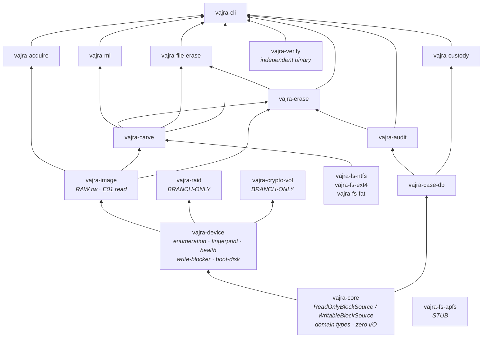

# Vajra Project Documentation

**Version of record:** pre-merge snapshot review
**Scope:** complete technical and project-level record of the Vajra platform
**Companion documents:** `README.md` (short overview), `docs/user-manual.md` (command reference), `docs/standards-mapping.md` (standards register), `docs/Vajra_Master_Technical_Document.md` (design blueprint)

---

## About this document

This is the detailed technical record behind the README. It documents what the Vajra source tree actually contains across all available branch snapshots, not what the design blueprint proposes.

**Source of truth, in priority order:** current source code → Cargo and package manifests → configuration files → tests → generated assets and models → previously verified documentation → design documents. Where the blueprint describes behaviour the code does not implement, this document records the code.

**Status labels** are used throughout and are not interchangeable:

| Label | Meaning |
|---|---|
| **IMPLEMENTED** | Functional in current source |
| **PARTIAL** | Present and working for a defined subset; gaps named explicitly |
| **STUB** | Type or module exists; no working implementation |
| **TESTED ON SYNTHETIC DATA** | Exercised only against generated fixtures |
| **TESTED ON MOCK DEVICE** | Exercised only against the in-memory mock device |
| **NOT REAL-HARDWARE VERIFIED** | No verified execution against physical media |
| **BRANCH-ONLY** | Exists on a development branch, not on `main` |
| **PLANNED** | Named in project source or documents; not implemented |

**Snapshots inspected:** `main`, `vaibhavi`, `hari-priya`, `nitya`, `syed-zahid`. The project is pre-merge; no merge was performed and no source file was modified in producing this document.

**Desktop interface:** desktop interface work exists on development branches and is documented separately. This document records UI facts only where directly verified from source, and makes no interface recommendations.

---

## 1. Project Overview

Vajra is an offline-first digital forensics and secure data sanitization platform implemented as a Rust workspace of 20 crates with a command-line front end.

It covers two operational modes over the same storage abstraction:

- **Forensic Mode (read-only)** — device discovery and fingerprinting, forensic image acquisition, filesystem-level recovery of deleted entries, signature and structure-based file carving, and confidence-scored artifact output.
- **Sanitization Mode (destructive)** — media-aware method recommendation, a two-phase authorization gate, overwrite execution, five-layer verification, and signed sanitization certificates.

Both modes write to a shared evidence spine: an encrypted-by-design case database, a hash-chained signed audit log, a validated chain of custody, six report types, and a standalone verifier that shares no code with the report generator.

**Intended authorized use.** Vajra is a tool for examiners operating on media they are lawfully entitled to examine or destroy. It implements no authentication bypass, no encryption bypass, no key recovery and no cryptanalytic attack. Encrypted volume support (branch-only) unlocks a volume using credentials the operator already lawfully holds. This is a design boundary of the project, not a temporary restriction.

**Offline operation.** The single outbound network call anywhere in the backend is an optional RFC 3161 timestamp request during report generation, which degrades to a local timestamp when unreachable. No telemetry, no cloud service, no license server.

---

## 2. Problem Statement

Three specific gaps motivate the design, and each maps to an implemented mechanism.

**Recovery output is asserted rather than qualified.** Most carving tools present a recovered file as recovered. An examiner cannot tell whether the object passed a structural parse, whether its extents were still marked free in the allocation bitmap, or whether it was reassembled across a fragment gap. Vajra attaches a six-signal confidence breakdown and a free-text `recovery_limitations` field to every `RecoveredArtifact`, and records provenance (source LBAs, fragment ranges, gap size) alongside the payload.

**Erasure is claimed rather than proven.** A wipe tool typically reports the status of the command it issued. That status says nothing about what a determined recovery attempt would find. Vajra verifies across five independent layers, the last of which runs its own recovery engine against the sanitized device; any artifact recovered forces the overall result to `Failed` regardless of the other four layers.

**Evidence handling depends on the tool being honest about itself.** A self-consistent audit log proves nothing if the tool that wrote it can rewrite it. Vajra hash-chains and signs the audit log, supports exporting a signed chain-head anchor to external media, and ships `vajra-verify` as a separate binary that re-implements every verification check with no dependency on the code that produced the report.

A fourth constraint shapes the whole system: forensic and sanitization work frequently occurs in air-gapped or evidence-controlled environments. Offline-first is therefore an architectural requirement rather than a feature.

---

## 3. Design Principles

Each principle below is stated with the implementation that enforces it. Principles without an enforcing mechanism are not listed.

**Read-only forensic abstraction, enforced by types.** `vajra-core` splits block access into `ReadOnlyBlockSource` and `WritableBlockSource` (`crates/vajra-core/src/traits.rs`). An analysis path that holds only a `ReadOnlyBlockSource` cannot write to evidence, and the compiler enforces this rather than code review. The corollary is compositional: any new backend that implements the trait becomes usable by the whole analysis stack without downstream change.

**Offline-first.** Verified by dependency inspection: the only network-capable dependency in the workspace is `ureq`, used solely by `vajra-audit` for optional RFC 3161 timestamping, with a documented offline fallback path.

**Evidence integrity by construction.** Hash-chained audit entries, Ed25519 signatures, database triggers that make case closure irreversible and case deletion impossible, and a device fingerprint that is stable across interface changes.

**Recovery confidence over binary claims.** Six weighted signals per artifact, with the breakdown preserved rather than collapsed into the composite score.

**Sanitization verification independent of the sanitization path.** Layer 5 re-invokes `vajra-carve` — the same code path used for evidence recovery — against the wiped device, and overrides all other layers on any hit.

**Independent verification.** `vajra-verify` has no `vajra-audit` dependency in its manifest and re-implements the hash chain, signature check and certificate handling from scratch. Verified: `grep` for `vajra_audit` in `crates/vajra-verify/src` returns only a doc comment stating the intent.

**Reproducibility.** Every test fixture is generated by a script in `scripts/` from documented parameters, so any reported measurement can be regenerated by a third party.

**Explicit limitations.** `RecoveredArtifact` carries a `recovery_limitations` field; the sanitization certificate carries a `residual_risk_warning`; `MetadataConfidence` distinguishes Confirmed / Partial / Low rather than reporting recovery as certain. The intent is that the tool states its own uncertainty in its output, not only in its documentation.

---

## 4. System Architecture



Arrows point in the direction of dependency (lower crate is depended upon by higher crate).

Three edges are worth naming because they are not obvious from a layer diagram:

- **`vajra-carve` → `vajra-erase`.** The sanitization engine depends on the recovery engine, because verification Layer 5 runs the recovery pipeline against the sanitized device.
- **`vajra-audit` → `vajra-erase`.** Sanitization certificates are signed using `vajra-audit`'s Ed25519 key handling.
- **`vajra-verify` is outside the graph.** It is linked into `vajra-cli` for convenience but depends on none of the evidence crates; it can be built and run standalone.

A rendered version of this diagram is available at `docs/architecture.png`.

---

## 5. Repository / Workspace Structure

```
Cargo.toml            workspace manifest, 20 members, shared dependency versions
Cargo.lock            214 resolved packages
config/
  signatures.json     runtime file-signature database
crates/               20 Rust crates (below)
docs/
  Vajra_Master_Technical_Document.md   design blueprint (§ references)
  agent-log/                            per-phase implementation logs
  team-roles/                           scope definitions
ml-models/
  file_type_classifier.onnx             ONNX export (not loaded at runtime)
  file_type_classifier_trees.json       tree dump consumed by vajra-ml
  model_metadata.json                   classes, features, measured metrics
scripts/
  generate_ground_truth_images.py       NTFS/ext4/FAT images with known deleted files
  generate_carve_corpus.py              carving corpus
test_data/                              synthetic images and candidate fixtures
training/                               Python dataset generator, feature extractor, trainer
```

### Workspace members

| Crate | Responsibility | Major dependencies | Architectural role | Status |
|---|---|---|---|---|
| `vajra-core` | Block-source traits, `MediaType`, `IoError`, `DeviceFingerprint`, `WriteBlockerMetadata`, `SanitizeMethod`, shared filesystem types, `detect_filesystem` | serde, sha2, thiserror, chrono, hex, tracing | Foundation; contains no I/O and no platform syscalls | IMPLEMENTED |
| `vajra-device` | Device enumeration, fingerprinting, health, write-blocker and boot-disk detection, `PhysicalDrive` / `WritablePhysicalDrive` | vajra-core, sha2, serde | Only crate performing platform device syscalls | PARTIAL (§7) |
| `vajra-image` | RAW/DD read+write, E01 read, `ImageFormat` metadata | vajra-core, ewf, sha2 | Presents images as block sources | PARTIAL (§14) |
| `vajra-acquire` | Acquisition profiles, bad-sector map, dual-phase hashing, checkpoint/resume | vajra-core, vajra-image, vajra-case-db, vajra-audit, vajra-custody | Device → forensic image | IMPLEMENTED / NOT REAL-HARDWARE VERIFIED |
| `vajra-fs-ntfs` | `$MFT`, `$Bitmap`, USN records, unallocated MFT scan | vajra-core | Tier-1 metadata recovery | PARTIAL (§15.1) |
| `vajra-fs-ext4` | Superblock, group descriptors, inodes, extent trees, directory slack | vajra-core | Tier-1 metadata recovery | PARTIAL (§15.2) |
| `vajra-fs-fat` | FAT12/16/32 chains, LFN, deleted entries | vajra-core | Tier-1 metadata recovery | PARTIAL (§15.3) |
| `vajra-fs-apfs` | APFS object map, snapshots | vajra-core | — | STUB (2-line `lib.rs`) |
| `vajra-carve` | Three-tier recovery, signature database, structural validators, confidence model, entropy analyzer trait | vajra-core, vajra-fs-*, sha2, crc32fast, flate2 | Recovery engine; also consumed by sanitization Layer 5 | IMPLEMENTED (limits in §16–19) |
| `vajra-ml` | Gradient-boosted file-type classifier, 280-feature extractor, `EntropyAnalyzer` implementation | vajra-core, vajra-carve, serde_json | Secondary explainable confidence signal | IMPLEMENTED / TESTED ON SYNTHETIC DATA |
| `vajra-erase` | Confirmation gate, decision engine, sanitization methods, five-layer verification, certificates | vajra-core, vajra-device, vajra-carve, vajra-audit, vajra-case-db, rand, rand_chacha | Sanitization engine | PARTIAL (§23) |
| `vajra-file-erase` | Block-level file erasure, live-OS-file primitive, residual artifact scanner | vajra-core, vajra-erase, vajra-fs-*, rand_chacha | File-level sanitization | PARTIAL (§25) |
| `vajra-case-db` | Nine-table case/evidence/operation schema, tombstoning triggers, Argon2id key derivation | vajra-core, rusqlite, argon2, zeroize, uuid | Evidence store | PARTIAL (§30 — at-rest encryption not active) |
| `vajra-audit` | Hash-chained audit log, Ed25519/X.509 signing, chain-head anchoring, six report types, RFC 3161 | vajra-core, vajra-case-db, ed25519-dalek, rcgen, ureq, rand | Evidence integrity and reporting | IMPLEMENTED (limits in §27) |
| `vajra-custody` | Ten custody event types, state-machine validation | vajra-core, vajra-case-db | Custody record | IMPLEMENTED |
| `vajra-verify` | Independent report verifier | serde, sha2, ed25519-dalek, rcgen, anyhow | Verification outside the trust boundary of the generator | IMPLEMENTED (limits in §28) |
| `vajra-cli` | Command dispatch over every crate above | all of the above | Reference front end | IMPLEMENTED |
| `vajra-raid` | RAID 0/5/6 reconstruction, GF(2⁸) Reed–Solomon, mdadm superblock detection | vajra-core, crc32fast, sha2 | Storage source | STUB on `main`; IMPLEMENTED on `syed-zahid` (BRANCH-ONLY) |
| `vajra-crypto-vol` | LUKS / BitLocker / FileVault volume unlock and sector decryption | vajra-core, aes, xts-mode, cbc, pbkdf2, hmac, argon2, sha1, base64 | Storage source | STUB on `main`; PARTIAL on `syed-zahid` (BRANCH-ONLY, §22) |
| `vajra-tauri-app` | Desktop application shell | vajra-core (on `main`) | Desktop interface work exists on development branches and is documented separately | STUB on `main` |

---

## 6. Technology Stack

Determined from `Cargo.toml`, `Cargo.lock`, `training/requirements.txt` and source.

| Layer | Technology | Detail |
|---|---|---|
| Language | Rust, edition 2021 | Workspace `[workspace.package] edition = "2021"` |
| Toolchain | Verified against `rustc` / `cargo` 1.95.0 | No `rust-toolchain.toml` pins a version; no MSRV is declared in any manifest |
| Resolver | Cargo resolver 2 | `resolver = "2"` |
| Database | SQLite via `rusqlite` 0.32 with the `bundled` feature | SQLite amalgamation compiled from source; no system SQLite required. See §30 for the encryption finding |
| Hashing | `sha2` (SHA-256) | Content hashes, audit chain, fingerprints, certificates |
| Signatures | `ed25519-dalek` 2.2 | Audit entries, reports, certificates, anchors |
| Certificates | `rcgen` 0.13 | Self-signed X.509 generation |
| Key derivation | `argon2` 0.5 (Argon2id) | Case database passphrase → key material |
| Secret hygiene | `zeroize` 1.9 | Key material zeroed on drop |
| CSPRNG | `rand` 0.8 + `rand_chacha` 0.3 | Overwrite pattern generation, statistical LBA sampling |
| Serialization | `serde` 1.0, `serde_json` 1.0 | Canonical JSON for hashing and signing; all persisted records |
| Compression / checksums | `flate2` 1.1, `crc32fast` 1.5 | PNG chunk CRC, ZIP structures |
| Forensic image format | `ewf` 0.4.10 | E01 read support |
| Time | `chrono` 0.4 | Timestamps throughout |
| Identifiers | `uuid` 1.26 | Case, evidence, operation, report identifiers |
| Errors | `thiserror` 2.0, `anyhow` 1.0 | Library and binary error handling respectively |
| Logging | `tracing` 0.1, `tracing-subscriber` 0.3 | Structured logging |
| Network | `ureq` 2.12 | RFC 3161 timestamp requests only |
| ML runtime | None — pure Rust | Tree ensemble evaluated natively from a JSON dump; no ONNX runtime, no C++ dependency, no GPU |
| ML training (offline) | Python: numpy, scipy, scikit-learn, lightgbm, onnx, skl2onnx, onnxruntime | `training/requirements.txt`; not required to build or run Vajra |
| Fixture generation | Python 3 standard library (`struct`, `zlib`, `random`, `json`, `subprocess`) | `scripts/*.py` |
| Encrypted volumes (branch) | `aes` 0.8, `cipher` 0.4, `xts-mode` 0.5, `cbc` 0.1, `pbkdf2` 0.12, `hmac` 0.12, `sha1` 0.10, `base64` 0.22 | Added by `syed-zahid` for `vajra-crypto-vol` |
| Desktop shell | Tauri appears as a dependency on development branches only | On `main`, `vajra-tauri-app` depends on `vajra-core` alone. Desktop interface work is documented separately |

No technology outside this list is used by the backend.

---

## 7. Device Layer

`vajra-device` is the only crate that performs platform device syscalls. Its public surface: `enumerate_devices()`, `DeviceDescriptor`, `PhysicalDrive` (read-only), `WritablePhysicalDrive`, health query, write-blocker detection and boot-disk detection.

| Capability | Windows | Linux | macOS | Status |
|---|---|---|---|---|
| Device enumeration | Yes | Yes | `syed-zahid` only, via `diskutil` subprocess | IMPLEMENTED / BRANCH-ONLY for macOS |
| Read-only open (`PhysicalDrive`) | Yes | Yes | Branch | IMPLEMENTED |
| Writable open | Yes | Yes | Branch | IMPLEMENTED |
| Deterministic fingerprint | Yes | Yes | Branch | IMPLEMENTED (§8) |
| SMART / NVMe health | Yes | **Placeholder — returns a nominal value without querying the drive** | Branch, via `smartctl` subprocess | PARTIAL |
| Boot-disk detection | Yes | Yes, including LVM / device-mapper slave traversal | Branch | IMPLEMENTED |
| Write-blocker detection | Vendor/model string match, OS read-only flag | Same | Branch | PARTIAL |
| Write-blocker via USB VID/PID | Table exists; **no backend extracts a VID/PID, so the path never fires** | Same | Same | STUB |
| SCSI Mode-Sense write-blocker detection | Declared in `WriteBlockerDetectionMethod`; not implemented | — | — | STUB |
| HPA / DCO detection | Data structure modelled; **no detection logic on any platform** | — | — | STUB |
| Controller sanitize commands (ATA/NVMe/SCSI) | `issue_sanitize` returns `UnsupportedOperation` for every hardware method | Same | Same | STUB — see §23 |

Unsupported targets return `IoError::UnsupportedOperation` rather than degrading silently, which is the correct behaviour for a forensic tool but means the platform matrix above is the real constraint.

**Real-hardware status.** Read-only enumeration, fingerprinting and health have been exercised against physical drives on Windows and Linux during development. No destructive operation has been run against physical media at any point in the project.

---

## 8. Device Fingerprinting

Implemented in `crates/vajra-core/src/fingerprint.rs`. IMPLEMENTED.

The fingerprint is SHA-256 over a length-prefixed concatenation of:

1. normalised serial number (length-prefixed)
2. normalised model string (length-prefixed)
3. capacity in bytes, little-endian `u64`
4. a 512-byte boundary sample read from the device

**Rationale for each choice, as reflected in the code and its tests:**

*Length prefixing* prevents the concatenation ambiguity where two different `(serial, model)` pairs produce the same byte stream.

*Normalisation* of serial and model absorbs whitespace and case differences that vary between enumeration paths on the same drive.

*The interface string is deliberately excluded.* A drive attached directly over SATA and the same drive attached through a USB bridge must fingerprint identically, otherwise checkpoint resume and evidence identity break when an examiner changes the attachment. There is an explicit test asserting this property.

*The boundary sample* distinguishes two devices whose reported serial and model are identical — a real condition with cheap USB controllers that report a fixed serial.

The fingerprint is used for: evidence identity in the case database, checkpoint/resume validation in `vajra-acquire` (a resume is refused if the fingerprint does not match), and device identification on sanitization certificates.

---

## 9. Case and Evidence Management

`vajra-case-db`. IMPLEMENTED, with the at-rest encryption caveat in §30.

**Schema** — nine tables plus a migrations table (`crates/vajra-case-db/src/schema.rs`):

| Table | Contents |
|---|---|
| `cases` | Case identity, examiner, status, timestamps |
| `evidence_items` | Registered evidence, device fingerprint, acquisition linkage |
| `forensic_images` | Image path, format, hashes, source evidence |
| `operations` | Every recorded operation with type and result |
| `recovered_artifacts` | Carved and recovered artifact records |
| `sanitization_events` | Sanitization operations and outcomes |
| `custody_events` | Chain-of-custody records |
| `audit_log` | Persisted hash-chained audit entries |
| `reports` | Generated report envelopes |
| `_schema_migrations` | Schema version tracking |

**Case lifecycle and tombstoning.** Case status is two-state: `Active → Closed`. Irreversibility is enforced twice — once in application code and once by a `BEFORE UPDATE` SQL trigger that aborts any transition out of `Closed`. A second trigger unconditionally aborts any `DELETE` against a case row. Deleting a case is therefore not possible through the application or through direct SQL against the same database file with the schema intact.

**Key handling.** A passphrase is stretched with Argon2id (64 MB memory, 3 iterations) into key material held in a zeroize-on-drop wrapper, and rendered as a hex string for a SQLCipher `PRAGMA key` (`crates/vajra-case-db/src/key.rs:52`, issued at `db.rs:51`). See §30 for why this does not currently encrypt anything.

---

## 10. Audit Logging

`vajra-audit`. IMPLEMENTED.

**Entry payload:** `{seq, timestamp, operator_id, case_id, operation, target_descriptor, result}`.

**Chain construction:**

```
entry_hash = SHA-256( canonical_json(payload) ‖ "||" ‖ prev_hash )
```

The genesis entry links to a fixed genesis value. Canonical JSON serialization is used so that the hash is stable across serializer versions and field ordering.

**Verification** independently checks four properties: sequence monotonicity, backward hash linkage entry to entry, genesis linkage, and per-entry payload integrity (recomputing each entry's hash from its stored payload).

**Signing.** Entries are signed with Ed25519 via `ed25519-dalek`, using an operator key pair managed by `vajra-audit::pki`.

**Threat model addressed.** The chain detects insertion, deletion, reordering and payload modification of entries within a log. It does not by itself detect wholesale regeneration of a self-consistent forged log by an attacker holding the signing key — that is the specific gap external anchoring addresses (§12).

---

## 11. Chain of Custody

`vajra-custody`. IMPLEMENTED.

**Ten event types:** `Seized`, `Received`, `StorageChange`, `Transferred`, `WriteBlockerAttached`, `AnalysisStarted`, `AnalysisCompleted`, `WorkingCopyCreated`, `Returned`, `Disposed`.

**State machine rules enforced:**

- The first event for an evidence item must be `Seized` or `Received`.
- No event may follow a terminal state (`Returned`, `Disposed`).
- A `Transferred` event requires both a transferring and a receiving party.
- Event timestamps must be monotonically non-decreasing.

**Stated limitation, present in the crate's own output.** The custody module records operator-reported events and checks their internal consistency. It does not and cannot verify that a physical transfer occurred, that the named parties were present, or that the recorded time matches reality. Custody records are evidence of what was entered into the system, not proof of physical handling. This framing is deliberate and should not be softened in downstream materials.

---

## 12. External Audit Anchoring

IMPLEMENTED.

The chain head can be exported as a signed anchor record:

```
VAJRA_ANCHOR_V1:{case_id}:{seq}:{chain_head_hash}:{timestamp}:{operator_id}
```

signed with the operator's Ed25519 key. Re-verification checks two things: that the anchor's own signature is valid, and that the anchored `(seq, hash)` pair still matches the live chain at that sequence number.

**What this defends against.** An attacker who compromises the machine and holds the signing key can regenerate an internally consistent forged audit log. Such a log will still fail against a previously exported anchor, because the forged chain will not reproduce the anchored hash at the anchored sequence number.

**Trust boundary — stated precisely.** The anchor file is written to the local filesystem by the tool. The security property depends entirely on the anchor subsequently being placed on media outside the attacker's control (write-once media, a separate custody-controlled system, a third party). Vajra does not and cannot enforce that placement; it is an operator procedure. An anchor left on the same machine as the log provides no additional protection against an attacker with write access to both.

---

## 13. Forensic Acquisition

`vajra-acquire`. IMPLEMENTED / NOT REAL-HARDWARE VERIFIED for the destructive-adjacent paths; read paths exercised against synthetic images and, during development, against physical drives read-only.

**Profiles** (`crates/vajra-acquire/src/profile.rs`):

| Profile | Definition | Status |
|---|---|---|
| `Physical` | Full LBA range of the device | IMPLEMENTED |
| `Partial { start_lba, end_lba }` | Explicit bounded range | IMPLEMENTED |
| `Logical { target_description, start_lba, end_lba }` | Bounded range with a description | PARTIAL — this is a described range, **not** filesystem-aware selective extraction |

**Bad-sector handling.** A three-step path: retry the chunk with linear backoff; on continued failure, recursively reduce the block size down to single-sector reads; a sector that still fails is recorded in an authoritative `BadSectorMap` and the output is filled with a non-ambiguous `VAJRA_BAD_SECTOR` placeholder. The placeholder matters — an unreadable region filled with zeros is indistinguishable from a legitimately zeroed region, which would corrupt every downstream inference about the media.

**Hashing.** Dual-phase on a fresh acquisition: a rolling SHA-256 computed during the copy, then an independent re-read of the completed image hashed separately and compared. Divergence indicates a write-path or storage fault.

**Checkpoints and resume.** A checkpoint is written every 10,000 blocks by default, recording position, partial hash state and the source device fingerprint. Resume validates the stored fingerprint against the currently attached device and refuses to continue on mismatch.

**Verified gap.** The independent re-read verification pass runs on a fresh acquisition but **not** on a resumed one; on resume, a single hash value is recorded for both the rolling and independent fields. An acquisition completed via resume therefore carries weaker verification than one completed in a single pass, and that distinction is not currently surfaced in the acquisition record.

**Testing status.** Clean round-trip with hash verification, partial ranges, the full bad-sector flowchart, transient-failure recovery with backoff, block-size reduction, interrupted-acquisition resume, and resume rejection on fingerprint mismatch — all TESTED ON SYNTHETIC DATA against generated images and fault-injecting mock sources. Acquisition from a physical device uses `PhysicalDrive::open_readonly` and requires a real device path; it is NOT REAL-HARDWARE VERIFIED in any automated test.

---

## 14. Forensic Image Formats

`vajra-image`. `ImageFormat` enum: `Raw`, `E01`, `Aff4` (`crates/vajra-image/src/metadata.rs:8`).

| Format | Read | Write | Status | Notes |
|---|---|---|---|---|
| RAW / DD (`.raw`, `.dd`, `.img`, `.bin`) | Yes | Yes | IMPLEMENTED | Flat byte stream; the format used by all acquisition and test paths |
| E01 (Expert Witness Format) | Yes | No | PARTIAL | Read via the `ewf` crate v0.4.10. No writer exists; Vajra cannot produce an E01 image |
| Ex01 / L01 | Recognised in the `E01` variant's documentation | No | UNVERIFIED | The enum comment names them; no separate handling was verified. Treat as untested |
| AFF4 | No | No | STUB | The variant exists and returns `UnsupportedFormat`. Named as deferred future scope in the source |

`MediaType::ForensicImage` allows an image file to be presented to the rest of the stack as a block source indistinguishable from a physical device, which is what allows the whole recovery pipeline to be tested without hardware.

---

## 15. Filesystem Engines

All three parsers produce the shared `RecoverableFileEntry` type with a `DataLocation` (Contiguous / Fragmented / Resident / Unresolved) and a `MetadataConfidence`.

**Confidence derivation is identical across all three:** `Confirmed` when every resolved cluster or block is still marked free in the allocation bitmap; `Partial` when only some are; `Low` when the bitmap is unavailable or none are free. A surviving metadata record alone never yields `Confirmed` — the reasoning is that a record can survive while its data blocks have been reallocated and overwritten.

### 15.1 NTFS — `vajra-fs-ntfs` — PARTIAL

**Structures parsed:** `$MFT` with update-sequence-array fixup replay; `$STANDARD_INFORMATION` (0x10), `$FILE_NAME` (0x30) and `$DATA` (0x80) attributes, both resident and non-resident, with signed-delta data-run decoding; `$Bitmap` read from MFT record 6.

**Recovery technique:** linear sector-by-sector scan of every MFT record, rather than a directory index walk.

**Deleted-file strategy:** records with the in-use flag clear are collected; their data extents are resolved from the run list and cross-referenced against `$Bitmap` for confidence. A separate bounded scan of unallocated clusters (capped at 200,000 clusters) locates orphaned `FILE` records whose MFT entries no longer exist — this is what makes recovery after a quick format work.

**Known gaps:**
- `$LogFile` is **not parsed**, despite being named in the crate's own module documentation. STALE DOCUMENTATION CLAIM.
- USN journal record parsing exists and is correct, but nothing in the crate locates or reads the `$UsnJrnl:$J` stream, so the parser is not reached by the enumeration path.
- `$ATTRIBUTE_LIST`, `$OBJECT_ID`, `$SECURITY_DESCRIPTOR`, `$INDEX_ROOT` and `$INDEX_ALLOCATION` constants are declared but never parsed. Because directory indices are not walked, `parent_mft_ref` is captured but unused and every recovered path is flattened to `/filename` rather than its true nested path.
- VSS handling is a filename and GUID substring heuristic against MFT filenames, not shadow-copy store parsing. STALE DOCUMENTATION CLAIM where described as VSS support.

### 15.2 ext4 — `vajra-fs-ext4` — PARTIAL

**Structures parsed:** superblock at byte 1024 with `0xEF53` magic check; 32-bit and 64-bit group descriptors; inodes (mode, uid/gid, split 64-bit size, timestamps, links, flags); extent trees via recursive `0xF30A` node walk, depth-bounded to 5.

**Recovery technique:** genuine recursive directory tree walk from root inode 2 with correct full-path reconstruction, plus a complete inode-table sweep for unlinked or orphaned inodes not reachable from any directory.

**Deleted-file strategy — the most capable of the three.** ext4's `unlink` expands the preceding directory entry's `rec_len` to cover the removed entry rather than erasing it. The parser scans that slack region within each directory block and recovers the hidden entries, which is how filenames survive deletion on ext4. There is a dedicated test proving this behaviour.

**Known gaps:**
- Legacy (non-extent) inodes resolve **only the 12 direct block pointers**. Single, double and triple indirect blocks are not walked, so any non-extent file larger than roughly 12 blocks resolves with incomplete extents.
- JBD2 journal parsing exists (`journal.rs` — superblock header only, no transaction or descriptor-block replay) but `Jbd2JournalInfo` is never called from the enumeration path. Dead code.

### 15.3 FAT — `vajra-fs-fat` — PARTIAL

**Structures parsed:** BPB with boot-signature validation and FAT-type derivation from cluster count and `root_cluster`; FAT12, FAT16 and FAT32 table entry decoding with correct EOF and bad-cluster sentinels.

**Recovery technique:** directory walk plus a bounded scan of unallocated clusters (capped at 100,000) for orphaned directory fragments.

**Deleted-file strategy:** `0xE5` marker detection with 8.3 name reconstruction, substituting a placeholder for the destroyed first byte. Long filenames are reconstructed from LFN chunks, including the correction that deleted LFN chunks appear in reverse disk order. Data resolution takes one of two paths: if the FAT chain survived, it is followed; if the chain was zeroed — the typical case — a contiguous run of `ceil(size / cluster_size)` clusters is reconstructed from the start cluster. That reconstruction is an assumption, and it is correctly graded down in confidence when any assumed cluster is not free.

**Known gaps:** exFAT is not supported anywhere in the crate. Verified by search: no exFAT boot-sector branch and no `exfat` identifier exists in any filesystem crate.

### 15.4 APFS — `vajra-fs-apfs` — STUB

`lib.rs` is two lines: a module doc comment and `#![allow(dead_code)]`. No structures, no functions, no tests.

---

## 16. Recovery Architecture

Three tiers execute in precedence order against a shared `AllocatedBlockMap`.

**Precedence and allocated-block tracking.** Tier 1 runs first and records every LBA it resolves in the `AllocatedBlockMap`. Tiers 2 and 3 skip any LBA present in that map. Only `Confirmed` and `Partial` confidence Tier-1 entries claim sectors — a `Low` confidence entry does not suppress carving over the same region, on the reasoning that a weak metadata claim should not prevent a strong structural one. Tier 2 marks the sectors of every accepted artifact, and Tier 3 marks both fragment ranges of every reassembled artifact.

**Tier 1 — filesystem metadata.** Thin orchestration over `vajra-fs-ntfs` / `-ext4` / `-fat`, converting `RecoverableFileEntry` into `RecoveredArtifact` and computing SHA-256 over the payload. This is the only tier that recovers the original path and filename.

**Tier 2 — signature and structural validation.** Sector-by-sector scan for signature headers from the runtime database, dispatch to the matching structural validator, and acceptance of the result. Detail in §17–18.

**Tier 3 — bifragment gap carving.** For two-fragment files, an O(n²) split-point × gap-size search using the empirically-derived gap order — 8, 16, 32, 4, 64, 24, 40, 128, 256, 512, 1024, 2048 sectors — before falling back to a linear scan, with `err_is_prefix` early rejection to prune the search. Candidate sizes 2 through 16 sectors are tried by default with a bounded search radius. Full provenance is retained: source LBAs for both fragments and the gap between them.

**Verified limitations of the tier structure:**
- Tier 2 accepts only `ValidationResult::Ok`. Every validator correctly returns `Eof` with a `partial_length` for a truncated candidate, but the pipeline discards those, so truncated objects that are structurally identifiable are not surfaced as partial recoveries. `ValidationResult::to_confidence()` — which defines `V_EOF = 0.5` — exists in `validator.rs` and has no call site.
- Tier 3 handles the two-fragment case only. N-fragment reassembly is PLANNED.

---

## 17. Structural Validators

All validators implement `StructuralValidator`:

```rust
fn validate(&self, data: &[u8]) -> ValidationResult;   // Ok{object_length} | Eof{partial_length} | Err(String)
fn flags(&self) -> ValidatorFlags;                      // err_is_prefix, appended_data_ignored, no_zblocks
fn file_type(&self) -> &str;
```

This is Garfinkel's fast-object-validation framework (DFRWS 2007): `V_OK` / `V_ERR` / `V_EOF` with per-format flags that tell the carver how aggressively it may prune the search space. Each validator's flag values are justified in a source comment rather than asserted.

**Registered validators** (`crates/vajra-carve/src/tier2/mod.rs`, `ValidatorRegistry::default`) — seven on the `vaibhavi` branch, five on `main`:

| Validator | Validation performed | Branch |
|---|---|---|
| `jpeg` | SOI/EOI framing and segment-marker walk | main |
| `png` | Chunk walk with per-chunk CRC verification through `IEND` | main |
| `pdf` | Header and `%%EOF` framing, object-structure checks | main |
| `zip` | Local file headers and end-of-central-directory; covers DOCX/XLSX/PPTX | main |
| `sqlite` | Header field validation and page-structure consistency | main |
| `ole2` | Compound File Binary header validation, FAT/DIFAT/MiniFAT sector-chain consistency, exact object length derived from the allocation table | `vaibhavi` — BRANCH-ONLY |
| `mp4` | ISO-BMFF box-tree walk (below) | `vaibhavi` — BRANCH-ONLY |

### 17.1 OLE2 / CFB

Reference: `[MS-CFB]`. Validates the compound-file header fields, then walks the FAT, DIFAT and MiniFAT sector chains checking for consistency — reserved sector identifiers (`MAXREGSECT`, `DIFSECT`, `FATSECT`, `ENDOFCHAIN`, `FREESECT`), chain termination, and absence of cycles. Object length is computed exactly from the allocation table as `(highest_non_FREESECT_index + 2) × sector_size` rather than being guessed from a maximum size.

Flags: `err_is_prefix: false`, `appended_data_ignored: true`, `no_zblocks: false`. The `false` on `err_is_prefix` is the significant one: the FAT is a random-access allocation table, not a stream parsed front to back, so a parse failure at one offset carries no information about whether a longer candidate would parse.

Covers legacy DOC, XLS and PPT.

### 17.2 MP4 / ISO-BMFF

Reference: ISO/IEC 14496-12.

**Detection — `ftyp` at offset 4.** An ISO-BMFF file does not begin with its magic. Bytes 0–4 are the big-endian size of the first box; the literal `ftyp` tag begins at byte 4:

```
 0..4   box size    (varies per file — not a usable signature)
 4..8   'ftyp'      (the actual magic)
 8..12  major_brand
12..16  minor_version
16..    compatible_brands[]
```

Detection therefore uses the signature database's `header_offset` mechanism with `header = "ftyp"` and `header_offset = 4`. Anchoring on the size bytes would be brittle — `00 00 00 18` is one of many valid first-box sizes. The candidate buffer still begins at byte 0; `header_offset` moves where the magic is sought, not where the object starts, so the validator receives the size field it needs.

**Supported box-size forms:**

| Form | Meaning | Handling |
|---|---|---|
| `size > 8` (32-bit) | Ordinary box | Walked |
| `size == 1` | 64-bit extended size follows the type tag | Walked |
| `size == 0` | Box extends to end of file | Handled as a terminal box |
| `size < 8` | Structurally impossible | Malformed |

Box types handled at the top level: `ftyp`, `moov`, `mdat`, `moof`, `free`, `skip`, `wide`.

**Three-outcome scan.** The walk distinguishes three reasons for stopping, which is what makes carving from a sector-padded disk window correct:

- **Truncated** — a well-formed header declares an extent running past the supplied data. The object genuinely continues beyond the slice, so this is `V_EOF`, never `V_OK`, even when `ftyp` and a media box have already been seen. Reporting `V_OK` here would carve a partial recording and label it whole.
- **Malformed** — the bytes are not a box header at all (non-printable type tag, size below header length, arithmetic overflow). On a real disk this is what sector padding or the next file looks like, so it marks the natural end of the object: `V_OK` if already complete, else `V_ERR`.
- **Exhausted** — fewer than 8 bytes remain. A complete object followed by a short padding stub lands here and is still recognised as complete.

The type tag is checked **before** the size, so a run of zero padding (type `00 00 00 00`) is classified Malformed — end of object — rather than being read as a `size == 0` extends-to-EOF box.

**Completeness** requires a valid `ftyp` **and** at least one of `moov`, `mdat` or `moof`. A candidate holding only `ftyp` plus padding boxes yields `V_EOF`, not `V_ERR` — more data could complete it, which is exactly what `V_EOF` means. A second top-level `ftyp` ends the object, since ISO/IEC 14496-12 specifies `ftyp` occurs once and first; without this rule two adjacent MP4 files are swallowed as one.

Flags: `err_is_prefix: true`, `appended_data_ignored: true`, `no_zblocks: false`.

**QuickTime relationship — stated precisely.** Modern QuickTime/MOV files that carry an ISO-BMFF-style `ftyp` box are accepted by the same validator, because they share the container. **This is not universal MOV support.** Older QuickTime layouts that do not begin with an `ftyp` box are not detected at all, and no claim of general `.mov` compatibility should be made from this implementation.

**`moov` reconstruction is NOT implemented.** The blueprint's interrupted-recording scenario — an intact `mdat` with a missing or truncated `moov` index — is not recoverable by the current validator. This is a deliberate deferral recorded in the module documentation: the current `ValidationResult` interface has no way to express "this object was reconstructed rather than found", and emitting a reconstructed file through the ordinary `Ok` path would misrepresent what was recovered. PLANNED, dependent on an interface change.

**Candidate-window limitation — still applicable.** Tier 2 reads at most `max_sectors.min(2048)` sectors, i.e. 1 MiB, into the candidate buffer (`crates/vajra-carve/src/tier2/mod.rs:130`). Objects larger than 1 MiB are validated only within that window. For MP4 this is material: most real-world video files exceed 1 MiB, and such a candidate will report `V_EOF` (correctly — the object does continue) and therefore be discarded by Tier 2, which accepts only `V_OK`. **The MP4 validator is structurally correct but the surrounding pipeline currently limits it to small files.** This is the single most consequential open limitation in the carving path.

---

## 18. Signature Database

`config/signatures.json`, loaded at runtime by `SignatureDb`. Adding a format requires no recompilation of the signature layer — only a validator registration for a genuinely new format.

**Record schema** (`crates/vajra-carve/src/tier2/signature_db.rs`):

| Field | Type | Meaning |
|---|---|---|
| `file_type` | string | Format identifier; **also the carved file's extension and the `file_type` recorded on the artifact** |
| `header` | array of bytes (decimal) | Magic byte pattern |
| `footer` | array of bytes or `null` | Optional trailing pattern |
| `max_size_bytes` | integer | Upper bound on the read window |
| `validator_id` | string | Key into `ValidatorRegistry` |
| `header_offset` | integer, optional | Byte offset at which `header` is sought; absent means 0 |

**Extension mapping.** The carved filename is built as `carved_file_{id:04}.{sig.file_type}` from the *signature's* `file_type`, not from `validator.file_type()`. The trait method exists but has no production call site; a mismatch between the two would be silent.

**`header_offset` semantics and backward compatibility.** The field is `Option<u32>`, declared `#[serde(default, skip_serializing_if = "Option::is_none")]`. Matching goes through `FileSignature::matches_header()`:

```rust
pub fn matches_header(&self, data: &[u8]) -> bool {
    let start = self.resolved_header_offset();
    let end = match start.checked_add(self.header.len()) { Some(e) => e, None => return false };
    if end > data.len() { return false; }
    data[start..end] == self.header[..]
}
```

`u32` was chosen over `u64` so the conversion to `usize` is lossless on every supported target. With `header_offset` absent, `resolved_header_offset()` returns 0 and the comparison is exactly equivalent to the previous `starts_with` behaviour — an empty header is deliberately not special-cased to preserve that equivalence. All six pre-existing signatures omit the field and behave identically to before its introduction; only `mp4` sets it, to 4.

Match sites: `crates/vajra-carve/src/tier2/mod.rs:115` and `crates/vajra-carve/src/tier3/mod.rs:71`.

**Current contents** — seven entries on the `vaibhavi` branch: jpeg, png, pdf, zip, sqlite, ole2, mp4.

---

## 19. Confidence Model

`crates/vajra-carve/src/confidence.rs`. Six signals with named constant weights summing to 1.0:

| Signal | Constant | Weight |
|---|---|---|
| Structural validity | `WEIGHT_STRUCTURAL` | 0.25 |
| Header/footer integrity | `WEIGHT_HEADER_FOOTER` | 0.20 |
| Metadata cross-reference | `WEIGHT_METADATA` | 0.20 |
| Entropy consistency | `WEIGHT_ENTROPY` | 0.15 |
| Fragmentation confidence | `WEIGHT_FRAGMENTATION` | 0.15 |
| Overwrite probability | `WEIGHT_OVERWRITE` | 0.05 |

The breakdown is preserved on every artifact alongside the composite score, and there is an optional `entropy_explainability` string for the ML signal's per-prediction detail.

**Calibration state — stated plainly.**

1. The source declares these as *"initial baseline weights pending empirical calibration against labeled corpora"* (`confidence.rs:10`). They are not empirically derived.
2. `header_footer_integrity` and `structural_validity` are set to the literal `1.0` at every construction site in Tier 1, Tier 2 and Tier 3 rather than being computed per candidate. **45% of the composite weight is therefore currently a constant**, and the composite score varies only across the remaining four signals.
3. `metadata_cross_reference` is `0.0` for pure carved artifacts by construction, since no metadata record exists to cross-reference.

Consequently the composite confidence score should be read today as a coarse ordering signal, not as a calibrated probability. Decile calibration against ground truth is PLANNED (§41).

---

## 20. ML Classification

`vajra-ml`. IMPLEMENTED / TESTED ON SYNTHETIC DATA.

**Architecture.** A `sklearn.ensemble.GradientBoostingClassifier` (60 estimators, max depth 4) trained offline in Python. The trained tree structure — `children_left`, `children_right`, `feature`, `threshold`, leaf values — is exported to JSON and re-implemented natively in Rust as scalar tree traversal plus softmax (`classifier.rs`). There is **no ONNX runtime, no C++ dependency and no GPU requirement** at inference time; `vajra-ml`'s only non-workspace dependencies are serde, serde_json, thiserror, tracing and hex.

**Model storage.** `ml-models/file_type_classifier_trees.json` is embedded at compile time with `include_str!`. `ml-models/file_type_classifier.onnx` also exists as an export artifact but is **not loaded at runtime** — noting this because its presence implies an ONNX dependency the code does not have.

**Classes — six:** `jpeg`, `png`, `pdf`, `zip`, `sqlite`, `unknown` (`ml-models/model_metadata.json`).

**Features — 280 dimensions:** a 256-bin byte-frequency histogram; a 16-chunk Shannon entropy profile; six bigram statistics (sparsity, top-10 concentration, transition entropy, mean probability, variance, distinct ratio); a longest-printable-ASCII-run ratio; and a chi-square uniformity statistic.

**Train/serve relationship.** The feature extractor exists twice — `training/feature_extractor.py` and `crates/vajra-ml/src/features.rs`. A dedicated parity test (`tests/feature_parity_test.rs`) checks the two implementations agree numerically against `training/parity_fixtures.json`. This is the mechanism that keeps a Python-trained model valid under Rust inference.

**Integration.** `MlEntropyAnalyzer` implements `vajra-carve`'s `EntropyAnalyzer` trait as a swap-in for `HeuristicEntropyAnalyzer`, blending the ML probability with the heuristic (ML dominant at probability ≥ 0.6, heuristic-anchored otherwise) to produce the entropy consistency signal.

**Measured results** (`ml-models/model_metadata.json`): macro precision 0.9964, macro recall 0.9963, macro F1 0.9963.

**Benchmarking caveats — these must travel with the numbers.**

- The test set is **540 samples**.
- The corpus is **entirely synthetic**: `training/dataset_generator.py` constructs JPEG/PNG/PDF/ZIP/SQLite byte sequences programmatically with random noise, truncation and header-stripping variants. No real-world files are involved.
- These figures characterise the model on a generated corpus. They are **not** an estimate of performance on real forensic media, and generalising them would be unsupported.

**Explainability — scope correction.** `ClassificationResult.top_features` returns the top five features by the model's **global** `feature_importances`, paired with the current sample's raw feature values. It is not a per-instance attribution (SHAP or equivalent); the ranked feature list is identical for every prediction. Additionally, `ConfidenceBreakdown.entropy_explainability` is never populated inside `vajra-carve` or `vajra-ml` — it is filled only by `vajra-cli` re-running the classifier after the pipeline completes, for display.

**Coverage gap.** There is no `ole2` or `mp4` class. Artifacts of those types classify as `unknown`, and their entropy signal falls back to the heuristic analyzer's range check.

---

## 21. RAID Support

**BRANCH-ONLY (`syed-zahid`). STUB on `main`** (2-line `lib.rs`).

| Aspect | Status |
|---|---|
| RAID 0 (striping) | IMPLEMENTED |
| RAID 5 (single XOR parity) | IMPLEMENTED |
| RAID 6 (dual parity) | IMPLEMENTED with a genuine GF(2⁸) Reed–Solomon implementation (`galois.rs`, 200 lines — log/antilog tables and field arithmetic, not a placeholder) |
| Degraded-mode reconstruction | IMPLEMENTED — reconstruction of a missing member from parity |
| Metadata detection | **mdadm superblocks only** (`superblock.rs`, 185 lines). No other RAID metadata format — no Intel Matrix / IMSM, no Adaptec, no LSI/MegaRAID, no DDF |
| Exposure to the stack | Implements `ReadOnlyBlockSource`, so `vajra-carve`, `vajra-fs-*` and the rest of the stack consume a reconstructed array with no RAID-specific code |
| Testing | 4 integration tests. TESTED ON SYNTHETIC DATA — arrays are constructed from generated member images, not from real controller output |
| Scope boundary | Local, directly-attached member drives only. Network-attached RAID is explicitly out of project scope |

Source size: 1,078 lines across `array.rs`, `galois.rs`, `layout.rs`, `superblock.rs`, `error.rs`, `lib.rs`.

New CLI commands on this branch: `raid detect`, `raid mount`.

---

## 22. Encrypted Volume Support

**BRANCH-ONLY (`syed-zahid`). STUB on `main`.** 1,280 lines across `luks/`, `bitlocker/`, `filevault/`, `cipher.rs`, `volume.rs`.

This section is stated conservatively because the four format families differ sharply in what is actually implemented.

| Format | Status | Detail |
|---|---|---|
| **LUKS1** | IMPLEMENTED — genuine format support | Real LUKS1 header parsing, PBKDF2 key derivation, AF-split/merge anti-forensic key handling, AES-XTS sector decryption (`luks/luks1.rs`, 221 lines) |
| **LUKS2** | IMPLEMENTED — genuine format support | LUKS2 JSON metadata area, Argon2id key derivation, AES-XTS sector decryption (`luks/luks2.rs`, 252 lines) |
| **BitLocker** | **PROJECT-DEFINED FORMAT ONLY — NOT the Microsoft on-disk format** | `bitlocker/fve.rs` (161 lines) parses a layout defined by this project for testing. It is **not** the real Microsoft FVE metadata structure, and it **will not open a real BitLocker volume**. Any claim of BitLocker support would be unsupported |
| **FileVault** | DETECTION ONLY | `filevault/mod.rs` identifies a FileVault volume; `unlock_filevault` returns `CryptoVolError::NotSupported` in all cases (`filevault/mod.rs:65`). No decryption path exists |

**Cryptographic primitives used:** `aes` 0.8, `xts-mode` 0.5, `cbc` 0.1, `pbkdf2` 0.12, `hmac` 0.12, `argon2` 0.5, `sha1` 0.10 (for LUKS1 PBKDF2-HMAC-SHA1), `base64` 0.22.

**Testing.** 5 tests. One of them, `test_real_luks1_unlock`, **silently no-ops** because its `test_fixtures/` directory is absent from the branch — the test reports as passing without exercising the unlock path. That test therefore provides no evidence for the LUKS1 claim above; the claim rests on source inspection of the header parsing and key derivation code.

**Design boundary, unchanged.** Unlock requires credentials — a password, recovery key or keyfile — that the operator already lawfully holds. There is no bypass, no key recovery and no attack on any of these formats.

---

## 23. Sanitization Architecture

`vajra-erase`. PARTIAL — see the execution matrix below, which is the most important table in this section.

### 23.1 Authorization

A `SanitizationAuthorizationToken` is required by every destructive call signature. Obtaining one requires completing a two-phase gate (`crates/vajra-erase/src/gate.rs`):

```
begin(device, operator_id, typed_serial, confirm) -> PendingSanitization
    ├── hard-rejects system disks
    ├── hard-rejects write-blocked devices
    ├── requires exact serial-number match
    └── requires an initial confirmation flag

PendingSanitization::finalize(self, pre_exec_confirm) -> SanitizationAuthorizationToken
    └── consumes self by value — single use — and requires a second confirmation
```

**Strength of this control, stated precisely.** The gate is a strong workflow control. It is **not** a cryptographic authorization, for two verified reasons:

1. `SanitizationAuthorizationToken` derives `Serialize` and `Deserialize` (`gate.rs:30`). Any external caller can construct an arbitrary token — fake serial, fake fingerprint, fake operator — by deserializing JSON, without ever calling `begin()` or `finalize()`.
2. The token is **not cross-checked against the device at the point of use**. `execute_hardware_sanitize_destructive` takes `_token` unused (`methods/hardware.rs:17`), and `execute_overwrite_pass_destructive` also takes `_token` unused (`methods/overwrite.rs:34`) — where a comment reads `// Security assertion: target path matches token authorization` with no corresponding assertion code (`overwrite.rs:40`).

The token is therefore a compile-time capability marker: it makes the correct workflow the only convenient path and makes a destructive call impossible to write accidentally, but it does not make one impossible to write deliberately.

### 23.2 Decision engine

Inputs: a `DeviceDescriptor` and the list of `SanitizeMethod`s the controller reports supporting. Rule-based, no heuristics (`decision_engine.rs`):

| Media condition | Recommendation |
|---|---|
| Self-encrypting drive | `CryptographicErase` |
| NVMe | `NvmeSanitizeBlock` / `NvmeSanitizeCrypto` / `NvmeFormat` |
| SATA SSD | `AtaEnhancedSecureErase` / `AtaSecureErase` |
| HDD | `HostOverwriteSinglePass` |
| Flash media without controller sanitize support | `HostOverwriteSinglePass` / `HostOverwriteMultiPass` **with an explicit residual-risk warning** |

`SanitizeMethod` variants (`crates/vajra-core/src/sanitize.rs`): `AtaSecureErase`, `AtaEnhancedSecureErase`, `NvmeSanitizeBlock`, `NvmeSanitizeCrypto`, `NvmeFormat`, `CryptographicErase`, `HostOverwriteSinglePass`, `HostOverwriteMultiPass { passes }`, `ScsiSanitizeOverwrite`, `ScsiSanitizeCrypto`.

### 23.3 Execution — the critical matrix

| Method | Real device | Mock device | Status |
|---|---|---|---|
| `HostOverwriteSinglePass` | **Executes** — ChaCha20-seeded patterns from OS entropy, chunked 2048-block writes through `WritableBlockSource` | Executes | IMPLEMENTED / TESTED ON MOCK DEVICE / NOT REAL-HARDWARE VERIFIED |
| `HostOverwriteMultiPass` | **Executes** — zero / ones / random pass sequence, final pass always zero-fill | Executes | IMPLEMENTED / TESTED ON MOCK DEVICE / NOT REAL-HARDWARE VERIFIED |
| `AtaSecureErase` | **Returns `UnsupportedOperation`** | Simulated (zeroes the in-memory buffer) | STUB on real hardware |
| `AtaEnhancedSecureErase` | **Returns `UnsupportedOperation`** | Simulated | STUB on real hardware |
| `NvmeSanitizeBlock` | **Returns `UnsupportedOperation`** | Simulated | STUB on real hardware |
| `NvmeSanitizeCrypto` | **Returns `UnsupportedOperation`** | Simulated | STUB on real hardware |
| `NvmeFormat` | **Returns `UnsupportedOperation`** | Simulated | STUB on real hardware |
| `CryptographicErase` | **Returns `UnsupportedOperation`** | Simulated | STUB on real hardware |
| `ScsiSanitizeOverwrite` | **Returns `UnsupportedOperation`** | Simulated | STUB on real hardware |
| `ScsiSanitizeCrypto` | **Returns `UnsupportedOperation`** | Simulated | STUB on real hardware |

All controller-level methods funnel to `target.issue_sanitize(method)`, whose real implementation (`vajra-device/src/drive.rs:273-296`) falls through to a catch-all returning `IoError::UnsupportedOperation` with the message that hardware protocol command execution will be integrated later. Verified by search: there is no `ioctl`, no ATA `SECURITY_ERASE` command construction and no NVMe admin command byte sequence anywhere in `vajra-device`.

**The consequence must be stated directly:** the decision engine can recommend a method the execution layer cannot perform on real media. For an SSD, NVMe drive or SED, the recommended controller-native method will fail cleanly with an unsupported-operation error rather than silently no-op — which is the right failure mode — but the platform cannot currently carry out its own best-practice recommendation on those media. Closing this is the highest-priority backend gap (§41).

**Standing safety rule, verified as observed throughout the project:** no destructive operation has been run against real hardware at any point. All sanitization testing is against `MockWritableDevice`.

---

## 24. Sanitization Verification

`crates/vajra-erase/src/verify/`. Five layers, then an assurance computation.

| Layer | Implementation | Status |
|---|---|---|
| **1 — Command status** | Pass-through of the `Result` from command execution. `command_status_code` is set to `Some(0)` on success because no real controller status code is available through the block-source abstraction | PARTIAL |
| **2 — Device status** | Checks `total_blocks() > 0 && block_size() > 0`. The source comment states the intent is to query the NVMe Sanitize Status log page or ATA IDENTIFY word 128; that is not implemented. **This layer passes for any responsive device** | STUB in substance |
| **3 — Deterministic sampling** | Reads specified LBAs and checks byte uniformity. Works because the final overwrite pass is always zero-fill | IMPLEMENTED |
| **4 — Statistical sampling** | Hypergeometric-corrected sample size `n ≈ [1 − (1 − C)^(1/(N·p))] · N`, bounded to 10–50,000 sectors, ChaCha20-seeded random LBA selection, per-sector uniformity check | IMPLEMENTED |
| **5 — Independent recovery scan** | Re-invokes the real `vajra-carve` `RecoveryPipeline` (Tier 2 + Tier 3, BGC radius capped at 64 sectors) against the just-sanitized device and fails if **any** artifact is recovered | IMPLEMENTED |

### The Layer-5 override

`verify/mod.rs:100-109` implements the override: if Layer 5 recovers any artifact, `OverallAssurance` is forced to `Failed` regardless of the results of Layers 1 through 4.

The reasoning is that Layers 1–4 all ask variants of "did the operation appear to do what it said". Layer 5 asks the only question that matters forensically — "can data still be recovered from this device by a competent recovery tool" — and it asks it using the project's own recovery engine, the same code path used against live evidence. A device that passes command status, device status, deterministic sampling and statistical sampling but yields a carved artifact has not been sanitized, and no combination of the other four results should be able to outvote that.

There are dedicated tests (`tests/layer5_tests.rs`) proving the override actually fires.

### Assurance cap for flash media

`verify/mod.rs:116-140`. `OverallAssurance` is structurally capped at `Medium` — never `High` — when the media type is `Nvme`, `SataSsd`, `Usb` or `SdCard` **and** the method used was a host-level overwrite. The citation in source is NIST SP 800-88's discussion of FTL and over-provisioning: the host cannot address every physical cell on flash media, so a host-level overwrite cannot be claimed as complete regardless of how many verification layers pass. This cap is code, not documentation policy.

---

## 25. File-Level Erasure

`vajra-file-erase`. PARTIAL.

### Block-level pipeline (`file_eraser.rs`)

For a file on an unmounted image or device, six documented steps:

| Step | Status |
|---|---|
| 1–2. Overwrite data extents — ChaCha20 / 0xFF / 0x00 multi-pass | IMPLEMENTED |
| 3. Zero the metadata record — targeted byte range or whole sector | IMPLEMENTED |
| 4. Journal scrubbing | **NOT PERFORMED.** `let journal_scrubbed = true;` (`file_eraser.rs:126`). No `$LogFile`, `$UsnJrnl` or jbd2 write occurs; the report field reports success unconditionally |
| 5. Free-after-overwrite verification | **NOT PERFORMED.** `let free_after_overwrite_verified = true;` (`file_eraser.rs:130`). No re-check against a live allocation bitmap |
| 6. Residual artifact scan | Runs, but is fed `detected_traces: Vec::new()` unconditionally (`file_eraser.rs:137`) — it never receives an independent byte-level re-scan of the sanitized region |

### Live-OS-file primitive (`local_eraser.rs`)

`erase_local_file_destructive` — IMPLEMENTED and functional: opens the file, performs multi-pass overwrite (random / 0xFF / final 0x00) with `sync_all()` after every pass, `set_len(0)` truncation, then `remove_file`.

**Inherent caveat, not a code defect.** On copy-on-write or journaling filesystems, and on SSDs with wear levelling, an in-place overwrite through the OS file API does not guarantee that the same physical blocks are overwritten. This limitation applies to any file-level overwrite technique and cannot be resolved at this layer.

### Residual artifact scanner (`scanner.rs`)

Five states: `Sanitized`, `ResidualTracesDetected(Vec<String>)`, `PartiallySanitized(String)`, `UnableToVerify(String)`, `NotApplicable(String)`.

`scan()` performs no I/O — it is a pure classifier over booleans and strings supplied by the caller. Given that `journal_scrubbed` is hardcoded `true` upstream and `detected_traces` is always empty, in practice the scanner currently resolves only to `Sanitized` or the generic `ResidualTracesDetected(["Data extents unverified"])`. The three richer states are reachable by the type system but not triggered by the one real caller in the crate.

---

## 26. Sanitization Certificates

`crates/vajra-erase/src/certificate.rs`. IMPLEMENTED, with two field-level caveats.

**Fields:** `certificate_id`; device make, model, serial and SHA-256 device fingerprint; `method`; `standard_reference`; start and end timestamps; per-layer PASS/FAIL summary for all five verification layers; `overall_assurance`; `residual_risk_warning`; `operator_id`; `certificate_sha256`; `digital_signature_hex`; `trusted_timestamp`.

**Signing.** Real Ed25519 via `ed25519-dalek`, using `vajra-audit::pki::OperatorKeyPair`.

**Caveat 1 — unsigned fallback.** If no signing key is supplied, `digital_signature_hex` is the literal string `"UNSIGNED_LOCAL_TEST_KEY"`. This is not a signature and a certificate carrying it has no cryptographic value. Any consumer of a certificate must check this field rather than assuming a signature is present.

**Caveat 2 — timestamp.** `trusted_timestamp` is unconditionally the string `"Not available — generated offline, local timestamp only"` (`certificate.rs:161`). This crate performs no RFC 3161 timestamping; that capability lives in `vajra-audit` and is not wired into certificate generation.

**Residual risk.** `residual_risk_warning` is populated for the flash-media-plus-host-overwrite combination, mirroring the assurance cap in §24, so the certificate states the limitation in text as well as in its assurance level.

---

## 27. Reporting System

`vajra-audit::report`. IMPLEMENTED.

**Six report types** (`report/model.rs:11`): `ForensicExamination`, `SanitizationCertificate`, `AcquisitionReport`, `RecoveryReport`, `DeviceHealthReport`, `ChainOfCustodyReport`.

**Generation pipeline**, shared by all six:

1. Collect real data from the relevant crates (device, acquisition, recovery, sanitization, custody, case database).
2. Serialize to canonical JSON.
3. Compute a SHA-256 content digest.
4. Request an RFC 3161 timestamp (optional, network); on failure, mark the report as locally timestamped and continue.
5. Sign the digest with Ed25519.
6. Embed a self-signed X.509 certificate generated with `rcgen`.
7. Write an audit-chain entry recording the report generation.
8. Persist a `.vjr` envelope and record it in the `reports` table.

**Generated formats — verified.** Reports are produced as signed JSON envelopes with Markdown bodies. **No PDF output exists**, despite a schema column anticipating one. There is no PDF-capable dependency anywhere in the workspace. Any claim of PDF reporting would be unsupported.

**RFC 3161 limitation.** The timestamp response is accepted on HTTP 200 without parsing the PKIStatus field, so a TSA returning a rejection with a 200 status would be recorded as a successful timestamp.

---

## 28. Independent Report Verification

`vajra-verify`. IMPLEMENTED.

**Security boundary.** `vajra-verify` is a separate binary whose manifest contains **no `vajra-audit` dependency**. Its data structures are declared independently — `models.rs` states they exist "to ensure zero dependency on vajra-audit's internal data structures and verification pipelines" — and inspection confirms this: a search for `vajra_audit` in `crates/vajra-verify/src` returns only that doc comment. The two crates share only third-party libraries (`ed25519-dalek`, `sha2`, `hex`).

The property this buys: a bug or a deliberate backdoor in `vajra-audit`'s verification path cannot mask itself, because the verifier does not execute that path. This is the standard argument for an independent checker in evidentiary tooling, and here it holds by construction rather than by convention.

**Checks performed:**

| # | Check | Notes |
|---|---|---|
| 1 | Content SHA-256 against the report envelope | Full recomputation |
| 2 | Ed25519 public key extraction from the embedded X.509 certificate | **Structural, not cryptographic** — see below |
| 3 | Ed25519 signature verification | Genuine cryptographic verification via `ed25519-dalek` |
| 4 | Independent recomputation of the entire audit hash chain | Includes sequence-gap detection and prev-hash linkage |
| 5 | Trusted-timestamp presence and label | Accepts a populated RFC 3161 token with TSA URL, or a status label containing "Local timestamp" |
| 6 | External evidence file SHA-256 against the manifest | Optional |

**Precision on check 2.** The certificate handling is a raw byte-pattern search for the Ed25519 SubjectPublicKeyInfo OID and bitstring header (`06 03 2B 65 70 03 21 00`) followed by extraction of the next 32 bytes (`verifier.rs:124-151`). It is **not** ASN.1 DER parsing, and it performs **no certificate chain validation, no expiry check and no CA trust decision**. It answers only "can a 32-byte Ed25519 key be located in this blob". The signature check that follows is genuine, but it proves the report was signed by whoever holds the key in that certificate — not that the certificate belongs to a trusted party. This distinction should not be blurred: the report is *signature-verified*, not *identity-verified*.

The crate also carries its own hand-rolled base64 decoder rather than a `base64` dependency.

**Testing:** run against multiple distinct tamper scenarios in `tests/tamper_tests.rs`.

---

## 29. Cryptography and Security Mechanisms

| Algorithm | Where used | Purpose | Library | Limitation |
|---|---|---|---|---|
| **SHA-256** | Audit chain, artifact content hashes, device fingerprint, image hashes, report digests, certificate digests, evidence manifest | Integrity and identity | `sha2` 0.10 | None specific. Used correctly with length-prefixed inputs in the fingerprint |
| **Ed25519** | Audit entries, report signatures, sanitization certificates, chain-head anchors | Origin authentication and tamper evidence | `ed25519-dalek` 2.2 | Certificates are self-signed; there is no trust anchor, so a valid signature proves key possession, not identity. Certificate falls back to an unsigned placeholder string when no key is supplied (§26) |
| **Argon2id** | Case database passphrase stretching (64 MB, 3 iterations) | Key derivation | `argon2` 0.5 | The derived key is currently issued to a `PRAGMA key` that vanilla SQLite ignores, so the derivation is correct but presently protects nothing (§30) |
| **ChaCha20 CSPRNG** | Overwrite pattern generation; random LBA selection for verification Layer 4 | Unpredictable wipe patterns and unbiased sampling | `rand_chacha` 0.3, seeded from OS entropy via `rand` 0.8 | None specific |
| **X.509** | Self-signed certificate embedded in reports | Carrying the Ed25519 public key | `rcgen` 0.13 (generation); byte-pattern extraction in `vajra-verify` (consumption) | **Not cryptographically validated on the verification side.** No chain, expiry or CA check — structural extraction only (§28) |
| **RFC 3161** | Optional trusted timestamping of reports | Proof of existence at a time | `ureq` 2.12 transport, in-project handling | Response accepted on HTTP 200 **without PKIStatus parsing**; a rejection returned with a 200 status would be treated as success. Not wired into sanitization certificates at all |
| **AES-XTS** | LUKS1/LUKS2 sector decryption | Encrypted volume access | `aes` 0.8 + `xts-mode` 0.5 | BRANCH-ONLY (`syed-zahid`). Genuine for LUKS; the BitLocker path uses a project-defined format, not Microsoft FVE (§22) |
| **AES-CBC** | LUKS key material handling | Encrypted volume access | `cbc` 0.1 | BRANCH-ONLY |
| **PBKDF2-HMAC-SHA1** | LUKS1 key derivation | Encrypted volume access | `pbkdf2` 0.12, `hmac` 0.12, `sha1` 0.10 | BRANCH-ONLY. SHA-1 here is required by the LUKS1 specification, not a project choice |
| **Zeroization** | Case database key material | Reduce key residency in memory | `zeroize` 1.9 | Best-effort; cannot defeat swap, hibernation or memory capture |
| **CRC-32** | PNG chunk validation, ZIP structure checks | Structural validation, not security | `crc32fast` 1.5 | Not a security mechanism and not used as one |

**Terminology discipline.** Where this document says a value is *cryptographically verified*, an actual signature or hash check is performed. Where a check is structural — the X.509 key extraction, the RFC 3161 status acceptance, the `command_status_code` in verification Layer 1 — the word "verified" is deliberately avoided.

---

## 30. Data Storage and Database Security

**Finding: database-at-rest encryption is NOT active in the current build.**

The evidence, in order:

1. `Cargo.toml:42` declares `rusqlite = { version = "0.32", features = ["bundled"] }`. The feature is `bundled` — the plain SQLite amalgamation — **not** `bundled-sqlcipher` or `bundled-sqlcipher-vendored-openssl`.
2. `crates/vajra-case-db/src/db.rs:51` issues `PRAGMA key = "x'<hex>'";` when a key is supplied.
3. Vanilla SQLite does not implement `PRAGMA key`. Against a non-SQLCipher build it is accepted and **silently ignored** — it is not an error, and no encryption occurs.

Therefore: the Argon2id key derivation (`key.rs`), the 64 MB / 3-iteration parameters, and the zeroize-on-drop key wrapper are all correctly implemented and are all currently protecting nothing. **The case database file on disk is plain, readable SQLite.** Anyone with filesystem access to the `.db` file can open it with any SQLite client and read every case, evidence item, custody event and audit entry.

**This is a build-configuration gap, not a design flaw** — the key management side is in place, and activating encryption requires switching the `rusqlite` feature and adding a test that asserts the on-disk file is unreadable without the key. Until that is done, no claim of an encrypted case database should be made in any project material, and operators should treat the database file as sensitive plaintext requiring filesystem-level or full-disk protection.

**Other storage configuration:** `PRAGMA foreign_keys = ON` is set (`db.rs:47`), so referential integrity across the nine tables is enforced by the database rather than only by application code. Schema versioning is tracked in `_schema_migrations`.

---

## 31. Testing Strategy

Test counts are deliberately not enumerated here, since they change with every commit; the structure below is stable.

**Unit tests** live inline in the crates they cover, concentrated in `lib.rs` files. Coverage is uneven — several substantive modules (`decision_engine.rs`, `certificate.rs`, the individual `verify/layer*.rs` files, `tier1.rs`, `confidence.rs`, `entropy.rs`) carry no inline unit tests and are exercised only through integration tests.

**Integration tests** in each crate's `tests/` directory:

| Suite | Covers |
|---|---|
| `vajra-carve/tests/carve_tests.rs` | Full pipeline against the synthetic corpus, with precision/recall assertions |
| `vajra-erase/tests/gate_tests.rs` | Gate semantics: system-disk rejection, write-blocked rejection, serial mismatch, single-use finalize |
| `vajra-erase/tests/layer5_tests.rs` | Recovery-scan override actually forces `Failed` |
| `vajra-file-erase/tests/file_erase_tests.rs` | Block and live-file erasure paths |
| `vajra-verify/tests/tamper_tests.rs` | Independent verification against several distinct tamper scenarios |
| `vajra-ml/tests/classifier_tests.rs`, `pipeline_integration_test.rs` | Classifier behaviour and pipeline integration |
| `vajra-ml/tests/feature_parity_test.rs` | Python ↔ Rust feature-extraction numerical agreement |
| `vajra-cli/tests/ground_truth_test.rs` | FAT32, ext4, NTFS and NTFS-quick-format recovery against generated ground-truth images |
| `vajra-cli/tests/cli_e2e_tests.rs` | End-to-end command paths |
| `vajra-raid/tests/`, `vajra-crypto-vol/tests/`, `vajra-device/tests/macos_tests.rs`, `vajra-cli/tests/cli_storage_tests.rs` | BRANCH-ONLY (`syed-zahid`) |
| `vajra-tauri-app/tests/ipc_tests.rs` | BRANCH-ONLY. Desktop interface work is documented separately |

**Fixture generation — reproducibility mechanism.** Two scripts, both parameterised and re-runnable:

- `scripts/generate_ground_truth_images.py` — NTFS, ext4 and FAT32 images containing known deleted files, including a real NTFS quick-format scenario, with expected SHA-256 values for byte-for-byte verification of recovered content.
- `scripts/generate_carve_corpus.py` — the carving corpus: intact, truncated, corrupted and genuinely two-fragmented files. On the `vaibhavi` branch it additionally emits a **separate** `test_data/mp4_test.img` rather than adding MP4 content to `carve_test.img`, so the existing precision/recall benchmark and its image hash are unaffected.

Every scenario is regenerable from a documented script, which is what allows a third party to reproduce any reported metric.

**Tamper tests** are worth calling out separately: `vajra-verify` is tested by mutating signed artifacts and asserting that verification fails, which tests the security property rather than the happy path.

**Verified testing weakness.** On the `nitya` branch, four fixture-existence assertions in `crates/vajra-cli/tests/ground_truth_test.rs` are replaced with early `return`s that print a skip message. The four filesystem recovery tests then report as passing whether or not the ground-truth images exist, without exercising any recovery logic. See §40.

---

## 32. Benchmarks and Evaluation

Only measured values appear here, each with its provenance.

| Measurement | Value | Provenance | Classification |
|---|---|---|---|
| Carving precision / recall / F1 | 100% / 100% / 100% | `test_data/carve_test.img` — 6 files | **SYNTHETIC**, and on a corpus small enough that the figure demonstrates the pipeline runs correctly rather than that it generalises. It should not be quoted without the corpus size |
| ML macro precision | 0.9964 | `ml-models/model_metadata.json`, 540-sample test set | **SYNTHETIC** — programmatically generated files, not real media |
| ML macro recall | 0.9963 | Same | **SYNTHETIC** |
| ML macro F1 | 0.9963 | Same | **SYNTHETIC** |
| Filesystem recovery correctness | Byte-for-byte SHA-256 match on recovered content | Generated ground-truth images | **SYNTHETIC** |
| Confidence calibration (predicted vs. observed) | — | — | **NOT YET MEASURED** |
| Byte-level recovery accuracy at scale | — | — | **NOT YET MEASURED** |
| False-positive rate on a collision-prone corpus | — | — | **NOT YET MEASURED** |
| Sanitization effectiveness on real media | — | — | **NOT MEASURED — no destructive operation has been run against real hardware** |
| Acquisition throughput on real media | — | — | **NOT YET MEASURED** |
| RAID reconstruction against real controller arrays | — | — | **NOT MEASURED** — synthetic member images only |

**The honest summary:** every quantitative figure this project currently has comes from a synthetic corpus. The correctness those figures demonstrate is real, but they are not evidence of behaviour on real-world forensic media, and expanding to a larger and harder corpus is the primary evaluation work outstanding (§41).

---

## 33. Standards and Regulatory Mapping

**This section describes engineering alignment, not certification.** Vajra holds no external certification against any standard listed here. No accredited body has assessed this software. The correct reading of every row below is "this implementation decision was made with reference to this document", not "this software complies with this standard".

The project's detailed register lives in `docs/standards-mapping.md` (BRANCH-ONLY, `vaibhavi`), which maps 32 implemented features across eight standards and additionally lists 18 blueprint claims the code does **not** support.

| Standard / instrument | Nature | Engineering relationship in Vajra |
|---|---|---|
| **NIST SP 800-88 Rev.2** (Guidelines for Media Sanitization) | Technical guideline, non-binding | Design reference for the sanitization decision engine's media-to-method mapping, and the explicit source cited in code for the flash-media assurance cap (§24). Vajra implements the Clear/Purge distinction conceptually; it currently cannot execute the controller-native Purge methods on real hardware (§23.3) |
| **IEEE 2883-2022 / 2883.1-2025** (Standard for Sanitizing Storage) | Technical standard | Implementation reference for sanitization method definitions and verification expectations |
| **ISO/IEC 27037** (Identification, collection, acquisition and preservation of digital evidence) | International standard, non-binding | Design alignment for the acquisition workflow, write-blocking posture, chain of custody and evidence integrity mechanisms |
| **ISO/IEC 27001** (Information security management) | Certifiable management-system standard | Referenced only as a control-framework context. Vajra is software, not a management system; it can support controls but cannot itself be ISO 27001 certified |
| **Information Technology Act 2000, s.43A** (India) | Binding statute | Legal context for the reasonable-security-practices obligation that motivates verified sanitization. A legal obligation on data fiduciaries, not a technical specification Vajra implements |
| **CERT-In Directions, 28 April 2022** (India) | Binding directions | Legal context for incident-response logging and log-retention obligations that motivate the audit log design. Vajra's audit log is an engineering response to that class of requirement, not a certified compliance mechanism |
| **DPDP Act 2023** (India) | Statute; commencement staged by notification | Legal context for erasure obligations. Note that the Act's provisions come into force by notification and the applicable commencement position should be checked at time of use rather than assumed |
| **Garfinkel, DFRWS 2007** (Carving contiguous and fragmented files with fast object validation) | Academic paper | Direct implementation reference for the V_OK/V_ERR/V_EOF validator framework, the per-format flags, and the bifragment gap carving gap-search order |
| **ISO/IEC 14496-12** (ISO base media file format) | Format specification | Direct implementation reference for the MP4 validator |
| **`[MS-CFB]`** (Compound File Binary File Format) | Format specification | Direct implementation reference for the OLE2 validator |

**Language to use and language to avoid.** Acceptable: "engineering mapping to NIST SP 800-88 Rev.2", "design aligned with ISO/IEC 27037", "implements the method definitions in IEEE 2883". Not acceptable and not supported by anything in this repository: "NIST compliant", "ISO compliant", "CERT-In compliant", "DPDP compliant", "certified", "accredited".

Legal requirements (IT Act, CERT-In Directions, DPDP Act) impose obligations on *organisations*. Engineering decisions (the assurance cap, the audit chain, the custody state machine) are Vajra's response to the technical shape of those obligations. Conflating the two would misrepresent both.

---

## 34. Third-Party Dependencies

Licence data below was derived from the `license` field of each package's own `Cargo.toml` in the local Cargo registry cache, cross-referenced with resolved versions from `Cargo.lock`. It was not recalled from memory. Where a package's source was not present in the local cache, the row says so explicitly rather than guessing.

`Cargo.lock` resolves **214 packages** total, of which 20 are Vajra's own workspace crates.

### 34.1 Direct dependencies

| Dependency | Version | Purpose | Licence | Source of licence data |
|---|---|---|---|---|
| `anyhow` | 1.0.104 | Binary-level error handling | MIT OR Apache-2.0 | Package manifest |
| `argon2` | 0.5.3 | Argon2id key derivation | MIT OR Apache-2.0 | Package manifest |
| `chrono` | 0.4.45 | Timestamps | MIT OR Apache-2.0 | Package manifest |
| `crc32fast` | 1.5.1 | PNG chunk / ZIP checksums | MIT OR Apache-2.0 | Package manifest |
| `ed25519-dalek` | 2.2.0 | Digital signatures | **BSD-3-Clause** | Package manifest |
| `ewf` | 0.4.10 | E01 forensic image reading | **Apache-2.0** (single licence, no MIT option) | Package manifest |
| `flate2` | 1.1.10 | Compression handling | MIT OR Apache-2.0 | Package manifest |
| `hex` | 0.4.3 | Hex encoding | MIT OR Apache-2.0 | Package manifest |
| `libsqlite3-sys` | 0.30.1 | SQLite FFI bindings; **bundles the SQLite amalgamation** | **MIT** | Package manifest |
| `rand` | 0.8.8 | Randomness | MIT OR Apache-2.0 | Package manifest |
| `rand_chacha` | 0.3.1 | ChaCha20 CSPRNG | MIT OR Apache-2.0 | Package manifest |
| `rcgen` | 0.13.2 | Self-signed X.509 generation | MIT OR Apache-2.0 | Package manifest |
| `rusqlite` | 0.32.1 | SQLite interface | **MIT** (single licence) | Package manifest |
| `serde` | 1.0.229 | Serialization | MIT OR Apache-2.0 | Package manifest |
| `serde_json` | 1.0.151 | JSON | MIT OR Apache-2.0 | Package manifest |
| `sha2` | 0.10.9 | SHA-256 | MIT OR Apache-2.0 | Package manifest |
| `tempfile` | 3.27.0 | Test fixtures (dev-dependency) | MIT OR Apache-2.0 | Package manifest |
| `thiserror` | 2.0.20 | Library error types | MIT OR Apache-2.0 | Package manifest |
| `tracing` | 0.1.44 | Structured logging | **MIT** (single licence) | Package manifest |
| `tracing-subscriber` | 0.3.23 | Log subscriber | **MIT** (single licence) | Package manifest |
| `ureq` | 2.12.1 | HTTP for RFC 3161 only | MIT OR Apache-2.0 | Package manifest |
| `uuid` | 1.26.0 | Identifiers | Apache-2.0 OR MIT | Package manifest |
| `zeroize` | 1.9.0 | Secret zeroization | Apache-2.0 OR MIT | Package manifest |

### 34.2 Direct dependencies added on `syed-zahid` (BRANCH-ONLY)

| Dependency | Version | Purpose | Licence | Source |
|---|---|---|---|---|
| `aes` | 0.8.4 | AES block cipher | MIT OR Apache-2.0 | Package manifest |
| `cipher` | 0.4.4 | Cipher traits | MIT OR Apache-2.0 | Package manifest |
| `xts-mode` | 0.5.1 | AES-XTS sector mode | **MIT** (single licence) | Package manifest |
| `cbc` | 0.1.2 | AES-CBC mode | MIT OR Apache-2.0 | Package manifest |
| `pbkdf2` | 0.12.2 | LUKS1 key derivation | MIT OR Apache-2.0 | Package manifest |
| `hmac` | 0.12.1 | HMAC | MIT OR Apache-2.0 | Package manifest |
| `sha1` | 0.10.7 | LUKS1 PBKDF2-HMAC-SHA1 | MIT OR Apache-2.0 | Package manifest |
| `base64` | 0.22.1 | LUKS2 JSON metadata | MIT OR Apache-2.0 | Package manifest |

### 34.3 Python (offline model training and fixture generation only)

Not required to build or run Vajra. Declared in `training/requirements.txt`:

| Package | Constraint | Purpose | Licence |
|---|---|---|---|
| numpy | ≥1.24.0 | Numerics | Licence requires verification |
| scipy | ≥1.10.0 | Numerics | Licence requires verification |
| scikit-learn | ≥1.3.0 | Model training (GradientBoostingClassifier) | Licence requires verification |
| lightgbm | ≥4.0.0 | Declared; not used by the current classifier | Licence requires verification |
| onnx | ≥1.14.0 | ONNX export | Licence requires verification |
| skl2onnx | ≥1.15.0 | sklearn → ONNX conversion | Licence requires verification |
| onnxruntime | ≥1.15.0 | Declared; the runtime is **not** used by Vajra | Licence requires verification |

No Python package metadata was available in this environment to derive licences from, and these are declared as unpinned minimum-version constraints, so the resolved version at install time is not fixed. **These require manual verification before any distribution claim.**

### 34.4 JavaScript (branch-only, desktop interface)

`ui/package.json` on the `nitya` branch declares React 18.3, Vite 6.1, TypeScript 5.7, Tailwind 3.4, `@tauri-apps/api` 2.2, `@tauri-apps/plugin-log` 2.2, `clsx`, `lucide-react`, `tailwind-merge`, plus type and build tooling. No `node_modules` or lockfile-derived licence metadata was inspected. Desktop interface work is documented separately; these are listed here only for dependency-inventory completeness and **all require licence verification**.

### 34.5 Transitive licence distribution

Of the 214 lock entries, licence metadata was resolvable for 162 third-party packages from the local registry cache:

| Licence expression | Count |
|---|---|
| MIT OR Apache-2.0 | 82 |
| MIT | 19 |
| Unicode-3.0 | 18 |
| Apache-2.0 OR MIT | 16 |
| MIT/Apache-2.0 (legacy syntax) | 5 |
| BSD-3-Clause | 3 |
| Unlicense OR MIT | 2 |
| Apache-2.0 | 2 |
| Zlib | 2 |
| Apache-2.0 WITH LLVM-exception OR Apache-2.0 OR MIT | 2 |
| ISC | 2 |
| CDLA-Permissive-2.0 | 2 |
| BSD-2-Clause OR Apache-2.0 OR MIT | 2 |
| 0BSD OR MIT OR Apache-2.0 | 1 |
| MIT OR Zlib OR Apache-2.0 | 1 |
| Apache-2.0 AND ISC | 1 |
| Apache-2.0 OR ISC OR MIT | 1 |
| (MIT OR Apache-2.0) AND Unicode-3.0 | 1 |

**No GPL, LGPL, AGPL, MPL, EUPL, CDDL or CC-BY-SA dependency was found** among the resolvable set. Every resolved licence is permissive.

**32 packages could not be resolved** because their sources are not in the local cache — they are platform-gated for targets other than the build host. These are: the `windows-*` family (`windows-core`, `windows-implement`, `windows-interface`, `windows-link`, `windows-result`, `windows-strings`, three `windows-sys` versions, `windows-targets`, and eight `windows_<arch>_<abi>` packages), the `wasm-bindgen` family (`wasm-bindgen`, `-macro`, `-macro-support`, `-shared`, `js-sys`, `bumpalo`), `core-foundation-sys`, `android_system_properties`, `iana-time-zone-haiku`, `fiat-crypto`, `r-efi`, `rustversion`, `valuable`, and `wasi`. **Licence requires verification** for all 32. All are widely-used ecosystem crates and none is expected to be copyleft, but that expectation is not verification and is not recorded here as fact.

---

## 35. Open-Source Licence Inventory

### 35.1 Vajra's own licence — a verified gap

| Item | Status |
|---|---|
| Declared licence | `Apache-2.0`, in `[workspace.package]` of the root `Cargo.toml`, inherited by all 20 crates via `license.workspace = true` |
| **Root `LICENSE` file** | **DOES NOT EXIST.** Verified by directory listing of the repository root on every branch snapshot |
| `NOTICE` file | Does not exist |
| Per-crate licence files | Do not exist |
| Copyright headers in source | Not present |

**This gap must not be glossed over.** A `license = "Apache-2.0"` field in a manifest is metadata for the package registry. It is not a licence grant. Apache-2.0 itself requires, in §4, that recipients receive a copy of the License and that any NOTICE file be propagated. **As the repository currently stands, Vajra is published without an actual licence text, which means the licensing position is incomplete regardless of what the manifest declares.**

Remediation is mechanical: add the full Apache-2.0 text as `LICENSE` at the repository root, and add a `NOTICE` file if attribution beyond the licence is intended. Until that is done, no material should describe the project as Apache-2.0 licensed without also noting the missing file.

### 35.2 Dependency licence position

**Dual-licensed dependencies.** The large majority of the tree is `MIT OR Apache-2.0` (or the equivalent reversed or legacy spelling), which is the Rust ecosystem norm. Under a disjunctive `OR`, the downstream project selects one licence. Given Vajra's declared Apache-2.0 posture, selecting Apache-2.0 where offered is the consistent choice; that selection should be recorded in the NOTICE file when one is created.

**Single-licence dependencies requiring specific attention:**

| Dependency | Licence | Consideration |
|---|---|---|
| `ed25519-dalek` | BSD-3-Clause | Requires retention of the copyright notice, this list of conditions and the disclaimer in redistributions. The non-endorsement clause applies |
| `ewf` | Apache-2.0 only | No MIT alternative; Apache-2.0 attribution and NOTICE-propagation obligations apply |
| `rusqlite`, `libsqlite3-sys` | MIT | MIT attribution required |
| `tracing`, `tracing-subscriber` | MIT | MIT attribution required |
| `xts-mode` (branch) | MIT | MIT attribution required |

**Copyleft.** None identified among the 162 resolvable packages. No GPL, LGPL, AGPL, MPL, EUPL or CDDL dependency exists in the resolvable set.

**Unicode-3.0** appears on 18 packages (the `icu_*` / `unicode-*` data crates pulled in transitively). This is a permissive licence with attribution requirements; it is not copyleft, but it is a distinct licence text that belongs in a complete attribution notice.

**CDLA-Permissive-2.0** appears on 2 packages. This is a data licence rather than a software licence, permissive in nature; worth flagging for a reviewer because it is unusual in a Rust dependency tree.

### 35.3 Bundled and native components

| Component | How bundled | Licence | Note |
|---|---|---|---|
| **SQLite amalgamation** | Compiled from source by `libsqlite3-sys` under the `bundled` feature of `rusqlite` | SQLite is released into the **public domain** by its authors | This is a native C library statically linked into every Vajra binary. Public-domain status means no attribution obligation, but its presence should be disclosed in any distribution manifest because it is native code, not Rust |
| `ml-models/file_type_classifier_trees.json` | Embedded at compile time via `include_str!` | Vajra's own generated artifact | Derived from a model trained on synthetically generated data produced by this project's own scripts. No third-party training corpus is involved, so no dataset licence attaches |
| `ml-models/file_type_classifier.onnx` | Present in the repository; **not loaded at runtime** | Vajra's own generated artifact | Same provenance |

### 35.4 Attribution requirements summary

A complete third-party attribution notice, if produced, would need to cover: the Apache-2.0 text (for Vajra itself and for `ewf` and any Apache-2.0 selections), the MIT text with per-package copyright lines, the BSD-3-Clause text for `ed25519-dalek`, the Unicode-3.0 licence text, and disclosure of the bundled public-domain SQLite. No such file currently exists in the repository.

**This documentation is not a legal opinion.** The licence analysis above is an engineering inventory derived from package metadata. Licence compatibility, distribution obligations and any commercial or competition-entry licensing question should be reviewed by someone qualified to give legal advice before the software is distributed.

---

## 36. Intellectual Property and Attribution Notes

Factual statements only.

- The root `Cargo.toml` declares `authors = ["Vajra Project Team"]` and `license = "Apache-2.0"` for all workspace members. No individual authorship is recorded in any manifest.
- No copyright notice appears in any source file.
- No `CONTRIBUTORS`, `AUTHORS`, `NOTICE` or `LICENSE` file exists in the repository.
- No Contributor Licence Agreement or Developer Certificate of Origin process is referenced anywhere in the tree.
- `docs/team-roles/` contains five role-scope documents naming individual team members. These define work assignment; they make no ownership or copyright claim, and should not be read as one.
- Third-party code is consumed exclusively through Cargo dependencies. No third-party source has been vendored into `crates/`.
- The following are implementations of published specifications and academic work, correctly cited in source, and are not derived from any third-party implementation: the Garfinkel validator framework and gap-search order (DFRWS 2007), ISO/IEC 14496-12 box parsing, `[MS-CFB]` compound-file parsing, LUKS1/LUKS2 header handling, and mdadm superblock parsing.
- Ownership of the project's own output is not determined by anything in this repository and is not asserted here.

---

## 37. Security Boundaries

What Vajra does **not** protect against. Every item is derived from the implementation, not hypothesised.

**A compromised host.** Vajra runs as an ordinary application. An attacker with code execution or root on the examiner's machine can modify the binary, read the signing key from memory, alter the case database (which is currently unencrypted — §30), and regenerate a self-consistent audit log. External anchoring (§12) detects the last of these **only if** an anchor was previously exported to media beyond the attacker's control.

**Signing key compromise.** Every integrity guarantee — audit chain, report signatures, certificates, anchors — rests on the operator's Ed25519 private key. Vajra provides no HSM integration, no key escrow and no threshold scheme. Key possession is total authority over the evidence chain.

**Identity of the signer.** Certificates are self-signed and `vajra-verify` performs no chain, expiry or CA validation (§28). A verified signature proves the report was signed by whoever held that key. It does not prove who that was.

**Database at rest.** Not encrypted in the current build (§30). Filesystem access equals full read access to all case data.

**Memory disclosure.** `zeroize` reduces key residency but cannot defend against swap files, hibernation images, core dumps, or a memory acquisition performed while Vajra is running.

**Physical evidence handling.** The custody module records what an operator typed. It cannot verify that a transfer happened, that the named parties were present, or that a timestamp is truthful (§11).

**Anti-forensic media behaviour.** Vajra reads what the device reports. It does not detect a drive lying about its capacity, a hidden HPA/DCO region (detection is unimplemented — §7), controller-level remapping that hides sectors from host addressing, or firmware-level manipulation.

**Flash-media residue.** A host-level overwrite cannot address over-provisioned or FTL-remapped cells. Vajra's response is to cap assurance rather than to solve the problem (§24) — the residue remains.

**Live-file erasure on modern filesystems.** In-place overwrite via the OS file API does not guarantee the same physical blocks are rewritten on copy-on-write, journaling, or wear-levelled storage (§25).

**Recovery completeness.** No carving engine recovers everything. Vajra's tiers, validators and 1 MiB candidate window each impose specific limits (§16–17); absence of a recovered artifact is not evidence that data was never present.

**Timestamp trustworthiness.** RFC 3161 responses are accepted on HTTP 200 without PKIStatus parsing (§27), and sanitization certificates carry no trusted timestamp at all (§26).

**Malicious input.** The validators and parsers were fuzzed for panics during development, but no formal security review or third-party audit of the parsing code has been performed. Parsing hostile disk images is an attack surface.

---

## 38. Safety and Authorized-Use Boundary

Digital forensic examination and data sanitization must be performed only against media the operator is lawfully authorized to examine or destroy. Authorization is a legal question determined outside this software, and Vajra neither establishes nor verifies it.

Operational rules the project holds itself to, all verifiable in the source and test suite:

1. **No destructive operation has been run against real hardware** at any point in this project. Sanitization is tested exclusively against `MockWritableDevice`.
2. **Destructive operations require the two-phase gate**, including exact re-entry of the device serial number, and the gate hard-rejects system disks and write-blocked devices.
3. **Read-only forensic paths hold only `ReadOnlyBlockSource`**, so writing to evidence is a compile error rather than a runtime check.
4. **Reported numbers are measured**, from documented, regenerable corpora.
5. **Encrypted volume support requires credentials the operator already lawfully holds.** No bypass exists and none is planned.
6. **Network-attached RAID is out of scope**; local, directly-attached member drives only.

Because controller-native sanitization cannot currently execute on real media (§23.3) and no real-hardware destructive testing has occurred, **Vajra should not be used as the sole sanitization mechanism for media carrying data whose destruction has legal or contractual consequence** until those gaps are closed and independently validated.

---

## 39. Current Limitations — Consolidated Register

Every entry verified against current source. Cross-references point to the section with detail.

| # | Area | Limitation | Status | §|
|---|---|---|---|---|
| 1 | Sanitization execution | ATA Secure Erase, ATA Enhanced, NVMe Sanitize/Format, SCSI Sanitize and crypto erase **return `UnsupportedOperation` on real devices**. No ioctl transport exists. The decision engine can recommend a method the execution layer cannot perform | STUB | 23.3 |
| 2 | Sanitization authorization | Token derives `Deserialize` and is never cross-checked against the target device at point of use | PARTIAL | 23.1 |
| 3 | Sanitization verification | Layer 2 checks only that the block source is responsive, not controller sanitize status | STUB in substance | 24 |
| 4 | Case database | **At-rest encryption is not active** — `rusqlite` uses `bundled`, not `bundled-sqlcipher`; `PRAGMA key` is silently ignored | PARTIAL | 30 |
| 5 | Device layer — Linux | SMART/NVMe health returns a placeholder without querying the drive | PARTIAL | 7 |
| 6 | Device layer — all platforms | HPA/DCO detection modelled but not implemented | STUB | 7 |
| 7 | Device layer — all platforms | USB VID/PID write-blocker detection never fires; no backend extracts a VID/PID. SCSI Mode-Sense detection unimplemented | STUB | 7 |
| 8 | Device layer — macOS | Supported only on `syed-zahid`, via `diskutil`/`smartctl` subprocesses. Agent logs on that branch describe an IOKit implementation and an `AlignedBuffer` type that **do not exist in the source** | BRANCH-ONLY / stale docs | 7, 40 |
| 9 | Acquisition | Independent re-read verification runs on fresh acquisitions but **not on resumed** ones; a single hash is recorded for both fields | PARTIAL | 13 |
| 10 | Acquisition | The `Logical` profile is a described LBA range, not filesystem-aware extraction | PARTIAL | 13 |
| 11 | Acquisition | Physical-device acquisition is NOT REAL-HARDWARE VERIFIED in any automated test | — | 13 |
| 12 | Image formats | E01 is read-only; no writer. Ex01/L01 untested. AFF4 returns `UnsupportedFormat` | PARTIAL / STUB | 14 |
| 13 | NTFS | `$LogFile` not parsed despite module documentation claiming it | STUB / stale docs | 15.1 |
| 14 | NTFS | USN parser exists but is never reached — no code locates the `$UsnJrnl:$J` stream | Dead code | 15.1 |
| 15 | NTFS | No `$INDEX_ROOT`/`$INDEX_ALLOCATION` walk, so recovered paths are flat, not nested | PARTIAL | 15.1 |
| 16 | NTFS | "VSS detection" is a filename/GUID substring heuristic, not shadow-copy store parsing | Stale docs | 15.1 |
| 17 | ext4 | Legacy non-extent inodes resolve only 12 direct blocks; indirect blocks not walked | PARTIAL | 15.2 |
| 18 | ext4 | jbd2 journal parsing exists but is never called | Dead code | 15.2 |
| 19 | FAT | exFAT unsupported | Not implemented | 15.3 |
| 20 | APFS | Two-line stub, no implementation | STUB | 15.4 |
| 21 | Carving | Tier-2 candidate window capped at 2048 sectors (1 MiB). **Most real MP4 files exceed this and are discarded** | PARTIAL | 17.2 |
| 22 | Carving | `moov` reconstruction from `mdat` not implemented; interrupted recordings not recoverable | PLANNED | 17.2 |
| 23 | Carving | MOV support is limited to ISO-BMFF-style files carrying `ftyp`; older QuickTime layouts undetected | PARTIAL | 17.2 |
| 24 | Carving | Tier 2 accepts only `V_OK`; `V_EOF` partial recoveries are discarded and `to_confidence()` is dead code | PARTIAL | 16 |
| 25 | Carving | Tier 3 handles two fragments only | PARTIAL | 16 |
| 26 | Confidence | `header_footer_integrity` and `structural_validity` hardcoded to 1.0 — 45% of composite weight is constant | PARTIAL | 19 |
| 27 | Confidence | Weights are declared baseline values; **no calibration has been performed** | Not measured | 19, 32 |
| 28 | ML | Six classes only; **no `ole2` or `mp4` class** — those artifacts classify as `unknown` | PARTIAL | 20 |
| 29 | ML | Explainability is global feature importance, not per-instance attribution | PARTIAL | 20 |
| 30 | ML | 99.6% figures are from 540 **synthetic** samples and do not characterise real media | Synthetic only | 20, 32 |
| 31 | File erasure | Journal scrubbing and free-after-overwrite verification report success **without performing the check** | STUB reporting success | 25 |
| 32 | File erasure | Residual scanner is a classifier over caller-supplied booleans, not an independent re-scan | PARTIAL | 25 |
| 33 | Certificates | Unsigned fallback writes the literal `"UNSIGNED_LOCAL_TEST_KEY"` into the signature field | PARTIAL | 26 |
| 34 | Certificates | `trusted_timestamp` is always the offline placeholder; RFC 3161 is not wired into certificates | PARTIAL | 26 |
| 35 | Reporting | **No PDF output**, despite a schema column for it. JSON envelopes with Markdown bodies only | Not implemented | 27 |
| 36 | Reporting | RFC 3161 responses accepted on HTTP 200 **without PKIStatus parsing** | PARTIAL | 27 |
| 37 | Verification | X.509 handling is byte-pattern SPKI extraction — no chain, expiry or CA validation | PARTIAL | 28 |
| 38 | RAID | mdadm superblocks only; no IMSM, DDF or vendor formats. Synthetic testing only | BRANCH-ONLY / PARTIAL | 21 |
| 39 | Encrypted volumes | **BitLocker parses a project-defined format, not Microsoft FVE — it will not open a real BitLocker volume** | BRANCH-ONLY / not real support | 22 |
| 40 | Encrypted volumes | **FileVault is detection-only**; `unlock_filevault` always returns `NotSupported` | BRANCH-ONLY / STUB | 22 |
| 41 | Encrypted volumes | `test_real_luks1_unlock` silently no-ops — fixtures absent from the branch | BRANCH-ONLY | 22 |
| 42 | Licensing | **No `LICENSE` file exists** despite the Apache-2.0 manifest declaration | Gap | 35.1 |
| 43 | Licensing | 32 platform-gated dependency licences and all Python/JS dependency licences unverified | Requires verification | 34 |
| 44 | Benchmarking | Every quantitative result is from a synthetic corpus; carving precision/recall is measured on a 6-file image | Synthetic only | 32 |
| 45 | Testing | Four filesystem recovery tests are silenced on one branch (see §40) | Branch conflict | 31, 40 |

---

## 40. Pre-Merge Branch Status

This section records integration state. It is not an assessment of individuals.

### 40.1 Baseline

**`main`** contains the complete backend described in §5–§32 except the branch-only items below. It is the shared baseline. `vajra-raid`, `vajra-crypto-vol`, `vajra-fs-apfs` and `vajra-tauri-app` are stubs on `main`.

### 40.2 Branch inventory

| Snapshot | Differs from `main` | Nature of change |
|---|---|---|
| `akanksha` | **0 differing entries — byte-identical to `main`** | No commits ahead. The ground-truth harness and carving corpus generator on `main` are the foundation this scope builds on; the expanded scenario matrix and calibration work described in the role document are not in the tree |
| `vaibhavi` | 4 source files + 2 documents | Carving formats and documentation — backend only |
| `syed-zahid` | 61 entries | Advanced storage — backend |
| `nitya` | 17 entries | Desktop interface, plus one backend test file |
| `hari-priya` | 4 entries | Desktop interface, plus one document |

### 40.3 Backend functionality unique to `vaibhavi`

Commits `1c40ab4`, `a20d186`, `b7cb1d7`, `5c65e29`, `f82af35`.

| Addition | Files | Status |
|---|---|---|
| OLE2/CFB structural validator | `crates/vajra-carve/src/tier2/ole2.rs`, registered in `tier2/mod.rs`, `lib.rs`, `config/signatures.json`; low-entropy profile in `entropy.rs` | IMPLEMENTED |
| `header_offset` in the signature database | `crates/vajra-carve/src/tier2/signature_db.rs`; match sites in `tier2/mod.rs:115` and `tier3/mod.rs:71` | IMPLEMENTED, strictly backward-compatible |
| MP4/ISO-BMFF structural validator | `crates/vajra-carve/src/tier2/mp4.rs`, registered as above; `header_offset: 4` entry in `signatures.json` | IMPLEMENTED, with the window limitation in §17.2 |
| Separate MP4 fixture image | `scripts/generate_carve_corpus.py` emits `test_data/mp4_test.img` without touching `carve_test.img` | Deliberate — preserves the existing benchmark corpus and its hash |
| `docs/standards-mapping.md` | 32 mappings, 8 standards, 18-item unsupported-claim register | Documentation |
| `docs/user-manual.md` | Command reference with captured output | Documentation |

**No conflict.** These changes touch `vajra-carve`, `config/signatures.json` and `scripts/`, none of which any other branch modifies.

### 40.4 Backend functionality unique to `syed-zahid`

| Addition | Status |
|---|---|
| `vajra-raid` — RAID 0/5/6, GF(2⁸) Reed–Solomon, mdadm superblock detection, `ReadOnlyBlockSource` exposure | IMPLEMENTED (§21) |
| `vajra-crypto-vol` — LUKS1/LUKS2 real; BitLocker project-defined format only; FileVault detection-only | PARTIAL (§22) |
| macOS device support via `diskutil`/`smartctl` subprocesses | IMPLEMENTED, with stale agent-log claims (§40.6) |
| CLI commands `raid detect`, `raid mount`, `crypto-vol unlock` | IMPLEMENTED |
| Eight new workspace dependencies for cryptography (§34.2) | — |
| `vajra-core` change: blanket `impl<T: ?Sized + ReadOnlyBlockSource> ReadOnlyBlockSource for Box<T>` (`traits.rs:49-78`) | **Purely additive; non-breaking.** Enables boxed trait objects to satisfy the trait, which is what RAID and crypto-volume composition need |
| New tests: `vajra-raid/tests/`, `vajra-crypto-vol/tests/`, `vajra-device/tests/macos_tests.rs`, `vajra-cli/tests/cli_storage_tests.rs` | — |

**No conflict with `vaibhavi`.** The only shared file between the two is `vajra-core/src/traits.rs`, which `vaibhavi` does not modify.

### 40.5 Backend changes on interface branches

**`nitya` modifies one backend test file.** `crates/vajra-cli/tests/ground_truth_test.rs` — four hard assertions of the form `assert!(img_path.exists(), "<name> must exist")` are each replaced with:

```rust
if !img_path.exists() {
    println!("Skipping <test>: test_data/<image> not found");
    return;
}
```

The affected tests are `test_fat32_ground_truth_recovery`, `test_ext4_ground_truth_recovery`, `test_ntfs_ground_truth_recovery` and `test_ntfs_quickformat_scenario_recovery`.

**Integration consequence.** With this version merged, those four tests report as passing whether or not the ground-truth images are present, and exercise no recovery logic when they are absent. A regression in the NTFS, ext4 or FAT recovery path would not be caught. `main`'s version should be retained unless the team makes an explicit decision otherwise; if fixture-optional behaviour is genuinely wanted, the correct form is a build-time feature gate or a generation step in CI, not a silent early return.

**`hari-priya`** adds `docs/safety-gate-proof.md`, which was checked against `crates/vajra-erase/src/gate.rs` and whose claims hold.

Neither branch changes any other backend source file.

### 40.6 Conflicts requiring resolution

| # | Conflict | Resolution needed |
|---|---|---|
| 1 | `crates/vajra-cli/tests/ground_truth_test.rs` — `main` version (hard assertions) vs `nitya` version (silent skips). **These are not both valid**; merging the branch version removes four real test signals | Team decision; `main`'s version recommended |
| 2 | `crates/vajra-tauri-app` — two branches independently rewrite this crate on incompatible foundations. Desktop interface work exists on development branches and is documented separately. **No backend crate is affected** | Out of scope for this document |
| 3 | Stale agent-log claims on `syed-zahid` — `docs/agent-log/10-macos-device-support-phase-a.md` and the `macos/mod.rs` header describe an IOKit-based implementation and an `AlignedBuffer` type that are **not present in the source**, which uses `diskutil`/`smartctl` subprocesses | Correct the logs before they are relied on; the agent log is the project's continuity mechanism |
| 4 | `Cargo.lock` differs on every branch | Mechanical; regenerate after merge |

**No two branches modify the same backend source file.** Apart from item 1, the merge is additive.

---

## 41. Backend Roadmap

Only backend capabilities evidenced by the project's source tree or its own documents. Ordered by impact on the platform's stated purpose.

1. **Controller-level sanitize transport.** Implement the ATA, NVMe and SCSI ioctl paths in `vajra-device` so the methods the decision engine recommends for SSD, NVMe and SED media can actually execute and be verified. This is the largest gap between what the platform recommends and what it can do (§23.3). PLANNED.
2. **Large-object carving.** Raise or stream past the 1 MiB Tier-2 candidate window so large media files can be validated in full. This is the blocker preventing the MP4 validator from being useful on real video (§17.2). PLANNED.
3. **Partial-recovery surfacing.** Carry `V_EOF` results through Tier 2 as partial artifacts with their `partial_length`, rather than discarding structurally-identified truncated objects (§16). PLANNED.
4. **RAID integration.** Merge `vajra-raid` to `main` and extend metadata detection beyond mdadm (§21). BRANCH-ONLY → merge.
5. **Encrypted volume completion.** Merge `vajra-crypto-vol`; replace the project-defined BitLocker layout with real Microsoft FVE parsing; implement FileVault unlock or document it as permanently out of scope; supply the missing LUKS1 test fixtures (§22). BRANCH-ONLY / PARTIAL.
6. **MP4 `moov` reconstruction.** Rebuild a minimal index from `mdat` structure to recover interrupted recordings — together with a `ValidationResult` interface extension able to represent a reconstructed object distinctly from an intact one, since the current interface cannot (§17.2). PLANNED.
7. **Confidence calibration.** Compute `header_footer_integrity` and `structural_validity` per candidate rather than as constants; bucket predicted confidence into deciles against ground truth; measure calibration error; replace baseline weights with empirically-derived values (§19, §32). PLANNED.
8. **Expanded benchmarking.** Scale the ground-truth matrix across the blueprint's scenario list — normal deletion, quick format, filesystem corruption, partial overwrite, fragmentation, random corruption, bad sectors, mixed types, large and small files, nested directories, colliding signatures — crossed against all three filesystems and all seven carving formats, and re-measure precision, recall, F1, byte-level accuracy and false-positive rate at that scale (§32). PLANNED.
9. **Database encryption at rest.** Switch to a SQLCipher-backed `rusqlite` build and add a test asserting the on-disk file is unreadable without the key (§30). PLANNED.
10. **Filesystem parser depth.** NTFS `$LogFile` parsing, `$INDEX_ROOT`/`$INDEX_ALLOCATION` walk for true directory hierarchy, real VSS store parsing, wiring the existing USN parser into enumeration; ext4 indirect-block traversal and journal integration (§15). PLANNED.
11. **APFS.** Object map and snapshot parsing — currently a stub (§15.4). PLANNED.
12. **exFAT.** Currently unsupported (§15.3). PLANNED.
13. **AFF4.** Image format read support (§14). PLANNED.
14. **N-fragment carving.** Extend Tier 3 beyond the two-fragment case (§16). PLANNED.
15. **ML class coverage.** Add `ole2` and `mp4` classes; move from global feature importance to per-instance attribution; retrain on a corpus that is not entirely synthetic (§20). PLANNED.
16. **Linux health parsing and HPA/DCO detection.** Real SMART/NVMe log-page queries on Linux; HPA/DCO detection on all platforms (§7). PLANNED.
17. **Report and certificate hardening.** RFC 3161 PKIStatus parsing; wire trusted timestamping into sanitization certificates; full X.509 validation in `vajra-verify`; remove the unsigned-certificate placeholder path (§26–28). PLANNED.
18. **Broader hardware validation.** Testing across more controllers, interfaces and media types, including the first supervised destructive testing on expendable media once item 1 lands (§32). PLANNED.
19. **Licence completion.** Add the `LICENSE` file, a `NOTICE` with third-party attributions, and verify the 32 outstanding platform-gated dependency licences (§35). PLANNED.

---

## 42. Glossary

| Term | Definition |
|---|---|
| **AF-split / merge** | Anti-forensic key splitting used by LUKS, which spreads key material across a large area so partial recovery of the key store yields nothing |
| **AFF4** | Advanced Forensic Format 4, a forensic image container. Stubbed in Vajra |
| **Allocated block map** | Vajra's record of which LBAs a recovery tier has already claimed, used to enforce tier precedence |
| **Bifragment gap carving (BGC)** | Recovery of a file split into exactly two fragments by searching candidate split points and gap sizes. Tier 3 |
| **Box (ISO-BMFF)** | The atomic structural unit of an MP4/MOV file: a size, a four-character type, then payload |
| **CFB / OLE2** | Compound File Binary, the container format of legacy DOC/XLS/PPT files |
| **Chain of custody** | The record of who held evidence, when, and what they did with it |
| **Confidence breakdown** | Vajra's six weighted signals per recovered artifact, preserved alongside the composite score |
| **Cryptographic erase** | Sanitization by destroying the media's encryption key rather than overwriting data |
| **DIFAT** | Double-Indirect File Allocation Table, the outer allocation structure of an OLE2 file |
| **E01** | Expert Witness Format, a widely used forensic image container. Read-only in Vajra |
| **Entropy consistency** | Whether a carved object's byte entropy matches what its claimed format should exhibit |
| **`ftyp`** | The ISO-BMFF file-type box; the effective MP4 magic, located at byte offset 4 |
| **FTL** | Flash Translation Layer, the controller logic that maps host LBAs to physical flash cells. The reason host overwrite cannot guarantee complete erasure on flash |
| **HPA / DCO** | Host Protected Area / Device Configuration Overlay — mechanisms that hide storage capacity from the host |
| **LBA** | Logical Block Address, the host-visible sector index |
| **LUKS** | Linux Unified Key Setup, the standard Linux disk encryption format |
| **`mdat`** | The ISO-BMFF media data box, containing raw frame data |
| **Metadata confidence** | Confirmed / Partial / Low, derived from allocation-bitmap cross-reference |
| **`moov`** | The ISO-BMFF movie box — the index. Often written last, so it is the box missing after an interrupted recording |
| **`$MFT`** | NTFS Master File Table |
| **Purge / Clear** | NIST SP 800-88 sanitization categories: Clear uses logical techniques, Purge uses techniques resistant to laboratory recovery |
| **`RecoveredArtifact`** | Vajra's output record for any recovered object, carrying payload, provenance, confidence and limitations |
| **`ReadOnlyBlockSource`** | The trait that makes read-only access to evidence a compile-time guarantee |
| **Residual risk warning** | The certificate field stating why an assurance level was capped |
| **RFC 3161** | Time-Stamp Protocol, providing third-party proof that data existed at a time |
| **Sanitization authorization token** | The value required by every destructive call, obtainable only through the two-phase gate |
| **Slack (directory)** | Space inside a directory block left by a deleted entry, from which ext4 filenames can be recovered |
| **Structural validator** | A per-format parser returning V_OK / V_ERR / V_EOF, used to decide whether a carved candidate is a real object |
| **Tombstoning** | Marking a case Closed irreversibly rather than deleting it |
| **V_OK / V_ERR / V_EOF** | Garfinkel's three validation outcomes: valid object; definitely not valid; valid so far but incomplete |
| **`.vjr`** | Vajra's signed report envelope file extension |
| **Write blocker** | Hardware or software preventing writes to evidence media during examination |

---

## 43. References

### Internal project documents

| Document | Location | Role |
|---|---|---|
| Vajra Master Technical Document | `docs/Vajra_Master_Technical_Document.md` | Design blueprint; the source of all `§NN` markers in code and documentation. **A design document — not a record of what is implemented** |
| Agent logs | `docs/agent-log/01` through `10` | Per-phase implementation records; the project's continuity mechanism. Entries 09 and 10 exist only on `syed-zahid` and contain claims not supported by source (§40.6) |
| Team role definitions | `docs/team-roles/ROLE_*.md`, `TEAM_SETUP_GUIDE.md` | Work-scope assignment |
| README | `README.md` | Short project overview; this document is its detailed counterpart |
| User manual | `docs/user-manual.md` (BRANCH-ONLY, `vaibhavi`) | Command reference with captured output |
| Standards mapping | `docs/standards-mapping.md` (BRANCH-ONLY, `vaibhavi`) | 32 feature-to-standard mappings and an 18-item unsupported-claim register |
| Safety gate proof | `docs/safety-gate-proof.md` (BRANCH-ONLY, `hari-priya`) | Verification of the sanitization gate enforcement path |
| Architecture diagram | `docs/architecture.png`, `docs/architecture.svg` | Rendered crate layering |

### External standards and specifications

| Reference | Use in Vajra |
|---|---|
| NIST SP 800-88 Rev.2, *Guidelines for Media Sanitization* | Sanitization method selection; cited in source for the flash assurance cap |
| IEEE 2883-2022 and IEEE 2883.1-2025, *Standard for Sanitizing Storage* | Sanitization method definitions |
| ISO/IEC 27037, *Guidelines for identification, collection, acquisition and preservation of digital evidence* | Acquisition and custody design alignment |
| ISO/IEC 27001, *Information security management systems* | Control-framework context only |
| ISO/IEC 14496-12, *ISO base media file format* | MP4/ISO-BMFF validator implementation |
| Microsoft `[MS-CFB]`, *Compound File Binary File Format* | OLE2 validator implementation |
| IETF RFC 3161, *Time-Stamp Protocol* | Report timestamping |
| Garfinkel, S. (2007), *Carving contiguous and fragmented files with fast object validation*, DFRWS | Validator framework (V_OK/V_ERR/V_EOF), per-format flags, bifragment gap-search order |
| Information Technology Act 2000 (India), s.43A | Legal context for reasonable security practices |
| CERT-In Directions of 28 April 2022 (India) | Legal context for logging and retention obligations |
| Digital Personal Data Protection Act 2023 (India) | Legal context for erasure obligations; commencement is staged by notification and should be checked at time of use |

---

*This documentation records the state of the Vajra source tree across the branch snapshots inspected at the time of writing. It is an engineering record, not a legal opinion, and not a certification of compliance with any standard.*
